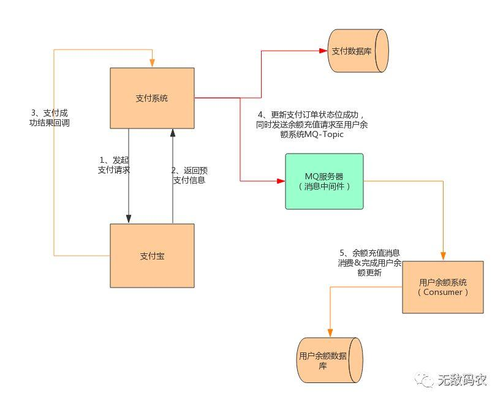
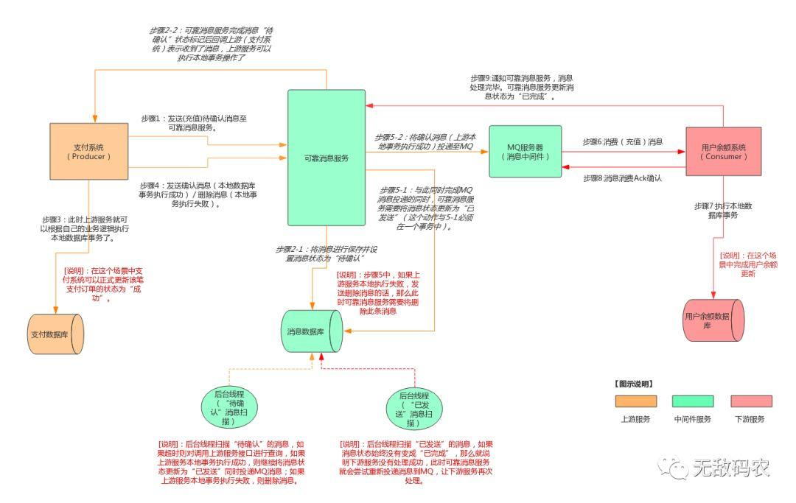
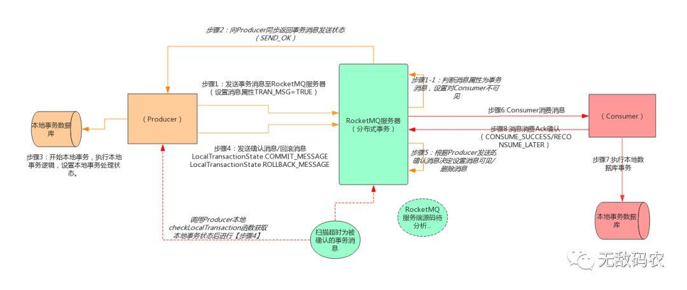

# RocketMQ事务消息实现思路
参考文档：  
分布式事务之如何基于RocketMQ的事务消息特性实现分布式系统的最终一致性？ ：https://www.javazhiyin.com/31853.html

# 事务消息原理
**事务消息可以看作是两阶段协议的消息实现方式**，用于确保在以消息中间件解耦的分布式系统中**本地事务的执行和消息的发送，可以以原子的方式进行**。  
举个例子，以某互联网的用户余额充值为例，用户Joe参加了该公司的的充值返现活动（冲100反20），用户充值了100元，支付成功后Joe的账户余额应该有120元钱。  
该公司的关于用户充值系统的设计框架大致如下图：  



该系统的大致逻辑是：通过支付系统完成用户的支付宝扣款操作，成功后需要更新支付流水的状态，因为**余额账户系统与支付系统之间是通过MQ解耦了**，所以支付系统在完成更新支付流水状态后通过发送MQ到消息中间件服务，然后余额系统通过订阅消息的方式来完成用户余额的增加操作。  
在该过程中村存在以下问题：  
* 支付系统如何确保充值余额消息一定会发送到MQ  
支付系统在完成订单状态变更后，MQ发送失败
* 用户余额系统如何做到一定能过成功处理  
用户余额系统处理消息失败

如果解决以上问题就要在现有的框架基础上添加逻辑已实现整个流程的事务性，比如：支付系统可以感知到消息发送失败从而进行重新发送，以确保支付系统和用户余额系统的最终一致性。  
首先看一下在rocketMQ不支持事务机制前，一些大公司是如何解决的。早起为了实现基于MQ异步调用多个服务，同时保证事务性的完成所有工作，一些常用的解决方案是采用**可靠消息最终一致性方案**，来实现分布式事务。还是以上面的充值业务为例，他的可靠性消息实现方案的过程大致如下图：  



从上图可以看出，为了实现基于可靠性消息实现的分布式事务，需要确保上游服务本地事务的处理与MQ的消息投递具有原子性，也就是说上游本地服务事务的处理成功后要确保消息一定投递到MQ，否则消息就不应该投递到MQ服务；同样被成功投递的消息也一定会被下游的消费者处理成功，否则就需要重新投递MQ。 从上图可以总结出为了实现基于MQ异步消息的事务，该实现思路是在本地事务和MQ之间加了一个**事务性逻辑判断中间层**来确保整个过程的最终事务性。  
其实现思路大致流程如下： 

## 上游发送消息事务性实现逻辑：
1. 在本地事务操作前，发送“待确认”的消息到可靠消息服务。可靠消息服务将该消息记录到自身服务的消息数据库中（消息状态：待确认），然后可靠消息回调上层服务表示收到消息可以开始事务。
2. 上游服务开始执行本地事务操作，执行完成后发送通知信息到可靠性消息层。
3. 如果上游事务执行成功，则向可靠消息服务发送确认信息，此时可靠性消息层就会正式传递消息到MQ，同时会更新消息状态为“已发送”
4. 如果上游事务执行失败，则会通知可靠性消息层删除该消息信息，可靠性消息删除消息流程结束。

但是在整个过程中可靠性消息层依然会存在一下问题：  
* 没有收到确认发送消息  
可以通过可靠性消息层在后台启动线程，不断轮询消息的状态，这里会轮询状态为“待确认”的消息，比昂判断消息的时间是否超过了规定的时间，如果超过了规定的时间消息还处于“待确认”状态，就会触发**上游服务状态的询问机制**，来主动确认消息状态。
* 发送消息到MQ失败的问题  
尝试重发，如果仍然失败则保存信息，打印报错信息。

## 下游消费者
1. 在正常情况下，下游消费者收到消息然后处理完事务，会主动通知可靠性消息层，可靠性消息层就会把消息状态更新为“已完成”
2. 如果失败，那么可靠性消息层会启动相应的后台线程，轮询一直处于“已发送”
状态的消息，判断消息持续时间是否超时，如果超时，可靠性消息层就会再次向MQ服务投递此消息，从而确保消息能够被再次消费（下游服务要保证消息处理的幂等性，应防止重复处理）

上面说完了在MQ不存在事务性功能时，旧的消息事务性处理逻辑，下面讲一下支持事务性消息的RocketMQ的事务实现机制。

# rocketMQ事务消息机制
rocketMQ在4.3.0+中实现了可靠性消息服务的所有功能，并且保证了高并发，高可用，高性能的实现。  
从逻辑上看rocketMQ的所实现的分布式事务和上面阐述的可靠性事务消息的大致逻辑是一致的。只是rocketMQ做了更加复杂的设计，将可靠性事务层和MQ服务紧密的结合，从而带来更高的优势。  
下面是利用rocketMQ实现的分布式事务操作逻辑图：  



从上图可以看出rocketMQ实现分布式事务消息的大致流程如此：  
1. producer使用事务消息的方式向rocketMQ发送消息，同时设置消息属性为：TRAN_MSG=TRUE
2. rocketMQ收到消息首先判断消息类型是否是事务消息：  
否：直接push给consumer  
是：对该消息做特殊处理设置消息ID，并设置消息对consumer不可见，之后向producer返回pre消息发送状态send_ok
3. producer收到确认信息开始执行本地事务，并设置本地事务的处理完成后向rocketMQ服务器发送该事务消息的确认/回滚消息（commit_mesage/rollback_message）
4. rocketMQ服务器根据该笔事务消息的本地事务执行状态决定将消息push给consumer还是删除掉。
5. 之后consumer就会消费掉该消息，执行consumer的本地事务逻辑，如果执行成功则向rocketMQ返回“consumer_success”；反之出现异常则需要返回“reconsumer_later”，以便rocketMQ再次push该消息

正常情况下以上就是rocketMQ事务消息的基本运行流程，但是异常情况下也可能存在producer迟迟不发送确认信息或回滚信息的情况。与可靠性消息一样，rocketMQ服务也会设置后台线程去扫描消息状态，之后调用producer的本地checkLocalTransaction函数获取本地事务状态后执行第3步的操作。

# 代码实现
## consumer
开发过程中consumer端的代码不需要有什么特别的变化，与普通的consumer大致是一样的：  
```
public static void main(String[] args) throws InterruptedException, MQClientException {

        // Instantiate with specified consumer group name.
        DefaultMQPushConsumer consumer = new DefaultMQPushConsumer("CID_PAY_ACCOUNT");

        // Specify name server addresses.
        consumer.setNamesrvAddr("10.211.55.4:9876;10.211.55.5:9876;10.211.55.6:9876");

        // Subscribe one more more topics to consume.
        consumer.subscribe("PAY_ACCOUNT", "*");
        // Register callback to execute on arrival of messages fetched from brokers.
        consumer.registerMessageListener(new MessageListenerConcurrently() {

            @Override
            public ConsumeConcurrentlyStatus consumeMessage(List<MessageExt> msgs,
                ConsumeConcurrentlyContext context) {
                for (MessageExt messageExt : msgs) {
                    System.out.println(new String(messageExt.getBody()));
                }
                return ConsumeConcurrentlyStatus.CONSUME_SUCCESS;
            }
        });

        //Launch the consumer instance.
        consumer.start();
        System.out.printf("Consumer Started.%n");
    }
```

## producer
producer的需要做一下改变，首先需要额外的编写一个实现本地事务逻辑，以及检查本地事务状态的类，其代码逻辑如下：  
```
public class TransactionListenerImpl implements TransactionListener {

    private AtomicInteger transactionIndex = new AtomicInteger(0);

    private ConcurrentHashMap<String, Integer> localTrans = new ConcurrentHashMap<>();

    @Override
    public LocalTransactionState executeLocalTransaction(Message msg, Object arg) {
        int value = transactionIndex.getAndIncrement();
        int status = value % 3;
        localTrans.put(msg.getTransactionId(), status);
        return LocalTransactionState.COMMIT_MESSAGE;
    }

    @Override
    public LocalTransactionState checkLocalTransaction(MessageExt msg) {
        Integer status = localTrans.get(msg.getTransactionId());
        if (null != status) {
            switch (status) {
                case 0:
                    return LocalTransactionState.UNKNOW;
                case 1:
                    return LocalTransactionState.COMMIT_MESSAGE;
                case 2:
                    return LocalTransactionState.ROLLBACK_MESSAGE;
            }
        }
        return LocalTransactionState.COMMIT_MESSAGE;
    }
}
```

然后producer的代码实例如下：  
```
public class TransactionProducerTest {
    public static void main(String[] args) throws MQClientException, InterruptedException {
        TransactionListener transactionListener = new TransactionListenerImpl();
        TransactionMQProducer producer = new TransactionMQProducer("CID_PAY_ACCOUNT");
        producer.setNamesrvAddr("10.211.55.4:9876;10.211.55.5:9876;10.211.55.6:9876");

        ExecutorService executorService = new ThreadPoolExecutor(2, 5, 100, TimeUnit.SECONDS, new ArrayBlockingQueue<Runnable>(2000), new ThreadFactory() {
            @Override
            public Thread newThread(Runnable r) {
                Thread thread = new Thread(r);
                thread.setName("client-transaction-msg-check-thread");
                return thread;
            }
        });

        producer.setExecutorService(executorService);
        producer.setTransactionListener(transactionListener);
        producer.start();

        String[] tags = new String[] {"TagA", "TagB", "TagC", "TagD", "TagE"};

        try {
            Map<String, String> paramMap = new HashMap<>();
            paramMap.put("type", "6");
            paramMap.put("bizOrderId", "15414012438257823");
            paramMap.put("payOrderId", "15414012438257823");
            paramMap.put("amount", "10");
            paramMap.put("userId", "200001");
            paramMap.put("tradeType", "charge");
            paramMap.put("financeStatus", "0");//财务状态，应收
            paramMap.put("channel", "a");//余额
            paramMap.put("tradeTime", "20190101202022");
            paramMap.put("nonce_str", "xkdkskskdksk");

            //拼凑消息体
            Message msg = new Message("PAY_ACCOUNT", "pre",paramMap.toString().getBytes(RemotingHelper.DEFAULT_CHARSET));
            SendResult sendResult = producer.sendMessageInTransaction(msg, null);
            System.out.printf("%s%n", sendResult);

            Thread.sleep(10);
        } catch (MQClientException | UnsupportedEncodingException e) {
            e.printStackTrace();
        }

        Thread.sleep(10*1000);
        producer.shutdown();
    }
}
``

与非事务消息直接调用rocketMQ的send方法不同，事务消息发送时需要设置事务监听类，并调用sendMessageInTransaction方法，这样才能够确保事务性消息后续流程的正确完成。