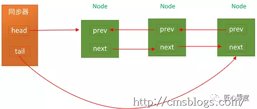
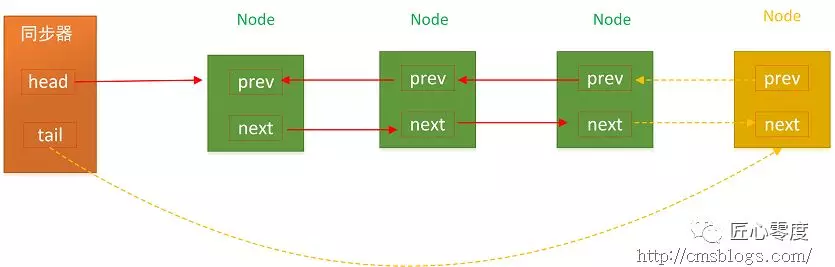
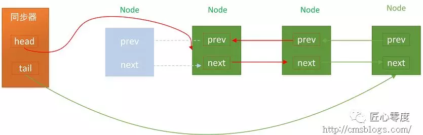

# 【死磕Java并发】—–J.U.C之AQS（一篇就够了）
参考文档：https://mp.weixin.qq.com/s/-swOI_4_cxP5BBSD9wd0lA  

#AQS简介
java的内置锁一直都是备受争议的，在JDK1.6之前Synchronized这个重量级锁其性能一直较为低下，虽然在1.6之后，进行了大量的锁优化策略，但是与Lock相比Synchronized还是存在一些缺陷：虽然Synchronized提供了便捷性的隐式获取锁释放锁机制（基于JVM机制），但是它却缺少了获取锁与释放锁的可操作性，可中断，超时获取锁，且他为独占式在高并发场景下性能大打折扣。  
在介绍Lock之前，我们需要先熟悉一下一个非常重要的组件，掌握了该组件JUC包下面很多问题都不在是问题了，该组件就是AQS。  
AQS：AbstractQueuedSynchronizer即队列同步器。它是构建锁或者其他同步组件的基础框架（如ReentrantLock，ReentrantReadWriteLock，Semaphore等），JUC并发包作者期望他能够成为实现大部分同步功能的基础。它是JUC并发包中核心基础组件。  
AQS解决了实现同步器时涉及到的大量细节问题，例如获取同步状态，FIFO同步队列。基于AQS来构建同步器可以带来很多好处。它不仅能够极大的减少实现工作，而且也不必处理在多个位置上发生的竞争问题。  
在基于AQS构建的同步器只能在一个时刻发生阻塞，从而降低了上下文切换的开销，提高了吞吐量。同时在设计AQS时充分的考录了可伸缩性，因此JUC中所有基于AQS构建的同步器均可以获得这个优势。AQS的使用方法时是继承，子类通过继承同步器并实现他的抽象类方法来管理同步状态。  
AQS使用了一个int类型的成员变量state来表示同步状态：  
* state>0：表示已经获取了锁
* state=0：表示释放了锁

他提供了三个方法（getState（），setState（int newState）,compareAndSetStatue(int expect, int update)）来对同步状态进行操作，当然AQS可以确保对state的操作是安全的。  
AQS通过内置了FIFO同步队列，来实现资源获取线程的排队工作，如果当前线程获取同步状态失败时，AQS则会将当前线程以及等待状态等信息构建成一个节点（Node）并将其加入到同步队列，同时阻塞当前线程，当同步状态释放时，则会把节点中的线程唤醒，使其再次尝试获取同步状态。  

## AQS提供了如下一些方法：  
* getState（）：返回同步状态当前值
* setState（int newState）：设置当前同步状态
* compareAndSetState（int expect， int update）：使用Cas设置当前状态，该方法能够保证状态设置的原子性
* tryAcquire（int arg）:独占式获取同步状态，获取同步状态成功后，其他线程需要等待该线程释放同步状态才能获取同步状态。
* tryRelease（int arg）:独占式释放同步状态
* tryAcquireShared（int arg）:共享式获取同步状态，返回值大于等于0则代表获取成功，否则失败。
* tryReleaseShared（int arg）：共享式释放同步锁
* isHeldExclusively（）：当前同步器是否在独占模式下被线程占用，一般该方法表示是否被当前线程所独占。
* acquire（int arg）：独占式获取同步状态，如果当前线程获取同步状态成功，则由该方法返回，否则将会进入同步队列等待，该方法将会调用可重写的tryAcquire（int arg）方法
* acquireInterruptibly（int arg）：与acquire（int arg）相同，但是该方法响应中断，当前线程为获取到同步状态而进入到同步队列中，如果当前线程被中断，则该方法会抛出InterruptedException异常并返回。
* tryAcquireNanos（int arg, long nanos）：超时获取同步状态，如果当前线程在Nanos时间内没有获取到同步状态，那么将返回false，已经获取则返回true
* acquireShareInterruptibly（int arg）：共享式获取同步状态，响应中断。
* tryAcquireSharedNanos（int arg, long nanosTimeOut）：共享式获取同步状态，增加超时限制
* release（int arg）：独占式释放同步状态，该方法会在释放同步状态之后，将同步队列中的第一个节点包含的线程唤醒
* releaseShared(int arg)：共享式释放同步状态

## CLH同步队列
CLH是一个FIFO的双向队列，AQS依赖它来完成同步状态的管理，当前线程如果获取同步状态失败时，AQS会将当前线程以及等待状态信息等构建成一个节点并将其加入到CLH同步队列，同时会阻塞当前线程，当同步状态释放时，会把首节点唤醒（在公平锁中），使其再次尝试获取同步状态。  
在CLH同步队列中，一个节点表示一个线程，它保存了线程的引用（thread），状态（waitState），前区节点（pre）。后继节点（next），其代码定义如下：  

```
static final class Node {
    /** 共享 */
    static final Node SHARED = new Node();
    /** 独占 */
    static final Node EXCLUSIVE = null;
    /**
     * 因为超时或者中断，节点会被设置为取消状态，被取消的节点时不会参与到竞争中的，他会一直保持取消状态不会转变为其他状态；
     */
    static final int CANCELLED =  1;
    /**
     * 后继节点的线程处于等待状态，而当前节点的线程如果释放了同步状态或者被取消，将会通知后继节点，使后继节点的线程得以运行
     */
    static final int SIGNAL    = -1;
    /**
     * 节点在等待队列中，节点线程等待在Condition上，当其他线程对Condition调用了signal()后，改节点将会从等待队列中转移到同步队列中，加入到同步状态的获取中
     */
    static final int CONDITION = -2;
    /**
     * 表示下一次共享式同步状态获取将会无条件地传播下去
     */
    static final int PROPAGATE = -3;
    /** 等待状态 */
    volatile int waitStatus;
    /** 前驱节点 */
    volatile Node prev;
    /** 后继节点 */
    volatile Node next;
    /** 获取同步状态的线程 */
    volatile Thread thread;
    Node nextWaiter;
    final boolean isShared() {
        return nextWaiter == SHARED;
    }
    final Node predecessor() throws NullPointerException {
        Node p = prev;
        if (p == null)
            throw new NullPointerException();
        else
            return p;
    }
    Node() {
    }
    Node(Thread thread, Node mode) {
        this.nextWaiter = mode;
        this.thread = thread;
    }
    Node(Thread thread, int waitStatus) {
        this.waitStatus = waitStatus;
        this.thread = thread;
    }
}
```

CLH同步队列的结构图如下：  




### 入列
了解了相关的数据结构后CLH队列入列操作就很好理解了，无法就是Tail指向新节点，新节点的prev指向当前的最后节点，当前的最后节点的next指向当前节点。其代码如下：  

```
    private Node addWaiter(Node mode) {
        //新建Node
        Node node = new Node(Thread.currentThread(), mode);
        //快速尝试添加尾节点
        Node pred = tail;
        if (pred != null) {
            node.prev = pred;
            //CAS设置尾节点
            if (compareAndSetTail(pred, node)) {
                pred.next = node;
                return node;
            }
        }
        //多次尝试
        enq(node);
        return node;
    }
```

addWaiter(Node node)先通过快速尝试设置尾节点，如果失败则调用enq(Node node)方法设置尾节点：  

```
    private Node enq(final Node node) {
        //多次尝试，直到成功为止
        for (;;) {
            Node t = tail;
            //tail不存在，设置为首节点
            if (t == null) {
                if (compareAndSetHead(new Node()))
                    tail = head;
            } else {
                //设置为尾节点
                node.prev = t;
                if (compareAndSetTail(t, node)) {
                    t.next = node;
                    return t;
                }
            }
        }
    }
```

在上面的代码中，两个方法都是通过一个CAS方法compareAndSetTail（Node expect，Node update）来设置尾节点，该方法可以确保节点是线程安全添加的。在enq(Node node)方法中，AQS通过“死循环”的方式来保证节点可以正常的添加，只有成功添加后，当前线程才会从该方法返回，否则会一直执行下去。  




### 出列
CLH同步队列遵循FIFO，首节点的线程释放同步状态后，将会唤醒他的后即节点（next），而后继结点将会在获取同步状态成功时将自己设置为首节点，这个过程非常简单，head执行该节点碧昂断开原首节点的next和当前节点的prev，注意在这个过程中不需要使用cas来保证，因为只有一个线程能获取到同步状态。  
 


# 同步状态的获取与释放
在前面提到过AQS时构建java同步组件的基础，我们期望他能够成为实现大部分同步需求的基础。AQS的设计模式采用的是模板方法模式，子类通过继承的方式实现他的同步方法来管理同步状态，对于子类而言没有太多的活要做，AQS提供了大量的模板来实现同步，主要是分三类：  
1. 独占式获取和释放同步状态
2. 共享式获取和释放同步状态
3. 查询同步队列中的等待线程情况

自定义子类使用AQS提供的模板方法实现自己的同步语句。

## 独占式
同一时刻只有一个线程有同步状态  
acquire（int arg）方法为AQS童工的模板方法，该方法为独占式获取同步状态，但是该方法对中断不敏感，也就是说由于线程获取同步状态失败加入到CLH同步队列中，后续对线程进行中断操作时，线程不会从同步队列中移除。  

```
    public final void acquire(int arg) {
        if (!tryAcquire(arg) &&
            acquireQueued(addWaiter(Node.EXCLUSIVE), arg))
            selfInterrupt();
    }
```