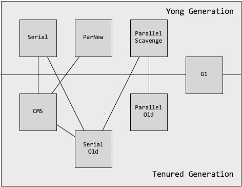
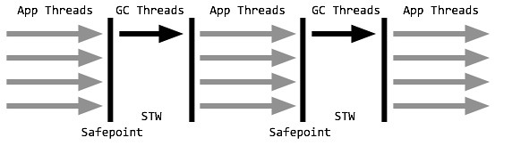
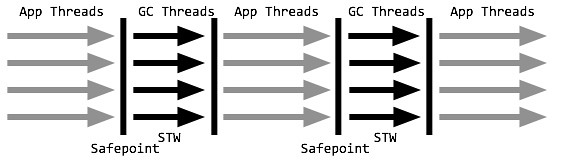
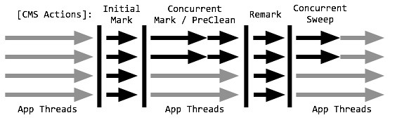
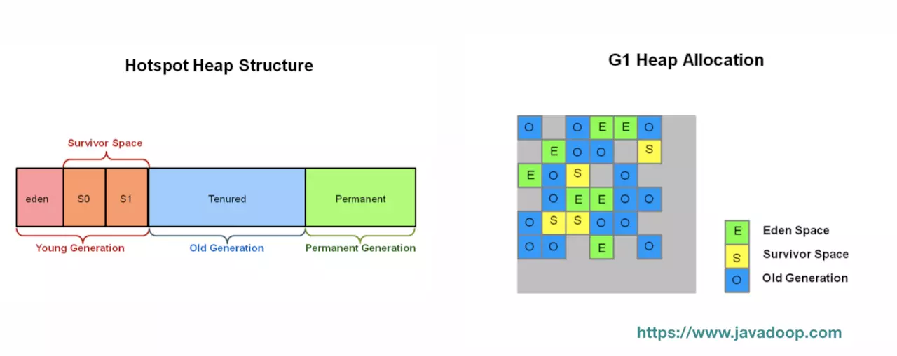
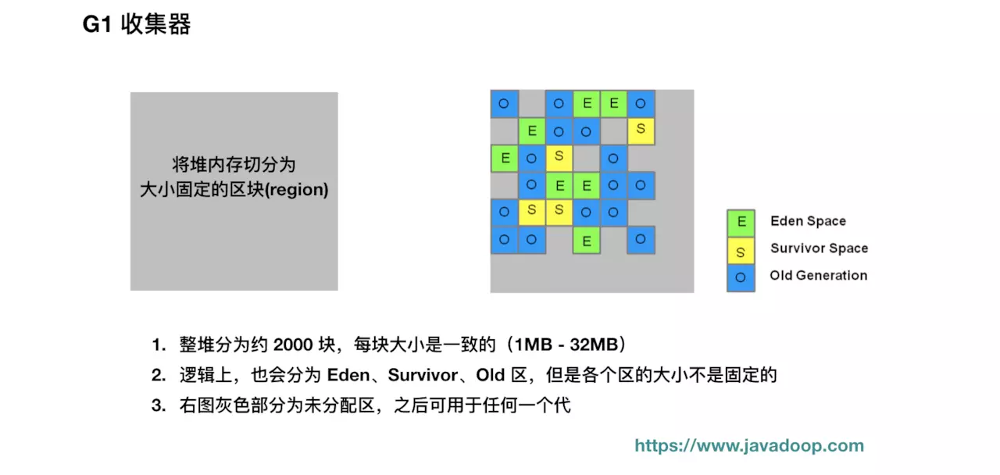
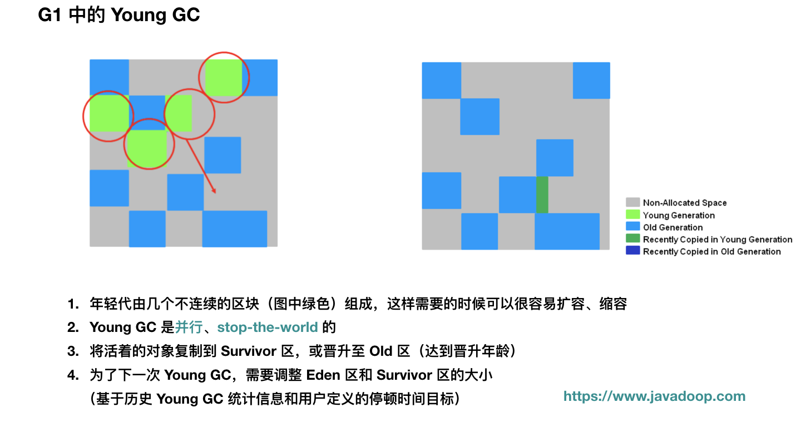

# 详解JVM Garbage First(G1) 垃圾收集器

参考文档：

详解JVM Garbage First(G1)垃圾收集器：https://blog.csdn.net/coderlius/article/details/79272773  
G1垃圾收集器介绍：https://juejin.im/entry/5af0832c51882567244deb44
G1与CMS垃圾回收：https://blog.csdn.net/wufaliang003/article/details/80684379

garbage first（G1）是垃圾收集领域的最新成果，同时也是hostSpot在jvm上力推的垃圾收集器，并赋予它取代cms的使命，如果使用java8/9，那么有很多可能希望对G1进行评估。

# 概述
G1垃圾收集器是当前垃圾回收技术最前沿的技术成果之一，仔仔JDK7就已经加入jvm的垃圾收集器大家庭中，成为hostSpot重点发展的垃圾回收技术，同优秀的的cms垃圾回收器一样，G1也是关注最小时延的回收器，也同样适合大尺寸堆内存额垃圾回收，官方也推荐使用G1来代替cms。G1最大的特点是弱化了分区，分代的概念，合理利用垃圾收集各个周期的资源，解决其他收集器甚至cms的众多缺陷。

# jvm gc收集器的回顾和比较

从JDK3开始，hostSpot团队一直努力朝着高效收集，减少停顿的方向努力，也贡献了从串行到cms乃至G1在内的一系列优秀的垃圾回收器。上面展示了JDK的垃圾回收大家庭，已经他们相互之间的关系，下面就几种典型的组合进行简单的介绍。

# 串行收集器

串行收集器组合：serial + serial old

> 开启选项： -XX:+SerialGC

串行收集器是最基本的，发展时间最长的，久经考验得的垃圾收集器，也是client模式下默认的收集器配置。  
串行收集器采用单线程stop-the-world的方式进行收集。当内存不足时，串行GC设置停顿标识，待所有线程进入安全点时，应用线程暂停，串行gc开始工作，采用单线程方式回收空间并整理内存。单线程也意味着复杂度更低，占用内存更少，但同时也意味着不能有效地利用多核的优势。事实上，串行收集器特别适合堆内存不高，单核甚至双核的CPU的场景。

# 并行收集器

并行收集器组合：parallel scavenge + parallel old

> 开启选项：-XX:+UseParallelGC 或 -XX:+UseParallelOldGC(可互相激活)

并行收集器是以关注吞吐量为目标的垃圾收集器，也是server模式下的默认收集器配置，对吞吐量的关注主要体现在年轻代的parallel scavenge收集器上。并行收集器和串行收集器的工作模式相似，都是stop-the-world方式，只是暂停时冰箱的进行垃圾回收。年轻代采用复制方法，老年代采用标记整理，在回收的同时还会对内存进行压缩。关注吞吐量主要指年轻代的parallel scavenge收集器，通过两个目标参数-XX:MaxGCPauseMills和-XX:GCTimeRatio,调整新生代空间大小，来减低gc触发的频率。并行收集器适合对吞吐量要求远远高于延迟要求的场景，并且在满足最差延迟的情况下，并行收集器将提供最佳的吞吐量。

# 并发标记清除收集器

并发标记清除收集器组合：parNew + cms + serial old

> 开启选项：-XX:+UseConcMarkSweepGC
并发标记清除cms是以关注延迟为目标，十分优秀的垃圾回收算法。开启后，年轻代使用STW式并行收集，老年代回收采用cms进行垃圾回收，对延迟的关注也主要是体现在老年代上cms上。  
年轻代parNew与并行收集器类似，而老年代cms每个这周期都要经历：**初始标记，并发标记，重新标记，并发清理**。其中初始标记以STW的方式标记所有根节点对象。并发标记则同应用线程一起并行，标记出跟对象的可达路径；在进行垃圾回收前，cms再以一个STW进行重新标记，按照那些由Mutator线程（指引起数据变化的线程，即应用线程）修改而可能错过的可达对象；最后得到的不可达对象将在并发清理阶段进行回收。值得注意的是：**初始标记和重新标记都已经优化为多线程执行**。cms非常适合堆内存大、CPU核数多的服务器端应用，也是G1出现之前大型应用的首选收集器。  
但是cms并不完美，它有以下缺点：  
1. 由于并发进行，cms的收集与应用线程会同时进行会增加对堆内存的占用，也就是说：cms不需要再老年代堆内存用尽之前完成垃圾回收，否则cms回收失败时，会触发担保机制，串行老年代收集器将会以STW的方式进行一次GC，从而造成较大的停顿时间。
2. 标记清理算法无法整理空间碎片，老年代空间会随着应用时长被逐步耗尽，最后将不得不通过担保机制对对内存进行压缩。cms也提供了参数-XX:CMSFullGCsBeForeCompaction（默认为0，即每次都进行内存整理）来指定多少次cms收集后，进行一次压缩的full GC

# G1收集器
首先从内存划分上，之前介绍的分代收集器将整个堆分为年轻代，老年代和永久代，每个代的空间是确定的。  
而G1将整个分代划分成了一个个大小相等的小块（region）。每一块的内存是连续的。和分代算法一样，G1中每个块也充当Eden，survivor，old角色，但是他们不是固定的，这使得内存使用更加灵活。  

执行垃圾收集时，也cms一样，G1收集线程在标记阶段和应用线程并行执行，标记结束后，G1也就知道了哪些区块基本上是垃圾，存活对象极少，G1会先从这些区块下手，因为从这些区块能很快释放很大的可用空间，这也是为什么G1被取名为Garbage-first的原因。  
在G1中，目标停顿时间非常重要，用-XX:MaxGCPauseMillis=200来指定期望的停顿时间。G1使用了停顿预测模型来满足用户指定的定顿时间目标，并基于目标来选择垃圾回收的区块数量。G1采用在增量回收的方式，每次回收一块区域，而不是整堆回收。  
我们要知道G1是一个实时收集器，他会尽力满足我们的停顿时间要求，但也不是绝对的，它基于之前的垃圾收集的数据统计，估计出在用户指定的停顿时间内能收集多少个区块。  
**注意：**G1有和应用程序一起运行的并发阶段，也有stop-the-world的并发阶段。但是**Full Gc的时候还是单线程运行的**，所以我们应该尽量避免Full GC。

## G1内存占用
G1比ParallelOld和cms会需要更多的内存消耗，那是因为有部分的内存消耗是用于簿记（accounting）上，如以下两个数据结构：  
1. Remembered Sets：每个区块都一个Rset，用于记录进入该区块的对象引用（区块A的对象引用了区块B的对象，区块B的Rset需要记录这个信息），它用于实现收集过程的并行化以及使得区块能够进行独立的收集。整体上Rset消耗的内存小于5%
2. Collection Sets：将要被回收的区块集合。GC时在这些区块中的对象会被复制到其他区快上，总体上Collection Sets消耗的内存小于1%、

## G1工作流程
G1收集器主要包括以下四种操作：  
1. 年轻代收集
2. 并发收集（和应用线程同时执行）
3. 混合式垃圾收集
4. 必要时的Full GC

## 年轻代收集
首先看一个G1的堆结构：  

年轻代中的垃圾收集流程（young GC）  

可以看出：年轻代收集概念上和之前的其他分代收集器基本相同，主要的区别时他的年轻代会动态的调整。

## old GC--并发标记周期
接下来Old GC的流程（含Young GC阶段）。其实把Old GC理解为并发周期是比较合理的，不要单纯地认为清理老年代区块，因为这一步和年轻代收集也会是相关的。他的执行流程是：  
1. 初始标记  
stop-the-world，它伴随着一次普通的Young GC发生，然后对Survivor区（Root Region）进行标记，因为该区可能存在对老年代的引用。因为Young GC是需要stop-the-world的，所以并发周期直接重用了这个阶段，虽然会增加CPU的开销，但是停顿时间只是增加了一小部分。
2. 扫描根引用区  
扫描Survivor到老年代的引用，该阶段必须在下一次Young GC发生前结束。这个阶段不能发生年轻代收集，如果中途Eden区真的满了，也要等待到这个阶段结束才能进行Young GC
3. 并发标记  
寻找整个堆的存活对象，该阶段可能会被Young GC中断。这个阶段是并发执行的，中间可以发生多次Young GC，Young GC会中断标记过程。
4. 重新标记  
完成最后的存活对象的标记。使用了比cms收集器更加高效的snapshot-at-the-beginning（SATB）算法，Orale官方资料显示：这个阶段会回收完全空闲的区块。
5. 清理  
清理阶段真正回收的内存很少。

到此G1的一个并发周期就算结束了，其实就是主要完成过了垃圾定位的工作，定位出了哪些分区是垃圾最多的。

## 混合垃圾回收周期
并发周期结束后是混合垃圾回收周期，不仅进行年轻代垃圾收集，而且回收之前标记出老年代的垃圾最多的区块。混合垃圾回收周期会持续进行，直到几乎所有的被标记出来的分区（垃圾占比大的分区）都得到回收，然后恢复到常规的年轻代垃圾回收，最终再次启用并发周期。

## Full GC
Full GC是需要极力避免的，以下情况会触发Full GC行为：  
1. 并发模式失败（concurrent mode failure）  
G1并发标记期间，如果在标记结束前，老年代被填满，G1会放弃标记（cms收集器也有同样的概念）。  
> 这个时候说明：  
>> * 堆需要增加
>> * 调整并发：如增加并发标记的线程数量，让并发标记尽快结束
>> * 进行更早的并发标记：调整并发周期，默认是整堆的45%被占用就开始进行并发周期

2. 晋升失败  
并发周期结束后,是混合垃圾回收周期，伴随着年轻代垃圾收集，进行清理老年代空间，如果这个时候清理的速度小于消耗的速度，导致老年代不够用，那么会发生晋升失败。  
> 说明混合垃圾回收需要更迅速地完成垃圾回收，也就是说混合回收阶段，每次年轻代的收集应该处理更多的老年代仪表及区块。

3. 疏散失败  
年轻代垃圾收集的时候，如果Survivor和Old区没有足够的空间容纳所有的存活对象。这种现象肯定是非常致命的，因为基本上已经没有多少空间可以用了，这个时候会触发Full GC也是合理的。  
> 最简单的方案就是增加堆大小

4. 大对象分配失败  
我们应尽可能地不创建大对象，尤其是大于一个区块大小的那种对象。

## 简单小结
看完上面的Young GC和Old GC，可能会有以下迷惑，下面使用浅显的语言做一下补充，以帮助理解。  
最好不要把Old GC当作是一次GC来看，而应该当作**并发标记周期**来理解，虽然他确实会释放一些内存。  
并发标记结束后，G1也就知道了哪些区块最适合被回收，那些完全空闲的区块会直接在这个阶段被回收。如果这个阶段释放了足够的内存出来，其实也可以认为结束了一次GC。  
假设并发标记结束了，那么下次GC的时候，还是会线回收年轻代，如果从年轻代中得到了足够的内存，那么结束；过了几次后，年轻代垃圾收集不能满足需要了，那么就需要利用之前并发标记的结果，选择一些活跃度最低的老年代区块进行回收。直到最后，老年代会进入下一个并发周期。  
那么什么时候会启动并发标记周期呢?这个是通过参数控制的，下面马上要介绍这个参数，此参数默认值是45，也就是当堆空间使用了45%后，G1就会进入并发标记周期。

## G1参数配置的最佳实践
G1调优的目标是尽量避免出现Full GC，其实就是给老年代足够的空间，或相对更多的空间。以下有几点调整方向：  
1. 增加堆大小或调整老年代和年轻代的比例
2. 增加并发周期的线程数量，目的就是为了加快并发周期结束时间。
3. 让并发周期尽早结束，这里是通过设置堆使用占比来调整的（默认45%）
4. 在混合垃圾回收周期中回收更多的老年代区块

G1的很重要的目标是达到可控的停顿时间，所以很多行为都以这个为出发点而开展的。  
我们可以通过设置-XX：MaxGCPauseMillis=N来指定停顿时间（默认200ms）,如果没有达到这个目标，G1会通过各种方法来补救：  
* 调整年轻代的比例
* 调整堆大小
* 调整晋升的年龄阈值
* 调整混合垃圾回收周期中处理老年代的区域数量等

需要注意的是，调整每个参数满足一个条件的同时往往会引起另一问题。  
比如：  
* 为了降低停顿时间，我们可以减小年轻代大小，这样的话就会增加年轻代的收集频率。
* 如果减少了混合垃圾回收周期处理的老年代区块数量，虽然可以更容易满足停顿时间要求，但是会增加Full GC的风险。

## 参数介绍：
* -XX:UseG1GC  
使用G1收集器
* -XX:MaxGCPauseMillis=200
指定目标停顿时间