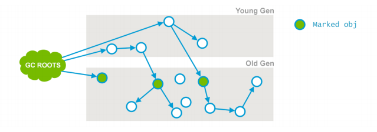
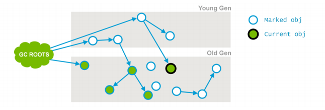
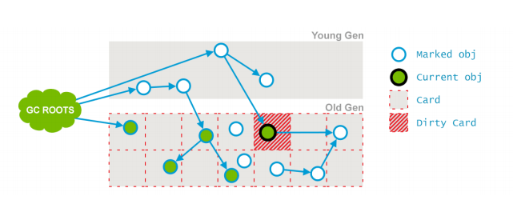
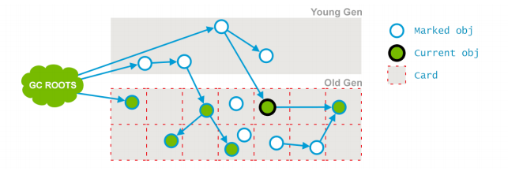
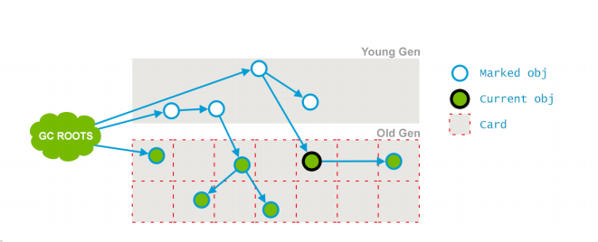

# cms垃圾收集器

一次完整的cms垃圾收集的日志信息：  
```
2015‐05‐26T16:23:07.321‐0200: 64.425: [GC (CMS Initial Mark)
[1 CMS‐initial‐mark: 10812086K(11901376K)]
10887844K(12514816K), 0.0001997 secs]
[Times: user=0.00 sys=0.00, real=0.00 secs]
2015‐05‐26T16:23:07.321‐0200: 64.425: [CMS‐concurrent‐mark‐start]
2015‐05‐26T16:23:07.357‐0200: 64.460: [CMS‐concurrent‐mark: 0.035/0.035 secs]
[Times: user=0.07 sys=0.00, real=0.03 secs]
2015‐05‐26T16:23:07.357‐0200: 64.460: [CMS‐concurrent‐preclean‐start]
2015‐05‐26T16:23:07.373‐0200: 64.476: [CMS‐concurrent‐preclean: 0.016/0.016 secs]
[Times: user=0.02 sys=0.00, real=0.02 secs]
2015‐05‐26T16:23:07.373‐0200: 64.476: [CMS‐concurrent‐abortable‐preclean‐start]
2015‐05‐26T16:23:08.446‐0200: 65.550: [CMS‐concurrent‐abortable‐preclean: 0.167/1.074 secs]
[Times: user=0.20 sys=0.00, real=1.07 secs]
2015‐05‐26T16:23:08.447‐0200: 65.550: [GC (CMS Final Remark)
[YG occupancy: 387920 K (613440 K)]
65.550: [Rescan (parallel) , 0.0085125 secs]
65.559: [weak refs processing, 0.0000243 secs]
65.559: [class unloading, 0.0013120 secs]
65.560: [scrub symbol table, 0.0008345 secs]
65.561: [scrub string table, 0.0001759 secs]
[1 CMS‐remark: 10812086K(11901376K)]
11200006K(12514816K), 0.0110730 secs]
[Times: user=0.06 sys=0.00, real=0.01 secs]
2015‐05‐26T16:23:08.458‐0200: 65.561: [CMS‐concurrent‐sweep‐start]
2015‐05‐26T16:23:08.485‐0200: 65.588: [CMS‐concurrent‐sweep: 0.027/0.027 secs]
[Times: user=0.03 sys=0.00, real=0.03 secs]
2015‐05‐26T16:23:08.485‐0200: 65.589: [CMS‐concurrent‐reset‐start]
2015‐05‐26T16:23:08.497‐0200: 65.601: [CMS‐concurrent‐reset: 0.012/0.012 secs]
[Times: user=0.01 sys=0.00, real=0.01 secs]
```

下面将分阶段对该日志进行剖析：  
# 阶段1：initial mark（初始标记）
这是一次stw事件，该阶段的目标是标记出所有老年代存活的的对象，**包括GC ROOT的直接引用，以及年轻代的存活对象所引用的对象**。后者也非常重要，因为老年代是独立进行回收的。  



# 阶段2：Concurrent Mark（并发标记）
在此阶段，垃圾收集器遍历老年代，标记所有存活的对象，从前一阶段所找到的Root根开始算起。该阶段是和应用程序同时运行的。注意：在该阶段并非所有的老年代都能被标记到，因为**在标记的过程中对象的引用关系还在发生变化**。  



从上图可以看到“current Object”旁边的一个引用被并发线程删除了。

# 阶段3：Concurrent PreClean（并发预清理）
此阶段同样是和应用程序并行执行的。因为前一个阶段是与应用程序并发进行的，可能有一些引用已经改变。如果在并发阶段发生了引用关系变化，jvm会将发生变化的区域标记为“脏”区（这里就是通过卡片标记card marking来实现的）  



**在预清理阶段这些脏对象会被他统计出来，从他们可达的对象也会被标记出来。此段完成后，用以标记的card也就被清空了。** 



# 阶段4：Concurrent Abortable Preclean(并发可取消的预清理)
此阶段也不暂停应用线程，本阶段尝试在STW与Final Remark之前尽可能的多做一些工作。本阶段具体时间取决于多种因素，因为它循环做同样的事情，直到满足某个条件为止（如迭代次数，有用工作量，消耗的系统时间等等）

# 阶段5：Final Remark（最终标记）
这是此次GC的第二次（也是最后一次）STW阶段。本阶段的目的是完成老年代中所有存活对象的标记。因为在preclean阶段是并发的，有可能无法跟上应用的变化速度。所以需要STW来处理复杂情况。  
通常cms会尝试在年轻代尽可能空的情况下运行final remark阶段，以避免接连发生多次STW事件。该过程主要流程如下：  
* rescan(parallel))：重新扫描已完成存活对象的标记，此时rescan是并发执行的。
* weak refs processing：处理弱引用阶段
* class unloading：卸载不用类
* scrub string table：最后一个子阶段，清理持有class级别的metadata的符号表（symbol tables），以及内部化字符串对应的string tables。

在五个阶段完成后，老年代中所有的存活对象都被标记了，现在GC将清除所有不使用的对象来回收老年代。

# 阶段6：Concurrent Sweep（并发清除）：
此阶段和应用程序并发执行，不需要STW停顿，目的是删除未使用的对象并回收他们占用的空间。  



# 阶段7：Concurrent Reset（并发重置）
此阶段与应用程序并发执行，重置cms算法相关的内部数据，未下一次GC循环做准备。