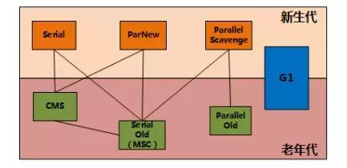
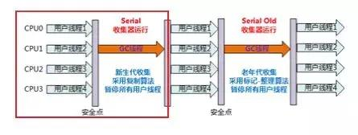
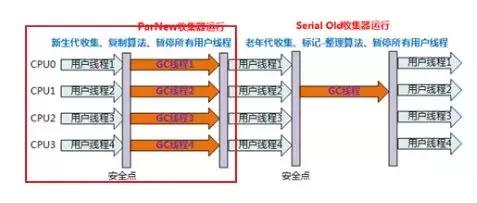
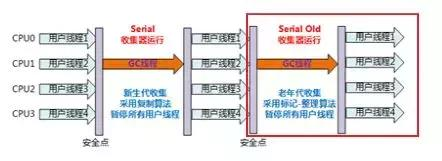
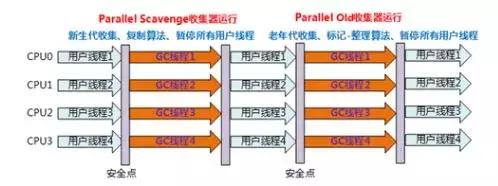
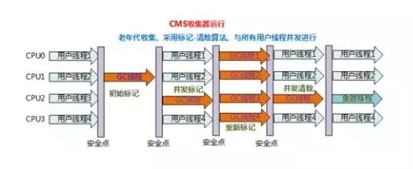

# 垃圾回收算法整理汇总
参考文档：https://www.jianshu.com/p/0b534ebc7f03  

# 首先需要引入一个概念
## Stop-The_World
### 概念
stop-the-world是java中的一种全局暂停现象。指所有的java代码停止工作（native仍然是可以继续工作的，但不能和JVM进行交互），大多数是由于GC引起的。

## 安全点（SafePoint）
### 概念
在“特定的位置”记录信息，这些位置称为安全点，即程序执行时，并不是所有的地方都能停下来GC，只有到达安全点才能暂停。

### 选取标准 
一般安全点的选用标准是“是否能让程序长时间执行的特征”为选取标准，最明显的特征就是指令序列复用，例如方法调用，循环跳转和异常跳转等这些关键点才能产生安全点。  

### 线程如何进入安全点
1. 抢占式中断（Preemptive suspension）  
在GC发生时，首先把所有的线程全部中断，若发现有线程中断的地方不在安全点上，就恢复线程让他跑到安全点（此方法几乎没有虚拟机在采用）

2.主动中断（Voluntary Suspension）  
当GC需要中断线程的时候，不直接对线程进行操作，仅仅简单的设置一个标识，各个线程执行时主动去轮训这个标识，发现中断标识为真时就自己中断挂起轮询标志的地方和安全点是否重合的，另外再加上常见对象需要分配内存的地方。

## 安全区域（Safe Region）
如果程序不执行，那么怎么到达安全点呢？比如处于sleep和blocked状态的线程，这是线程无法响应JVM的中断请求，这时候就需要安全区域。  
在线程执行到安全区域（safe region）时，首先标识自己已经进入了safe region，那么当在这段时间内JVM发起GC时，就不再管标志自己为safe region状态的线程了，在线程离开safe region时，他要检查系统是否已经完成了根节点枚举（或者整个GC过程），如果完成了，那线程就继续执行，否则就必须等待直到收到可以离开安全区域的信号为止。

## 串行
* 优点：古老，稳定，效率高
* 缺点：可能产生较长的停顿

# 垃圾回收

## serial收集器（串行）
是一个单线程的收集器，他在工作时，必须暂停其他所有线程，直到它收集完成为止，暂停的时间长但是效率高。  

## Parnew收集器（并行）
是serial收集器的多线程版本。  

## Parallel Scavenge收集器（并行）

是一个新生代的收集器，他也是使用复制算法。他的目标规则是达到一个可控制的吞吐量。
吞吐量（throughput）就是CPU用于运行用户代码与CPU总消耗时间的比值吞吐量=运行代码的时间/（运行代码的时间+垃圾回收的时间），虚拟机总共运行了100分钟，其中垃圾回收花掉了1分钟，那么吞吐量就是99%。

## serial old收集器
serial收集器的老年代版本，一个单线程收集器采用标记整理算法。

## parallel old收集器
parallel scavenge收集器的老年代版本，使用多线程标记整理算法。

## cms收集器
cms(concurrent Mark sweep)收集器，是一种以获取最短回收停顿时间为目标的收集器，停顿时间短，用户体验就好。基于“标记清理”算法，并发收集，低停顿，运作过程复杂，分4步。
1. 初始标记：仅仅标记GC Root能直接关联的对象，速度快，需要stop-the-world
2. 并发标记：并发追踪引用链，可以喝用户线程并发执行。
3. 重新标记：修正并发标记阶段因为用户线程继续运行而导致标记发生变化的那一部分对象的标记记录，比初始标记时间长但远比并发标记的时间短，需要stop-the-world
4. 并发清除：清除标记为可以回收的对象，可以和用户线程并发执行。

由于整个过程耗时最长的并发标记和并发清除都可以和用户线程一起工作，所以总体上来看，cms收集器的内存回收过程和用户线程是并发执行的。

cms收集器的缺点：  
1. 对CPU资源非常敏感  
并发收集虽然不会暂停用户线程，但因为占用一部分CPU资源，还是会导致应用程序变慢，总吞吐量降低。cms默认收集线程的数量=（CPU数量+3）/4，当CPU数量多于4个，收集线程占用CPU资源多于25%，对用户程序影响可能较大，不足4个时，影响更大。
2. 无法处理浮动垃圾  
在并发清除时，用户线程新产生的垃圾叫浮动垃圾，可能出现“concurrent mode failure”失败。  
并发清除时需要预留一定的内存空间，不像其他收集器在老年代几乎填满再进行垃圾回收，如果cms预留内存空间无法满足程序需要，就会出现一次“concurrent mode failure”失败，这时jvm启用后备方案，临时采用serial old收集器，从而导致另一次full gc的产生。
3. 产生大量内存碎片  
cms基于“标记清理”算法，清除后不进行压缩操作而产生大量的内存碎片，这样会导致分配大内存对象时，无法找到足够的连续内存，从而提前触发一次full gc动作

