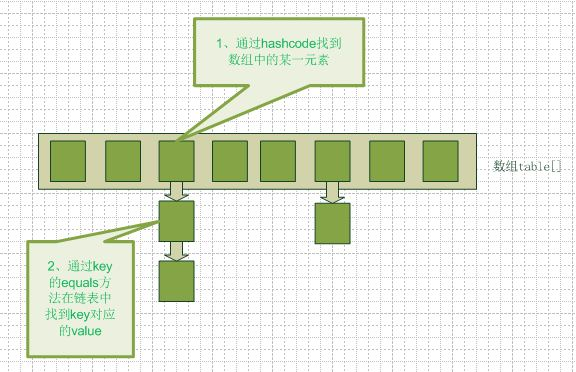
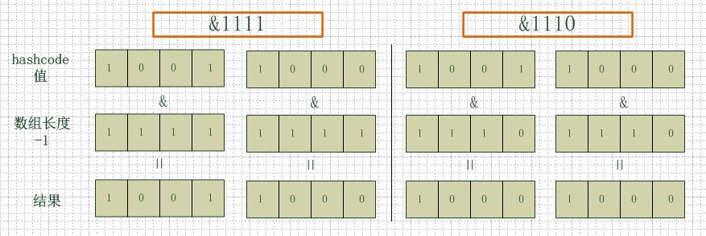
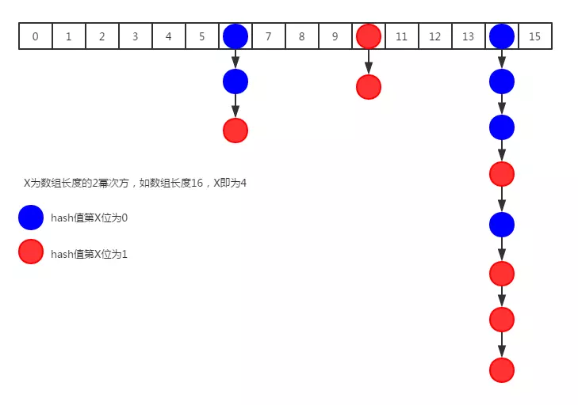
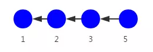
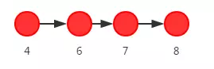
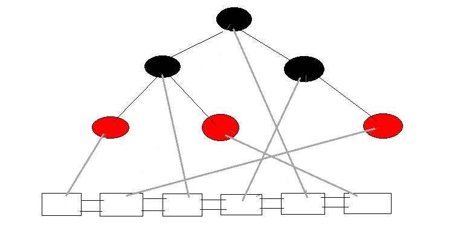

# hashMap的扩容机制

参考：[HashMap的扩容机制---resize()](https://www.cnblogs.com/williamjie/p/9358291.html)

## 1. hashMap的数据结构

在java语言中最基本的结构就是两种：  
* 数组
* 模拟指针（引用）  
所有的数据结构都可以用这两种基本结构来构造，hashmap也不例外。hashMap实际上是一个数组和链表的结合体，其大致结构如下图：  



以下为hashMap对应的代码结构：
```
transient Entry[] table;  

static class Entry<K,V> implements Map.Entry<K,V> {  
        final K key;  
        V value;  
        final int hash;  
        Entry<K,V> next;  
..........  
}  
```
通过Entry<K,V>结构中的Entry<K,V> next对象来指向下一个元素的引用，从而构成链表结构。  

## 2. hash算法

```
static int indexFor(int h, int length) {  
       return h & (length-1);  
   }  
```

首先算得key的hashcode值，然后拿着**这个hashcode值**和**数组长度-1的结果**两个值做一次“与”运算。看上去这个运算很普通，而事实上却是hashMap的精髓所在。hashMap通过**限定数组长度为2的幂次方**并结合**该hash算法**来实现hashMap的最高效率(同时也保证了hash扩容时的高效率)。下面以2的4次放举例，来解释为什么数组大小为2的幂次方时hashMap的访问性能最高。  
如下图：左边两组是数组长度为16（2的4次方），右边两组是数组长度为15。两组的hashcode均为8和9，但是很明显，当它们和1110“与”的时候，产生了相同的结果，也就是说它们会定位到数组中的同一个位置上去，这就产生了碰撞，8和9会被放到同一个链表上，那么查询的时候就需要遍历这个链表，得到8或者9，这样就降低了查询的效率。同时，我们也可以发现，当数组长度为15的时候，hashcode的值会与14（1110）进行“与”，那么最后一位永远是0，而0001，0011，0101，1001，1011，0111，1101这几个位置永远都不能存放元素了，空间浪费相当大，更糟的是这种情况中，数组可以使用的位置比数组长度小了很多，这意味着进一步增加了碰撞的几率，减慢了查询的效率！ 



当数组长度为2的n次幂的时候，能保证不同的key算出的index相同的几率最小，从而保证数据在数组上的分布最均匀，也就是碰撞的几率最小，相对的，查询的时候遍历某个位置上链表的长度减少提高了查询效率。

## 3. hashMap的resize

当hashMap元素的个数超过**数组大小长度*loadFactor**时，就会进行数组扩容。loadFactor默认值为0.75，hashMap扩容后的长度为当前长度的二倍。以下为JDK8中对应的扩容方法：

```
final Node<K,V>[] resize() {
        Node<K,V>[] oldTab = table;
        int oldCap = (oldTab == null) ? 0 : oldTab.length;
        int oldThr = threshold;
        int newCap, newThr = 0;
        if (oldCap > 0) {
            if (oldCap >= MAXIMUM_CAPACITY) {//扩容前的数组大小如果已经达到最大(2^30)了 
                threshold = Integer.MAX_VALUE;//修改阈值为int的最大值(2^31-1)，这样以后就不会扩容了
                return oldTab;
            }//通过该（newCap = oldCap << 1）位移操作将新数组长度扩容为原数组长度的两倍
            else if ((newCap = oldCap << 1) < MAXIMUM_CAPACITY &&
                     oldCap >= DEFAULT_INITIAL_CAPACITY)
                newThr = oldThr << 1; // double threshold
        }
        else if (oldThr > 0) // initial capacity was placed in threshold
            newCap = oldThr;
        else {               // zero initial threshold signifies using defaults
            newCap = DEFAULT_INITIAL_CAPACITY;
            newThr = (int)(DEFAULT_LOAD_FACTOR * DEFAULT_INITIAL_CAPACITY);
        }
        if (newThr == 0) {
            float ft = (float)newCap * loadFactor;
            newThr = (newCap < MAXIMUM_CAPACITY && ft < (float)MAXIMUM_CAPACITY ?
                      (int)ft : Integer.MAX_VALUE);
        }
        threshold = newThr;
        @SuppressWarnings({"rawtypes","unchecked"})
            Node<K,V>[] newTab = (Node<K,V>[])new Node[newCap];
        table = newTab;
        if (oldTab != null) {
            for (int j = 0; j < oldCap; ++j) {//循环将数据转移到新的数组中
                Node<K,V> e;
                if ((e = oldTab[j]) != null) {
                    oldTab[j] = null;
                    if (e.next == null)//如果该节点是单个节点则直接计算新的位置然后转移
                        newTab[e.hash & (newCap - 1)] = e;
                    else if (e instanceof TreeNode)//如果该节点是tree则进行tree的rehash
                        ((TreeNode<K,V>)e).split(this, newTab, j, oldCap);
                    else {
                        //如果该节点是链表则进行链表rehash
                        ..........
                    }
                }
            }
        }
        return newTab;
    }
```

主要关注一下链表的rehash和tree的rehash;

###  3.1 链表的rehash

如果该槽位是链表则进行链表的rehash，假设原hashmap的结构如下图，这里区分蓝色和红色节点，是为了后续更好的分析：



如上图第14个槽位插入新结点后，链表元素个数达到了8，且数组长度为16，优先通过扩容来缓解链表过长的问题，其代码实现逻辑如下：

```
//如果该节点是链表则进行链表rehash
Node<K,V> loHead = null, loTail = null;
Node<K,V> hiHead = null, hiTail = null;
Node<K,V> next;
do {
    next = e.next;
    if ((e.hash & oldCap) == 0) {
        if (loTail == null)
            loHead = e;
        else
            loTail.next = e;
        loTail = e;
    }
    else {
        if (hiTail == null)
            hiHead = e;
        else
            hiTail.next = e;
        hiTail = e;
    }
} while ((e = next) != null);
if (loTail != null) {
    loTail.next = null;
    newTab[j] = loHead;
}
if (hiTail != null) {
    hiTail.next = null;
    newTab[j + oldCap] = hiHead;
}
```

链表的rehash是通过循环遍历链表并通过**((e.hash & oldCap) == 0)**比较将链表拆分成两个新链表来实现的。
最终拆分完成后的loHead会被设置到新链表第j的位置，其结构如下：



最终拆分完成后的hiHead会被设置到新链表第j + oldCap的位置，结构如下：




###  3.2 链表转化为tree和tree的rehash

要了解tree的rehash，首先了解一下从链表转化为tree的过程，了解完该构造过程后能更好的了解tree的rehash。
当链表超过链表最大长度8限制时，则将链表转化为为tree，该tree事实上并非简单的红黑树，hashMap在实现链表转化为tree的时候实际上分成两部实现：  

* 首先通过treeifyBin方法将原有的node节点格式的单链表包装成treeBin格式的双端链表。
* 然后调用treeBin链表的treeify方法将treeBin双端链表构造为红黑树。  

因此转化后的数据结构，有可能是一个如下图分布情况。



为什么要在红黑树的基础上又加了一个双端链表呢，直接用单纯的红黑树不就行了？妙就妙在这个双端链表：虽然在链表转化为tree的过程中似乎感觉多次一举，事实上它是用在后续进行tree的rehash的时候，tree的rehash是通过循环遍历这个双端链表来进行的（红黑树的结构不适合循环遍历）。这就解释了为什么链表转化为tree的过程中为什么又加了一个双端链表的原因。

#### 3.2.1 treeifyBin方法实现单链表转化为双端链表的过程
```
/**
 * tab：元素数组，
 * hash：hash值（要增加的键值对的key的hash值）
 */
final void treeifyBin(Node<K,V>[] tab, int hash) {
 
    int n, index; Node<K,V> e;
    /*
     * 如果元素数组为空 或者 数组长度小于 树结构化的最小限制
     * MIN_TREEIFY_CAPACITY 默认值64，对于这个值可以理解为：如果元素数组长度小于这个值，没有必要去进行结构转换
     * 当一个数组位置上集中了多个键值对，那是因为这些key的hash值和数组长度取模之后结果相同。（并不是因为这些key的hash值相同）
     * 因为hash值相同的概率不高，所以可以通过扩容的方式，来使得最终这些key的hash值在和新的数组长度取模之后，拆分到多个数组位置上。
     */
    if (tab == null || (n = tab.length) < MIN_TREEIFY_CAPACITY)
        resize(); // 扩容，可参见resize方法解析
 
    // 如果元素数组长度已经大于等于了 MIN_TREEIFY_CAPACITY，那么就有必要进行结构转换了
    // 根据hash值和数组长度进行取模运算后，得到链表的首节点
    else if ((e = tab[index = (n - 1) & hash]) != null) { 
        TreeNode<K,V> hd = null, tl = null; // 定义首、尾节点
        do { 
            TreeNode<K,V> p = replacementTreeNode(e, null); // 将该节点转换为 树节点
            if (tl == null) // 如果尾节点为空，说明还没有根节点
                hd = p; // 首节点（根节点）指向 当前节点
            else { // 尾节点不为空，以下两行是一个双向链表结构
                p.prev = tl; // 当前树节点的 前一个节点指向 尾节点
                tl.next = p; // 尾节点的 后一个节点指向 当前节点
            }
            tl = p; // 把当前节点设为尾节点
        } while ((e = e.next) != null); // 继续遍历链表
 
        // 到目前为止 也只是把Node对象转换成了TreeNode对象，把单向链表转换成了双向链表
 
        // 把转换后的双向链表，替换原来位置上的单向链表
        if ((tab[index] = hd) != null)
            hd.treeify(tab);//此处单独解析
    }
}

```

#### 3.2.2 treeify方法实现最终转化为红黑树的结构
```  

final void treeify(Node<K,V>[] tab) {
    TreeNode<K,V> root = null; // 定义树的根节点
    for (TreeNode<K,V> x = this, next; x != null; x = next) { // 遍历链表，x指向当前节点、next指向下一个节点
        next = (TreeNode<K,V>)x.next; // 下一个节点
        x.left = x.right = null; // 设置当前节点的左右节点为空
        if (root == null) { // 如果还没有根节点
            x.parent = null; // 当前节点的父节点设为空
            x.red = false; // 当前节点的红色属性设为false（把当前节点设为黑色）
            root = x; // 根节点指向到当前节点
        }
        else { // 如果已经存在根节点了
            K k = x.key; // 取得当前链表节点的key
            int h = x.hash; // 取得当前链表节点的hash值
            Class<?> kc = null; // 定义key所属的Class
            for (TreeNode<K,V> p = root;;) { // 从根节点开始遍历，此遍历没有设置边界，只能从内部跳出
	            // GOTO1
                int dir, ph; // dir 标识方向（左右）、ph标识当前树节点的hash值
                K pk = p.key; // 当前树节点的key
                if ((ph = p.hash) > h) // 如果当前树节点hash值 大于 当前链表节点的hash值
                    dir = -1; // 标识当前链表节点会放到当前树节点的左侧
                else if (ph < h)
                    dir = 1; // 右侧
 
                /*
                 * 如果两个节点的key的hash值相等，那么还要通过其他方式再进行比较
                 * 如果当前链表节点的key实现了comparable接口，并且当前树节点和链表节点是相同Class的实例，那么通过comparable的方式再比较两者。
                 * 如果还是相等，最后再通过tieBreakOrder比较一次
                 */
                else if ((kc == null &&
                            (kc = comparableClassFor(k)) == null) ||
                            (dir = compareComparables(kc, k, pk)) == 0)
                    dir = tieBreakOrder(k, pk);
 
                TreeNode<K,V> xp = p; // 保存当前树节点
 
                /*
                 * 如果dir 小于等于0 ： 当前链表节点一定放置在当前树节点的左侧，但不一定是该树节点的左孩子，也可能是左孩子的右孩子 或者 更深层次的节点。
                 * 如果dir 大于0 ： 当前链表节点一定放置在当前树节点的右侧，但不一定是该树节点的右孩子，也可能是右孩子的左孩子 或者 更深层次的节点。
                 * 如果当前树节点不是叶子节点，那么最终会以当前树节点的左孩子或者右孩子 为 起始节点  再从GOTO1 处开始 重新寻找自己（当前链表节点）的位置
                 * 如果当前树节点就是叶子节点，那么根据dir的值，就可以把当前链表节点挂载到当前树节点的左或者右侧了。
                 * 挂载之后，还需要重新把树进行平衡。平衡之后，就可以针对下一个链表节点进行处理了。
                 */
                if ((p = (dir <= 0) ? p.left : p.right) == null) {
                    x.parent = xp; // 当前链表节点 作为 当前树节点的子节点
                    if (dir <= 0)
                        xp.left = x; // 作为左孩子
                    else
                        xp.right = x; // 作为右孩子
                    root = balanceInsertion(root, x); // 重新平衡
                    break;
                }
            }
        }
    }
 
    // 把所有的链表节点都遍历完之后，最终构造出来的树可能经历多个平衡操作，根节点目前到底是链表的哪一个节点是不确定的
    // 因为我们要基于树来做查找，所以就应该把 tab[N] 得到的对象一定根是节点对象，而目前只是链表的第一个节点对象，所以要做相应的处理。
    //把红黑树的根节点设为  其所在的数组槽 的第一个元素
    //首先明确：TreeNode既是一个红黑树结构，也是一个双链表结构
    //这个方法里做的事情，就是保证树的根节点一定也要成为链表的首节点
    moveRootToFront(tab, root); 
}

```

#### 3.2.3 tree的rehash
```
final void split(HashMap<K,V> map, Node<K,V>[] tab, int index, int bit) {
            TreeNode<K,V> b = this;
            // Relink into lo and hi lists, preserving order
            TreeNode<K,V> loHead = null, loTail = null;
            TreeNode<K,V> hiHead = null, hiTail = null;
            int lc = 0, hc = 0;
            //通过该循环可以看出对tree的rehash事实上是通过遍历双端链表实现的。
            for (TreeNode<K,V> e = b, next; e != null; e = next) {
                next = (TreeNode<K,V>)e.next;
                e.next = null;
                if ((e.hash & bit) == 0) {
                    if ((e.prev = loTail) == null)
                        loHead = e;
                    else
                        loTail.next = e;
                    loTail = e;
                    ++lc;
                }
                else {
                    if ((e.prev = hiTail) == null)
                        hiHead = e;
                    else
                        hiTail.next = e;
                    hiTail = e;
                    ++hc;
                }
            }

            if (loHead != null) {
                //如果拆分后的TreeNode双端链表长度不足则转化为简单的单链表
                if (lc <= UNTREEIFY_THRESHOLD)
                    tab[index] = loHead.untreeify(map);
                else {//否则将再次基于新的TreeNode双端链表构造其对应的红黑树
                    tab[index] = loHead;
                    if (hiHead != null) // (else is already treeified)
                        loHead.treeify(tab);
                }
            }
            if (hiHead != null) {
                if (hc <= UNTREEIFY_THRESHOLD)
                    tab[index + bit] = hiHead.untreeify(map);
                else {
                    tab[index + bit] = hiHead;
                    if (loHead != null)
                        hiHead.treeify(tab);
                }
            }
        }
```