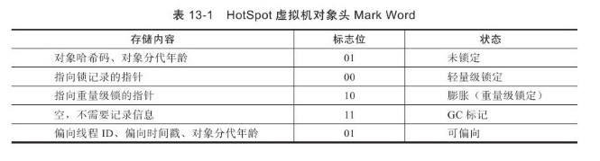
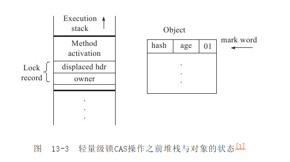
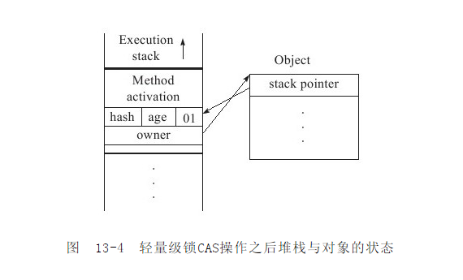
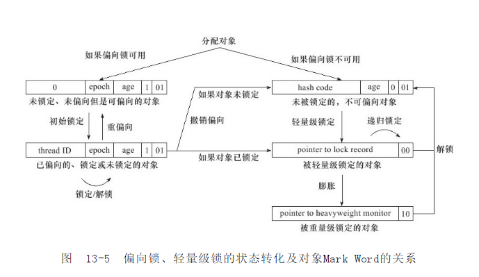

# sync锁的优化

## 1. 自旋锁与自适应锁
synchronize锁对性能最大的影响是阻塞的实现，挂起线程和恢复线程都要转入内核态完成，这些操作给系统的并发性能带来很大的压力。虚拟机的开发团队注意到在很多应用上，被锁定的数据的锁定状态只会持续很短的一段时间，为了这一很短时间去挂起和恢复线程并不值得。如果物理机有一个以上的处理器，能让两个以上的线程同时执行，就可以让后面请求锁的那个线程“稍等一下”，但不放弃处理器的执行时间，看看持有锁的线程是否很快就会释放锁。为了让线程等待，我们只需要让线程执行一个忙循环（自旋），这项技术就是所谓的自旋锁。  

自旋锁在jdk1.4.2中就已经引入，只不过默认是关闭的，在jdk1.6中默认开启。自旋锁不能代替阻塞，且先不说对处理器数量的要求，自旋等待本身虽然避免了线程切换的开销，但它任然是要占用处理器时间的，因此他适用于锁被占用时间很短的锁情况。如果锁占用的时间很长，自旋锁只会白白消耗处理器时间，而不会有任何有用的工作，反而会带来性能上的浪费。因此自旋等待时间必须有一定的限度，如果超过这个限度任然没有成功获取锁，就使用传统的方式挂起线程。自旋次数默认是10次，可以通过参数-XX:PreBlockSpin来更改。

在jdk1.6引入了自适应的自旋锁，自适应意味着自旋的时间不再固定，而是由前一次在同一个锁上的自旋时间及锁的拥有着的状态来决定。如果在同一个锁对象上，自旋等待刚刚成功获取得到锁，并且持有锁的线程正在运行，那么虚拟机认为这次自旋也很有可能再次成功，进而将允许自旋等待持续相对更长的时间。如果对于某个锁自旋很少成功获得过，那在以后要获得这个锁时将可能省略掉自旋过程，以避免浪费处理器资源。

## 2. 锁消除
锁消除是指虚拟机即时编译器在运行时，对一些代码上要求同步，但是却被检测出不可能存在共享数据竞争的锁进行消除。锁消除的主要判断依据是逃逸分析的数据支持（第11章），如果判断在一段代码中，堆上的所有数据都不会逃逸出去从而被其他线程访问到，那就可以把它们当做栈上的数据对待，因为它们是线程私有的，自然就无需进行同步加锁。

```
public String concatString（ String s1， String s2， String s3）{
     return s1+ s2+ s3 ;
}
```

有些锁并不是程序员自己加的，如上图代码，看似没有加锁，事实上在JDK1.5以后String的相加默认会转化为StringBuilder对象的append（）操作，而StringBuilder.append()方法是一个同步块，是一个加锁方法，也就是该代码默认情况下上图代码是加锁的。面对该情况jvm分析到其内部变量会不会逃逸到concatString（）方法外，其他线程永远无法访问当他们，因此虽然这里有锁，但是可以被安全的消除掉，因此在即时编译之后，这段代码就会忽略所有的同步而直接执行了。

## 3. 锁粗化
原则上，同步块的作用范围应该限制的尽量小--只在共享数据的实际作用域中才进行同步。这样是为了使得需要同步的操作数量尽可能变小，如果存在锁竞争，那等待锁的线程也能尽快拿到锁。  
大部分情况下该原则都是正确的，但是如果加锁过分细化，频繁的加解锁也会导致不必要的性能损耗。  
比如在循环体中加锁。如果jvm检测到类似在循环体加锁的情况时，会主动把加锁同步的范围扩展（粗化）到整个操作序列的外部。这样整个操作只需要一次加锁就可以了。

## 4. 轻量级锁
轻量级锁是JDK1.6加入的新型锁机制，它名字中“轻量级”是相对于使用操作系统互斥量来实现的传统锁而言。因此传统的锁就称为“重量级”锁。需要强调的是：轻量级锁并不是为了代替重量级锁的，它存在的前提是没有多线程竞争。减少传统的重量级锁使用操作系统互斥量产生的性能消耗。  
要了解轻量级锁和后边的偏向锁，必须了解hotSpot虚拟机中对象（具体来说是对象头）的内存布局。虚拟机中的对象头分为两部分信息：
* 第一部分用于存储对象运行时的数据：哈希码，GC分代年龄等（长度在32为和64为虚拟机中分别是32bit和64bit）
* 第二部分用于存储指向方法区对象类型数据的指针，如果是数组对象，还会有一个额外的部分用于存储数组长度。

在32为的hotSpot虚拟机中Mark Word的32bit中25bit用于存储对象哈希码，4bit用于存储对象分代年龄，2bit用于存储锁标志位，1bit固定为0，以下是对象在不同状态下锁标志位的存储内容：


### 4.1 轻量级锁的加锁流程如下：
1. 当代码进入同步块时，首先检查对象的锁标示位
2. 如果检查到同步对象的锁标示位为“01”（该对象没有被锁定），虚拟机首先将在当前线程的栈桢中建立一个名为锁记录（Lock Record）的空间，用于存储锁对象目前的Mark Word的拷贝（官方把这份拷贝加了一个Displaced前缀，即Display Mark Word），这时候线程堆栈与对象头的状态如下图：  

3. 然后虚拟机将采用CAS操作尝试将对象的Mark Word更新为执行Lock Record的指针。如果这个更新动作成功了，那么这个线程就拥有了该对象的锁，并且对象Mark Word的锁标示位（Mark Word的最后2bit）将转变为“00”，即表示此对象处于轻量级锁定状态，这时候线程堆栈与对象头的状态如下图：  

4. 如果这个更新操作失败了，虚拟机首先检测对象的Mark Word是否指向当前线程的栈桢，如果是说明当前线程已经拥有了这个对象的锁，那就可以直接进入同步块继续执行，否则说明这个锁对象已经被其他线程占用。如果有两条以上的线程争用同一个锁，那轻量级锁就不在有效，要膨胀为重量级锁，锁标志的状态值变为“10”，Mark Word中存储的就是指向重量级锁（互斥量）的指针，后面等待锁的线程也要进入阻塞状态。

### 4.2 轻量级锁的解锁过程
轻量级锁的解锁过程也是通过CAS操作来进行的，如果对象的Mark Word任然指向线程的锁记录，那就用CAS操作把对象当前的Mark Word和线程中复制的Displaced Mark Word替换回来，如果替换成功，整个同步过程就完成了。如果替换失败，说明有其他线程尝试获取该锁，那就要在释放锁的同时，唤醒被挂起的线程。

**提示：**  
轻量级锁能提升程序同步性能的依据是“对于绝大部分的锁，在整个同步周期内都是不存在竞争的”，这个是一个经验数据。如果没有竞争轻量级锁使用CAS操作避免了使用互斥量的开销。但如果存在锁竞争，使用轻量级锁除了互斥量的开销外，还额外发生了CAS操作，因此在有竞争的情况下，轻量级锁会比传统的重量解锁更慢。

## 5. 偏向锁
偏向锁也是JDK1.6中引入的一项锁优化，它的目的是清除数据在无竞争情况下的同步原语，进一步提高程序的运行性能。如果说轻量级锁是在无竞争的情况下使用CAS操作去消除同步使用的互斥量，那偏向锁就是在无竞争的情况下把整个同步都消除掉，连CAS操作都不做了。  
偏向锁的意识是，这个锁会偏向于第一个获取它的线程，如果在接下来的执行过程中，该锁没有被其他线程获取，则持有偏向锁的线程将永远不需要在进行同步。  
如果读懂了轻量级锁，理解偏向锁就更简单一些。假设当前虚拟机启用了偏向锁（启用参数-XX:+UseBiasedLocking，这是JDK1.6的默认值），那么当锁对象第一次被线程获取的时候，虚拟机将会把对象头中的标示位设置为“01”，即偏向模式。同时使用CAS操作把获取到这个锁的线程的ID记录在对象的Mark Word之中，如果CAS操作成功，持有偏向锁的线程以后每次进入这个锁的相关同步块时，虚拟机就可以不再进行任何同步操作（例如Locking，Unlocking及对Mark Word的update等）。  
当有另一个线程去尝试获取这个锁时，偏向模式就宣告结束。根据锁对象目前是否处于被锁定状态，撤销偏向后恢复到未锁定（标示位为01）或者轻量级锁（标示位为00）的状态，后续的同步操作就像轻量级锁那样执行。偏向锁，轻量级锁的状态转换及对象Mark Word的关系如下图：


**提示：**  
偏向锁可以提高带有同步但是无竞争的程序性能。他同样是一个带有效权衡（Trade Off）性质的优化，也就是说，它并不一定总是对程序运行有利，如果程序中大多数的锁总是被多个不同的线程访问，那偏向锁就是多余的。