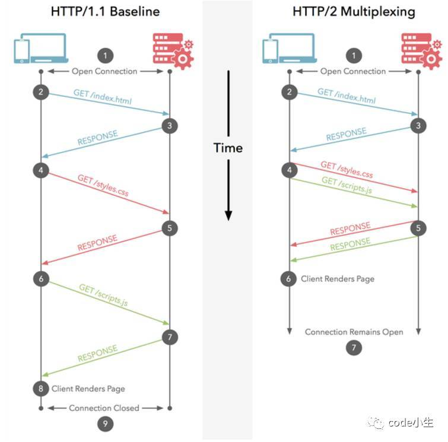

# HTTP1.0 1.1 2.0 的区别

参考文献：  
HTTP1.0、HTTP1.1 和 HTTP2.0 的区别：https://juejin.im/entry/5981c5df518825359a2b9476

# http1.1 的区别
1. 缓存处理  
在http1.0时主要是用header中的if-modified-since，expire来做缓存判断的标准，http1.1中引入了更多缓存控制策略如entity tag，if-modified-since，if-match，if-none-match等更过可供选择的缓存头来控制缓存策略。
2. 带宽优化及网络连接的使用  
http1.0中，存在一些带宽浪费，例如客户端要请求某个对象的一部分，服务端却将整个对象转送过来，并且不支持断点续传功能，http1.1则在header中添加了range头域，它允许只请求资源的某个部分，即返回码是206（partial content），这样就方便了开发者自由的选择以便充分的利用带宽和连接。
3. 错误通知的管理  
在http1.1中新增了24个错误状态码，如409（conflict）表示请求的资源与资源的当期状态发生冲突；410（gone）表示服务器上某个资源被永久的删除。
4. host头处理  
在http1.0中认为每个服务器都绑定唯一个IP地址，因此请求消息中的URL并没有传递主机名（hostName）。随着虚拟主机技术的发展，一个物理主机上可以存在多个虚拟主机，并且他们共享同一个IP地址。http1.1的请求消息和相应消息都支持host头域，且请求消息中如果没有头域会报400 bad request错误。
5. 长连接  
http1.1支持长连接（persistentConnection）和请求的流水线（pipeLineing）处理，在一个tcp连接上可以传送多个http请求和响应，减少了建立和关闭连接的消耗和延迟，在http1.1中默认开启connection：keep-alive，一定程度上弥补了http1.0每次请求都要创建连接的缺点。

# http2.0
1. 新的二进制格式（binary format）  
http1.x的解析是基于文本的，基于文本格的的解析存在天然的缺陷，文本的表现形式有多种多样，要做到健壮性考虑的场景必然很多，二进制则不同，只认识0和1的组合，基于这种考虑的http2.0的协议解析决定采用二进制格式，实现方便且健壮。
2. 多路复用（multiPlexing）  
连接共享，每一个request都是用作连接共享机制的。一个request对应一个id，这样一个链接上可以有多个request，每个连接的request都可以随机的混杂在一起，接收方可以根据request的id将request再附属到各自不同的服务端请求里面。
3. header压缩  
http1.x中header带有大量的信息，而且每次都要重复发送，http2.0使用encoder来减少需要传输的header大小，通讯双方各执cache一份header fields表，既避免了重复的的header的传输，又减少了需要传输的大小
4. 服务端推送（server push）  
可以通过服务端主动推送信息给客户端。

# Http1.1的长连接和http2.0的多路复用的区别

