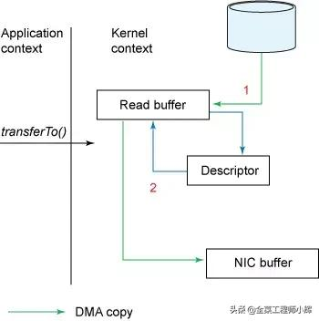

# NIO效率高的原理之零拷贝与直接内存映射

零拷贝和直接内存映射并非java独有，并且这两个技术并非等价的。

# 零拷贝
零拷贝是指避免在用户态和内核态之间来回拷贝数据的技术。

##传统的IO
传统的IO读取数据并通过网络发送的流程如下图：  


1. read()调用导致上下文从用户态切换到内核态。内核通过sys_read()（或等价的方法）从文件读取数据，DMA引擎执行一次拷贝：从文件读取数据并存储到内和空间的缓冲区中。
2. 请求的数据从内核的读缓冲区拷贝到用户缓冲区，然后read方法返回。read方法返回导致上下文从内核态切换到用户态。现在待读取的数据已经存储在用户空间内的缓冲区。至此完成了一次IO的读取过程
3. Send（）调用导致上下文从用户态切换到内核态。第三次拷贝数据从用户空间重新拷贝到内核空间缓冲区。但是这一次，数据被写入一个不同的缓冲区，一个与目标套接字相关联的缓冲区。
4. Send（）系统调用返回导致第四次上下文切换。当DMA引擎将数据从内核缓冲区传输到协议引擎缓冲区时，第四次拷贝是独立异步的。

> 内存缓冲数据（上图中的Read Buffer和Socket Buffer）主要是为了提高性能，内核可以预读部分数据，当所需数据小于内存缓冲区大小时，将极大的提高性能

## IO的内核切换
磁盘到内核空间属于DMA拷贝，用户空间与内核空间之间的数据传输并没有类似DMA这种不需要CPU参与的传输方式，因此用户空间与内核空间之间的数据传输是需要CPU全程参与的。所以为了避免不必要的CPU数据拷贝过程，就有了零拷贝技术的出现。

> DMA拷贝即直接内存存取，原理是外部设备不通过CPU而直接与系统内存交换数据。

## NIO的零拷贝
NIO的零拷贝通过TransferTo方法实现。TransferTo方法将数据从FileChannel对象传送到可写的字节通道（如Socket Channel等），TransferTo的内部实现中，由Native方法TransferTo0来实现，它依赖底层操作系统的支持。在UNIX和Linux系统中，调用这个方法会引起SendFile()系统调用，实现了数据直接从内核的读缓冲区传递到套接字缓冲区，避免了用户态与内核态之间的数据拷贝。


1. transferTo方法触发DMA引擎将文件上下文信息拷贝到内核缓冲区，接着内核将数据从内核缓冲区拷贝到与套接字相关联的缓冲区。
2. DMA引擎将数据从内核套接字缓冲区传输到协议引擎（第三次数据拷贝）

内核态与用户态的切换如下图：  


相比传统的IO，使用NIO后改进的地方有：  
1. 将上下文切换从4次减少到2次
2. 将数据拷贝次数从4次减少到3次（其中只有一次涉及到CPU拷贝，另外两次都是DMA直接存取）

如果底层NIC（网络接口卡）支持gather操作，可以进一步减少内核中的数据拷贝。在Linux2.4以及更高版本的内核中，Socket缓冲区描述符已经修改用来适应这个需求。这种方法不但减少了上下文切换，同时消除了CPU参与的数据拷贝的操作。  



用户这边使用方法不变，依然调用transferTo方法，但是方法的内部实现发生了变化：  
1. TransferTo方法调用触发DMA引擎将文件上下文信息拷贝到内核缓冲区。
2. 数据不会再被拷贝到套接字缓冲区，只有数据的描述符（包括数据位置和长度）被拷贝到套接字缓冲区。DMA引擎直接将数据从内核缓冲区拷贝到协议引擎中，这样减少了最后一次需要CPU拷贝的操作。  

* NIO的零拷贝适用于以下场景：  
1. 文件较大，读写较慢，追求速度。
2. JVM内存不足，不能加载太大数据。
3. 内存带宽不够，即其他程序和线程存在大量的IO操作，导致内存带宽变小。

NIO零拷贝代码示例：  

```
/**
 * filechannel进行文件复制（零拷贝）
 *
 * @param fromFile 源文件
 * @param toFile 目标文件
 */
public static void fileCopyWithFileChannel(File fromFile, File toFile) {
 try (// 得到fileInputStream的文件通道
 FileChannel fileChannelInput = new FileInputStream(fromFile).getChannel();
 // 得到fileOutputStream的文件通道
 FileChannel fileChannelOutput = new FileOutputStream(toFile).getChannel()) {

 //将fileChannelInput通道的数据，写入到fileChannelOutput通道
 fileChannelInput.transferTo(0, fileChannelInput.size(), fileChannelOutput);
 } catch (IOException e) {
 e.printStackTrace();
 }
}

static final int BUFFER_SIZE = 1024;
/**
 * BufferedInputStream进行文件复制（用作对比实验）
 *
 * @param fromFile 源文件
 * @param toFile 目标文件
 */
public static void bufferedCopy(File fromFile,File toFile) throws IOException {
 try(
    BufferedInputStream bis = new BufferedInputStream(new FileInputStream(fromFile));
    BufferedOutputStream bos = new BufferedOutputStream(new FileOutputStream(toFile));
    byte[] buf = new byte[BUFFER_SIZE];
    while ((bis.read(buf)) != -1) {
        bos.write(buf);
    }
 )
}
```

**在不需要进行数据文件操作时，可以使用NIO的零拷贝。但是如果既要IO速度，有需要进行数据操作，则需要使用NIO的直接内存映射来实现。**

# 直接内存映射
Linux提供了MMAP系统调用，它可以将一段用户空间内存映射到内核空间，当映射成功后，用户对这段内存区域的修改可以直接反映到内核空间；同样的内核空间对这段区域的修改也可以直接反映到用户空间。因为有了这样的映射关系，就不需要再用户态和内核态之间进行数据拷贝了，从而提高了数据传输的效率。

## NIO的直接内存映射
JDK1.4加入了NIO机制和直接内存映射功能，目的是防止Java对和Native堆之间复制带来的性能损耗，此后NIO可以使用Native的方式直接在Native堆分配内存。  

> JVM堆内数据在Flush到远程时，会先复制到Native堆，然后再发送；直接移到堆外就更快了。在JDK8中Native Memory包含元空间和Native堆。更多JVM的知识，点击查看[JVM内存模型和垃圾回收机制](https://www.toutiao.com/i6715393041059807752/?group_id=6715393041059807752)。


## 直接内存创建
在ByteBuffer由两个子类，HeapByteBuffer和DirectByteBuffer。前者是存在于JVM堆内的，后者是存在于Native堆中的。


相关内存的申请操作：  
```
//申请堆内存
public static ByteBuffer allocate(int capacity) {
 if (capacity < 0)
 throw new IllegalArgumentException();
 return new HeapByteBuffer(capacity, capacity);
}

//申请直接内存
public static ByteBuffer allocateDirect(int capacity) {
 return new DirectByteBuffer(capacity);
}
```

## 使用直接内存的原因
1. 对垃圾回收停顿的改善。因为Full Gc时，垃圾收集器会对所有分配的堆内存进行扫描，垃圾收集对Java应用造成的影响，跟堆的大小是成正比的。过大的堆会影响java应用的性能。如果使用堆外内存的话，堆外内存是直接受操作系统管理的。这样做的结果是能保持一个较小的JVM堆内存，以减少垃圾回收时对应用造成的影响。（Full GC时会触发堆外空闲空间内存的回收）
2. 减少了数据从JVM拷贝到Native堆的次数，在某些场景下可以提升程序IO的性能
3. 可以突破JVM内存限制，操作更多的物理内存

> 当直接内存不足时会触发Full GC，排查Full GC的时候一定要考虑

## 使用只鹅接内存存在的问题
1. 堆外内存难以控制，如果内存泄露，那么很难排查（VisualVM可以通过安装插件来监控堆外内存）
2. 堆外内存只能通过序列化和反序列化来存储，保存对象的速度比堆内慢，不适合存储很复杂的对象。一般简单的对象和扁平化的比较合适
3. 直接内存的访问速度（读写方面）会快于堆内存。在申请内存空间时，堆内存速度高于直接内存。

直接内存适合申请次数少，访问频繁的场景。如果内存空间需要频繁的申请，则不适合直接内存。

## NIO的直接内存映射
NIO中一个重要的类MappedByteBuffer——java NIO引入的文件内存映射方案，读写性能极高。MappedByteBuffer将文件直接映射到内存。可以映射整个文件，如果文件比较大的话可以考虑分段进行映射，只要指定文件的感兴趣部分就可以了。  
由于MappedByteBuffer申请的是直接内存，因此不受Minor GC的控制，只能在Full GC时才能被回收，因此Java提供了DirectByteBuffer类来改善这一情况。它是MappedByteBuffer类的子类，同时他实现了DirectBuffer接口，维护了一个Cleaner对象来完成内存回收。因此它既是可以通过Full GC来回收内存，也可以通过调用clean（）方法来进行回收。  

## NIO的直接内存映射的函数调用
FileChannel提供了Map方法来把文件映射为内存对象：  
MappedByteBuffer map(int mode, long position, long size);  
可以把文件从position开始的size大小的区域映射为内存对象，mode指出了可访问该内存映像文件的方式：  
* READ_ONLY：只读方式，试图修改该缓冲区将导致抛出异常。
* READ_WRITE：读写模式，对得到的缓冲区的更改最终将传递到文件上；该更改对映射到同一文件的其他程序不一定是可见的。
* PRIVATE：专用模式，对得到缓冲区的更改不会传播到文件，并且该更改对映射到同一文件的其他程序也是不可见的；相反会创建缓冲区已修改部分的专用副本。

> 使用参数-XX：MaxDirectMemorySize=10M，可以指定DirectByteBuffer的大小最多是10M

直接内存映射代码示例：  

```
static final int BUFFER_SIZE = 1024;

/**
 * 使用直接内存映射读取文件
 * @param file
 */
public static void fileReadWithMmap(File file) {

 long begin = System.currentTimeMillis();
 byte[] b = new byte[BUFFER_SIZE];
 int len = (int) file.length();
 MappedByteBuffer buff;
 try (FileChannel channel = new FileInputStream(file).getChannel()) {
 // 将文件所有字节映射到内存中。返回MappedByteBuffer
 buff = channel.map(FileChannel.MapMode.READ_ONLY, 0, channel.size());
 for (int offset = 0; offset < len; offset += BUFFER_SIZE) {
 if (len - offset > BUFFER_SIZE) {
 buff.get(b);
 } else {
 buff.get(new byte[len - offset]);
 }
 }
 } catch (IOException e) {
 e.printStackTrace();
 }
 long end = System.currentTimeMillis();
 System.out.println("time is:" + (end - begin));
}

/**
 * HeapByteBuffer读取文件
 * @param file
 */
public static void fileReadWithByteBuffer(File file) {

 long begin = System.currentTimeMillis();
 try(FileChannel channel = new FileInputStream(file).getChannel();) {
 // 申请HeapByteBuffer
 ByteBuffer buff = ByteBuffer.allocate(BUFFER_SIZE);
 while (channel.read(buff) != -1) {
 buff.flip();
 buff.clear();
 }
 } catch (IOException e) {
 e.printStackTrace();
 }
 long end = System.currentTimeMillis();
 System.out.println("time is:" + (end - begin));
}

```

参考文档：  
NIO效率高的原理之零拷贝与直接内存映射：https://www.toutiao.com/i6722656646830490126/?group_id=6722656646830490126