# 看懂Netty世界
netty时Jboss提供的基于JavaNIO的开源框架，Netty提供了异步非阻塞，事件驱动，高性能，高可靠，高可定制性的网络应用程序和工具，可以用于开发服务器端和客户端。  

## netty是什么
Netty是一个高性能的异步事件驱动的NIO框架，基于Java NIO提供的API实现。他提供了对于TCP，UDP和文件传输的支持。作为一个异步框架，他的所有IO操作都是异步非阻塞的，通过Future-Listener机制，用户可以方便的主动获取或者通过通知机制获得IO的操作结果。

## Netty线程模型
在Java NIO方面Selector给Reactor模式提供了基础，Netty结合Selector和Reactor模式设计了高效的线程模型。

## Reactor模式

首先Reactor模式是事件驱动的，有一个或者多个并发输入源，有一个Server Handler和多个Request Handlers，这个Service Handler会同步的将输入的请求多路服用的分发给相应的Request Handler。其流程大致如下图：  

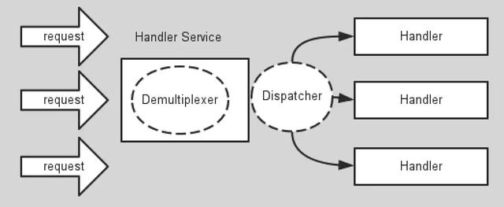

从结构上类似与生产者和消费者模式，即一个或多个生产者将事件放入queue中，一个或多个消费者主动消费这个队列。而Reactor模式没有Queue来做缓冲，每当有事件输入到Service Handler之后，该Service Handler会主动根据不同的Event类型将其分发给对应的Request Handler来处理。

## Reactor的模式实现

### 第一种实现模型

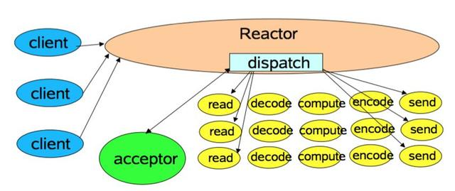

这是最简单的Reactor单线程模型，由于Reactor模式使用的是异步非阻塞的IO，所有的IO操作都不会阻塞，理论上一个线程可以独立处理所有的IO操作。这时的Reactor线程是个多面手，负责多路分离套接字，Accept新的连接，分发请求到处理链路中。对于一些小容量应用场景，可以使用这种单线程模型。不适合高负载大并发的应用场景。

缺陷： 
1.  当一个NIO线程同时处理成百上千的链路，性能上无法支撑，即使NIO线程的CPU负载达到100%，也无法完全处理消息。
2. 当NIO线程负载过重后，处理速度会变慢，会导致大量客户端连接超时，超时之后往往会重发，会加重NIO线程的负载。
3. 可靠性低，一个线程意外死循环，会导致整个通讯系统不可用。

为了解决这个问题，出现了Reactor多线程模型

### Reactor多线程模型

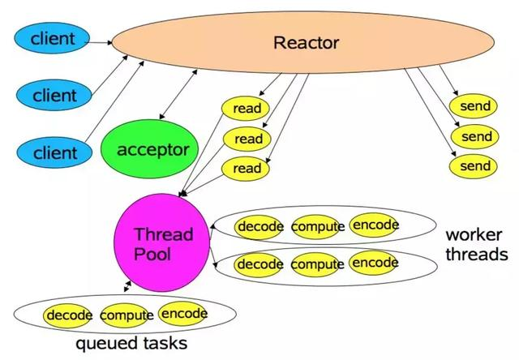

相比上一种模式，该模式在处理链部分采用了多线程（线程池）  
在绝大多数场景下，该模式都能满足性能需求，但是在一些特殊的场景下，比如服务器会对客户端的握手消息进行安全认证。这类场景下，单独的一个Acceptor线程可能会存在性能不足的问题。  
为了解决这种问题，产生了第三种Reactor线程模型。  

### Reactor主从模型

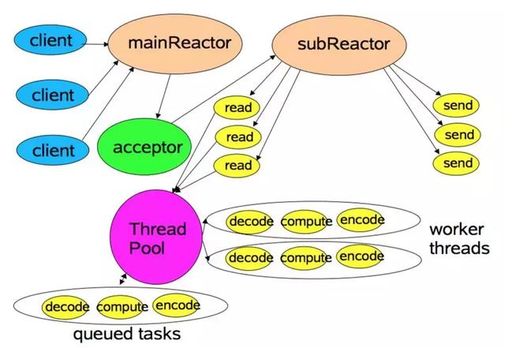

该模型相比于第二种模型，是将Reactor分为两部分，MainReactor负责监听server socket，accept新的连接；并将建立的socket分派给subReactor。  
subReactor负责多路分离已连接的socket，读写网络数据，对业务处理功能，其扔给worker线程池完成。通常，subReactor个数上可与cpu个数等同。  

## Netty模型

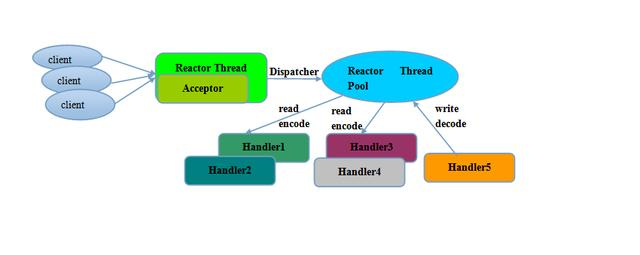

其实Netty的模型是Reactor模型的变种，那就是去掉线程池的第三种模型的变种，这也是Netty NIO的默认模式。Netty的Reactor模式的参与者主要有以下几种组件：  
1. Selector
2. EventLoopGroup/EventLoop
3. ChannelPipeline

Selector即为NIO提供的的SelectableChannel多路复用器，充当着Demultiplexer的角色，这里不在赘述；下面对另外两个组件在Netty的Reactor模式中扮演的的角色进行介绍。

### EventLoopGroup/EventLoop

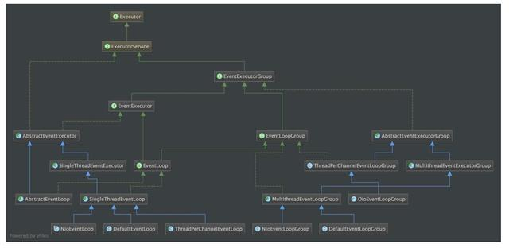

当系统在运行过程中，如果频繁的进行线程上下文切换，会带来额外的性能损耗。  
多线程并发执行某个业务流程，业务开发者还需要时刻对线程安全保持警惕，那些数据可能会被并发修改，如何保护？这不仅降低了开发效率，也带来了额外的性能损耗。为了解决这个问题Netty采用了串行化的设计理念。  
从消息的读取，编码以及后续Handler的执行，始终都由IO线程EventLoop负责，这就意味着整个流程不会进行县城上下文的切换，数据也不会面临被并发修改的危险。这也解释了为什么Netty线程模型去掉了Reactor主从模型中的线程池。  
EventLoopGroup是一组EventLoop的抽象，EventLoopGroup提供next接口，可以从一组EventLoop里面按照一定规则获取其中一个EventLoop来处理任务。对于EventLoopGroup这里需要了解的是，在Netty服务器编程中我们需要BossEventLoopGroup和WorkEventLoopGroup两个EventLoopGroup来进行工作。  
通常一个服务器端口即一个ServerSocketChannel对应一个Selector和一个EventLoop线程，也就是说BossEventLoopGroup的线程参数是1。BossEventLoop负责接收客户端的连接并将SocketChannel交给WorkerEventLoopGroup来进行IO处理。EventLoop的实现充当Reactor模式中的分发器（Dispatcher）的角色。

### ChannelPipeLine

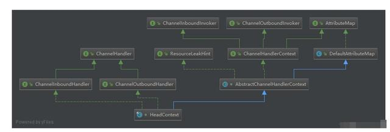

ChannelPipeline其实是担任着Reactor模式中的请求处理器这个角色。  
ChannelPipeLine的默认实现是DefaultChannelPipeline，DefaultChannelPipeline本身维护着一个用户不可见的Tail和Head的ChannelHandler，他们分别位于链表队列的头部和尾部。Tail在更上层的部分而Head在更靠近网络层的方向。  
在Netty中关于ChannelHandler有两个重要的接口：ChannelInBoundHandler和ChannleOutBoundHandler。InBound可以理解为网络数据从外部流向系统内部，OutBound则是网络数据从系统内部流向系统外部。  
用户实现ChannelHandler可以根据需要实现其中的一个或者多个接口，将其放入Pipeline中的链表队列中，ChannelPipeline会根据不同的IO事件类型来调用相应的Handler进行处理。同时链表队列是责任链模式的一个变种，至上而下或者至下而上所有满足事件关联的Handler都会对事件进行处理。  
ChannelInBoundHandler：对客户端发往服务器的报文进行处理，一般用来执行粘包拆包，解码，读取数据，业务处理等工作；  
ChannelOutBoundHandler：对从服务器发往客户端的报文进行处理，一般用来进行编码，发送报文到客户端。  
下图是对ChannelPipeling执行过程的说明：  

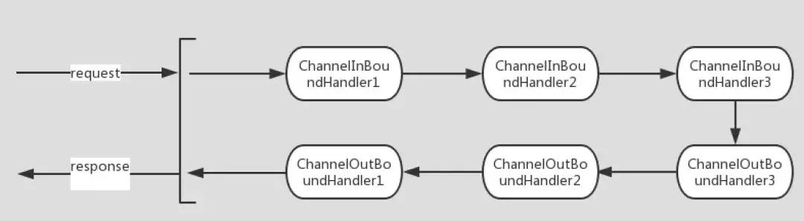

### Buffer

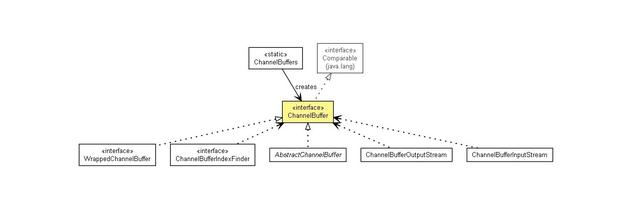

Netty提供的经过扩展的Buffer相对于NIO中的原生buffer有了很多优势，作为数据存取非常重要的一块，我们来看看Netty中的Buffer有什么特点。

#### ByteBuf读写指针
在ByteBuffer中，读写指针都是Position，而在ByteBuf中，读写指针分别为ReaderIndex和WriterIndex，直观上看ByteBuffer仅用一个指针就实现了两个指针的功能，节省了变量，但是当对于ByteBuffer的读写状态切换的时候，必须要掉用Flip方法，而当下一次写之前，必须要将Buffer中的内容读完，再调用Clear方法。每次读之前调用Flip，写之前调用Clear，这样无疑给开发带来了繁琐的步骤，而且内容没有读完之前是不能写的，这样非常不灵活。相比之下ByteBuf在读的时候仅依赖readerIndex指针，写的时候仅仅依赖writerIndex指针，不需要每次读写之前调用对应的方法，而且没有必须一次读完的限制。

#### 零拷贝

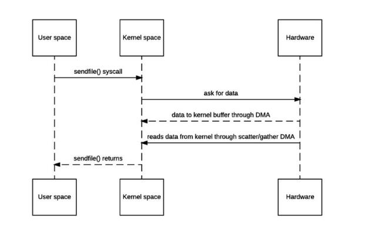

Netty的接收和发送ByteBuffer采用Direct Buffer，使用堆外直接内存进行Socket读写，不需要进行字节缓冲区饿二次拷贝。如果使用传统的堆内存进行Socket读写，JVM会将堆内存Buffer拷贝一份到直接内存中，然后才写入Socket中。相比之下会多了一次缓冲区的内存拷贝操作。  
Netty提供了组合Buffer对象，可以聚合多个ByteBuffer对象，用户可以像操作一个Buffer那样方便的对组合的Buffer进行操作，避免了传统通过内存拷贝的方式将几个Buffer合并为一个大的Buffer。  
Netty的文件传输采用了TransferTo方式，它可以直接将文件缓冲区的数据发送到目标Channel，避免了传统的通过循环Write方式导致的内存拷贝问题。  

#### 引用计数与池化技术

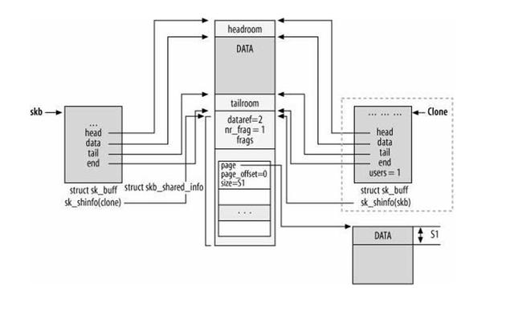

在Netty中每一个被申请的Buffer对于Netty来说都可能是很宝贵的资源，因此为了获得对于内存的申请与回收更多的控制权，Netty自己根据引用计数器来实现了对直接内存的管理。Netty申请的直接内存虽然大大提高了IO操作的效率，但是直接内存和堆内存相比除了IO操作效率更高之外还天生有一个缺陷，即对直接内存的申请相比HeapBuffer效率更低。Netty为了更高效的管理直接内存，结合计数器实现了PolledBuffer，即池化的方式，当计数器等于0的时候，Netty将Buffer回收到池中，在下一次申请Buffer的某个时刻直接复用池中的Buffer。

## 总结
Netty其实本质上就是Reactor模式的实现，Selector做为多路复用器，EventLoop作为转发器，Pipeline作为事件处理器。  
但是和一般的Reactor不同的是，Netty使用串行化的实现方式，并在Pipeline中使用了责任链模式，同时Netty中的Buffer相对于NIO中原始的Buffer又做了优化，进一步提高了性能。

参考文档：  
高性能：《一遍文章带你看懂 Netty世界》：https://www.toutiao.com/i6706828472330748419/  
彻底理解Netty，这一篇文章就够了：https://juejin.im/post/5bdaf8ea6fb9a0227b02275a  
探秘Netty7：一篇文章，读懂Netty的高性能架构之道:https://blog.csdn.net/a724888/article/details/80771791