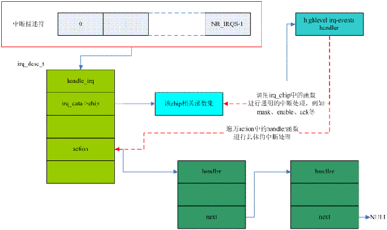

## 内核中断原理解析
[中断原理](https://blog.csdn.net/ls152121349/article/details/51683755)  

## 内核epoll原理解析
[epoll原理](https://blog.csdn.net/HDUTigerkin/article/details/7517390)
大话 Select、Poll、Epoll：https://cloud.tencent.com/developer/article/1005481

[Undertow,Tomcat和Jetty服务器配置详解与性能测试](https://www.cnblogs.com/maybo/p/7784687.html)