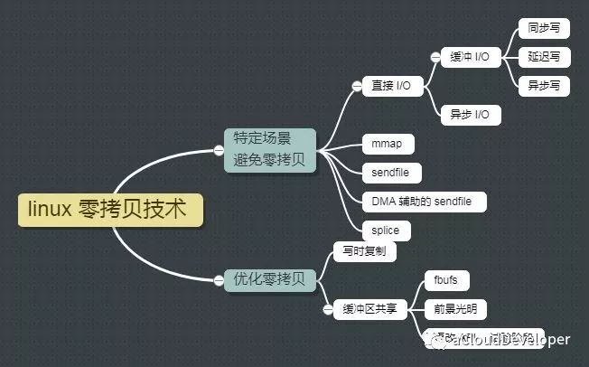
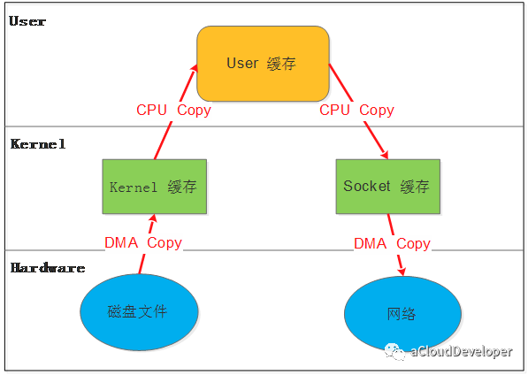
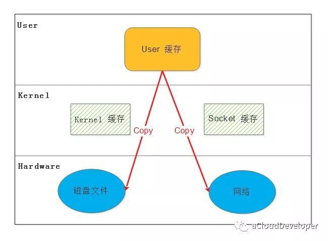
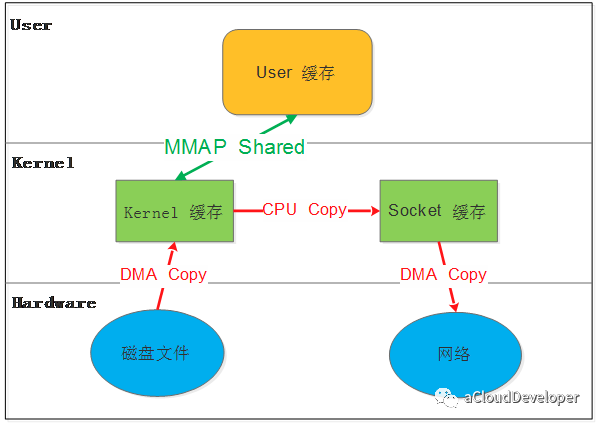
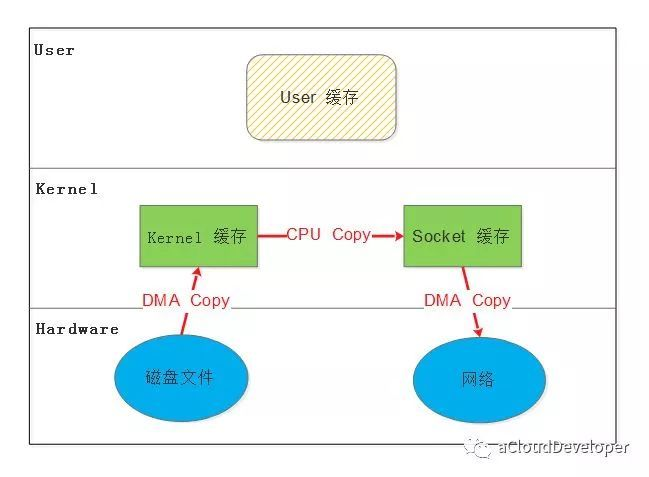
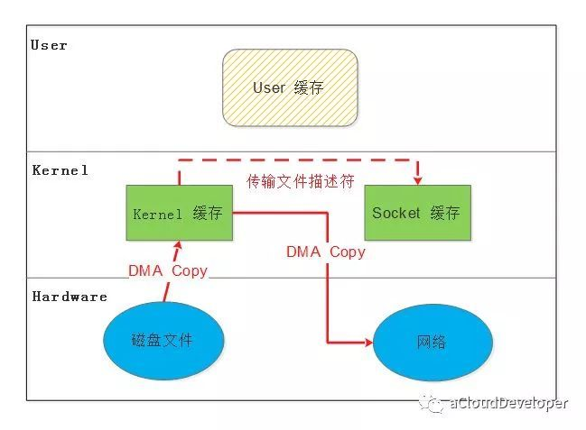
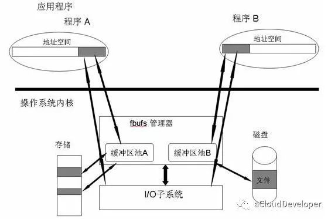
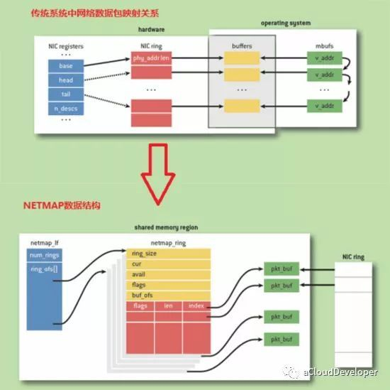

# Linux零拷贝技术，看完这篇文章就懂了

## 为什么需要零拷贝
传统的Linux系统的I/O接口（read,write）时基于数据拷贝的，也就是数据都是copy_to_user或者copy_from_user,这样做的好处是，通过中间缓存的机制，减少磁盘的I/O的操作，但是坏处也很明显，大量的数据拷贝，用户态和内核态的频繁切换，会消耗大量的CPU资源，严重的影响数据传输的性能，有数据表明，在Linux内核协议栈中，这个拷贝耗时甚至占到了数据包正格处理流程的57.1%

## 什么是零拷贝
零拷贝就是这个问题的一个解决方案，通过尽量避免拷贝操作来缓解CPU的压力。Linux下常见的零拷贝技术可以分为两大类：  
* 针对特定场景去掉不必要的拷贝
* 优化整个拷贝的过程  

由此可见零拷贝并没有真正做到“0”拷贝，他更多的是一种思想，很多零拷贝就是基于这个思想来做优化。

## 零拷贝的几种实现



### 原始的数据拷贝操作
在介绍之前先看一下Linux原始的数据拷贝操作流程，如下例子，假设某个应用需要从磁盘读取文件然后通过网络发出去：  
```
while((n = read(diskfd, buf, BUF_SIZE)) > 0)
write(sockfd, buf , n);
```

那么整个流程需要经历如下步骤：  
1. read将数据从磁盘文件通过DMA等方式拷贝到内核开辟的缓冲区
2. 数据从内核缓冲区复制到用户态缓冲区
3. write将数据从用户态缓冲区复制到内核协议栈开辟的socket缓冲区
4. 数据从socket缓冲区通过DMA拷贝到网卡上发送出去



由上图可见，整个过程发生了至少四次数据拷贝，其中两次是DMA与硬件通信来完成的，CPU不直接参与，去掉这两次，仍然有两次的CPU数据拷贝操作发生。

### 方法一：用户态直接I/O
这种方法可以使应用程序或者运行在用户态的库函数直接访问硬件设备，数据直接跨过内核进行传输，内核在整个数据传输过程中除了进行必要的存储配置工作之外，不参与其他任何工作，这种方式能够直接绕过内核，极大地提高了性能。  



缺陷：  
1. 这种方法只适合那些不需要内核缓冲区处理的应用程序，这些应用程序通常是在进程地址空间有自己的数据缓存机制，称为自缓存应用程序，如数据库管理系统
2. 这种方法直接操作磁盘I/O，由于CPU和磁盘IO之间的执行时间差距，会造成资源的浪费，解决这个问题需要和一部IO结合使用

### MMAP
使用MMAP来代替read可以减少一次拷贝操作
```
buf = mmap(diskfd, len);
write(sockfd, buf, len);
```



应用程序调用MMAP，磁盘文件中的数据通过MMAP拷贝到内核缓冲区，接着操作系统会将这个缓冲区与应用程序共享，这样就不用往用户空间拷贝，应用程序调用write，操作系统直接将数据从内核缓冲区拷贝到socket缓冲区，最后在通过DMA拷贝到网卡发送出去。  
缺陷：  
1. MMAP隐藏着一个陷阱，当MMAP一个文件时，如果这个文件被另一个进程所截获，那么write系统调用会因为访问非法地址呗SIGBUS信号终止，SIGBUS默认杀死进程并产生一个coreDump，如果服务器被这样终止，那损失就很大了。  
解决这个问题通常使用文件的租借锁：首先为文件生成一个租借锁，当其他进程要截获这个文件时，内核会发送一个实时的RT_SIGNAL_LEASE信号，告诉当前进程有进程在试图破坏文件，这样write再被SIGBUS杀死之前，会被中断，返回已经写入的字节数，并设置errno为success。  
通常的做法是在MMAP之前加锁，操作完之后解锁。  

### 方法三：sendFile
从Linux2.1版内核开始，Linux引入了sendFile，也能减少一次拷贝。

```
#include<sys/sendfile.h>
ssize_t sendfile(int out_fd, int in_fd, off_t *offset, size_t count);
```

sendFile是自发生在内核态的数据传输接口，没有用户态的参与，自然避免了用户数据拷贝。他指定在in_fd和out_fd之间传输数据，其中它规定in_fd指向的文件必须是可以MMAP的，out_fd必须指向一个套接字，也就是规定数据只能从文件传输到套接字，反之则不行。sendFile不存在象MMAP时文件被截获的情况，它自带异常处理机制。  



缺陷：  
只能适用于那些不需要用户态处理的应用程序

### 方法四：DMA辅助的sendFile
常规的sendFile还有一次内核态的拷贝操作，能不能也把这次拷贝去掉呢？答案就是这种DMA辅助的sendFile。  
这种方法借助硬件的帮助，在数据从内核缓冲区到socket缓冲区这一步操作上，并不是拷贝数据，而是拷贝缓冲区的描述符，待完成后，DMA引擎直接将数据从内核缓冲区拷贝到协议引擎中去，避免了最后一次拷贝。  



缺陷：  
1. 除了3.4中的缺陷，还需要硬件和驱动程序的支持
2. 只适用于将数据从文件拷贝到套接字上

### 方法五：splice
splice去掉了sendFile的适用范围限制，可以用于任意两个文件描述符中传输数据  

```
#define _GNU_SOURCE         /* See feature_test_macros(7) */
#include <fcntl.h>
ssize_t splice(int fd_in, loff_t *off_in, int fd_out, loff_t *off_out, size_t len, unsigned int flags);
```

但是splice也有局限，它使用了Linux的管道缓冲机制，所以他的两个文件描述符参数中至少有一个必须是管道设备。  
splice提供了一种流控制机制，通过预先定义的水印（waterMark）来阻塞写请求，有实验表明，利用这种方法将数据从一个磁盘传输到另外一个磁盘会增加30%~70%的吞吐量，CPU负载也会减少一半。  
缺陷：  
1. 同样只适用于不需要用户态处理的程序
2. 传输描述符至少有一个是管道设备

### 方法六：写时复制
在某些情况下，内核缓冲区可能被多个进程所共享，如果某个进程想要这个共享区进行write操作，由于write不提供任何的锁操作，那么就会对共享区的数据造成破坏，写时复制就是Linux引入来保护数据的。  
写时复制，就是当多个进程共享同一块数据时，如果其中的一个进程需要对这个数据进行修改，那么就需要将其拷贝到自己的地址空间中，这样做并不影响其他的进程对这块数据的操作，每个进程要修改的时候也会进行拷贝。这种方法在某种程度上能降低系统开销，如果某个进程永远不会对所访问的数据进行更改，那么也就永远不需要拷贝。  
缺陷：  
需要MMU的支持，MMU需要自导进程地址空间中哪些页面时自读的，当需要往这些页面写数据时，发出一个异常给操作系统内核，内核会分配新的存储空间来供写入需求。

### 方法七：缓冲区共享
这种方法完全改写了IO操作，因为传统的IO是基于数据拷贝的，要避免拷贝，就去掉原先的那套接口，重新改写，所以这种方法时比较全面的零拷贝，目前比较成熟的方案是在Solaris上实现的FBUF（Fast Buffer快速缓冲区）。  
Fbuf的思想是每个进程都维护者一个缓冲区池，这个缓冲区池能同时被映射到程序地址空间和内核地址空间，内核和用户共享这个缓冲区池，这样就避免了拷贝。  



缺陷：  
1. 管理共享缓冲区池需要应用程序，网络软件，设备驱动程序之间紧密合作
2. 需要改写API尚处于试验阶段

### 高性能网络IO框架-netMap
netMap是基于共享内存的思想，是一个高性能收发原始数据包的框架，由Luigi Rizzo等人开发完成的，其包含了内核模块以及用户态库函数。其目标是：不修改现有操作系统软件以及不需要特殊硬件支持，实现用户态和网卡之间数据包的高性能传递。  



在netMap框架下内核拥有数据包池，发送环、接收环上的数据包不需要动态申请，有数据到达网卡时，当有数据到达后，直接从数据包池中取出一个数据包，然后将数据放入此数据包，再将数据包的描述符放入接收环中。内核中的数据包池，通过MMAP技术映射到用户空间。用户态程序最终通过netmap_if获取接收发送环netmap_ring，进行数据包的获取发送。  

## 总结
1. 零拷贝本质上是一种优化思想。
2. 直接IO，MMAP，sendFile，DMA sendFile，splice，缓冲区共享，写时复制....


参考文档：  
Linux零拷贝技术，看完这篇文章就懂了：https://www.toutiao.com/i6719984199803077123/