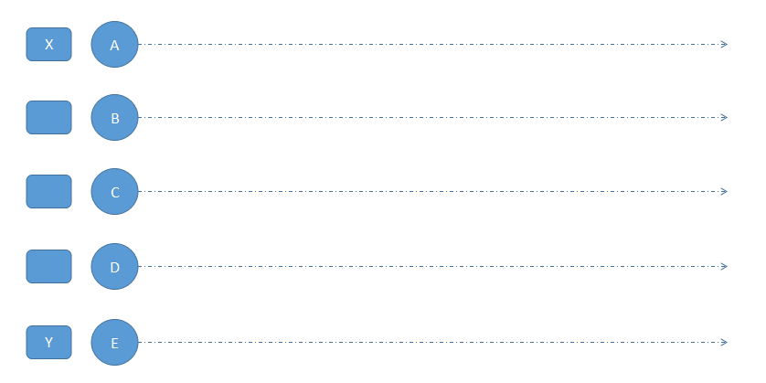
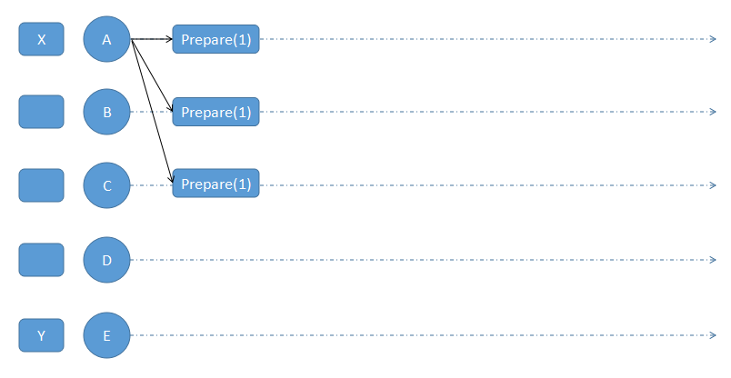
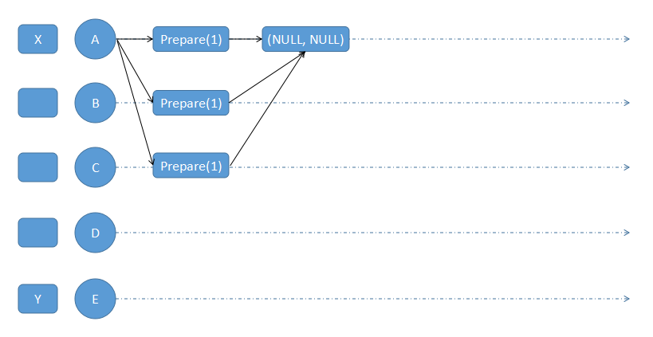
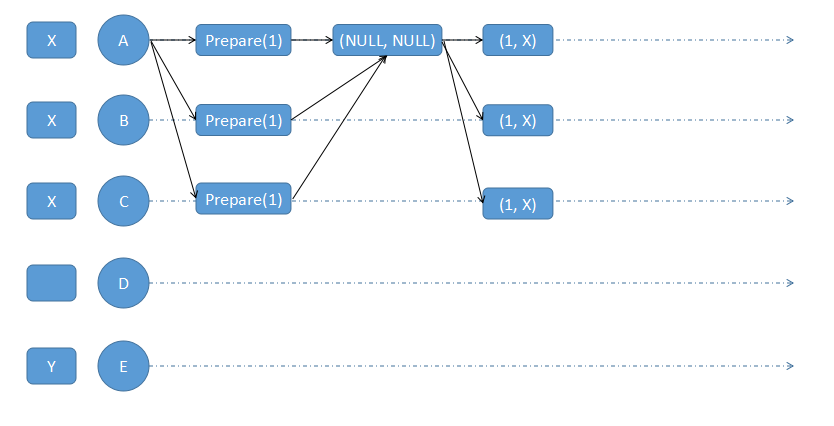
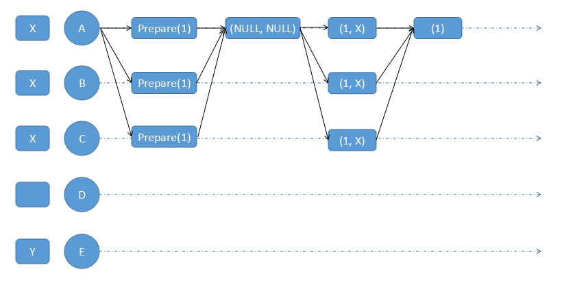
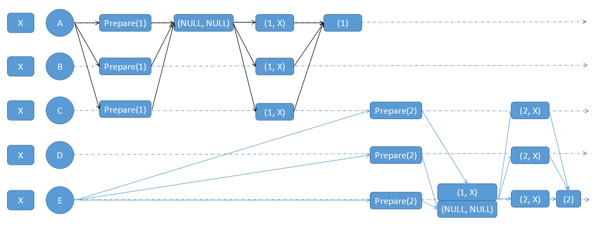
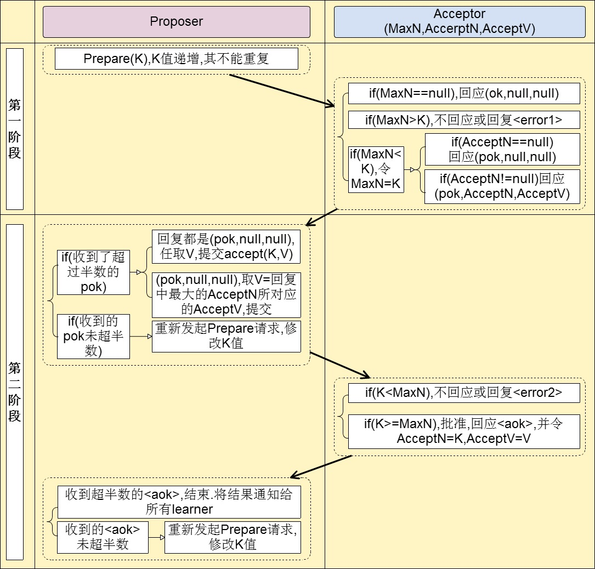

# paxos算法通俗版
## 基本概念
Paxos算法可分为两种：
* Single-Decree Paxos：决策单个Value
* Multi-Paxos：连续决策多个Value，并且保证每个节点上的顺序完全一致，多Paxos往往是同时进行多个单Paxos协议共同执行的结果。

本文只关注单Paxos的原理，理解了单Paxos，多Paxos也不难理解

## Paxos协议中的三种角色
* 倡议者Proposer：提出提议以供投票选择
* 接受者Acceptor：对提议进行投票表决，提议有超过半数接受者投票即选中
* 学习者Learner：学习者无权投票，只是从接受者哪里获知那个提议被选中

在协议中，每个节点可以同时扮演以上多个角色。

## Paxos的特点
* 一个或者多个节点可以提出提议
* 系统必须针对所有提案中的某个提案达成一致（超过半数接受者选中）
* 最多只能对一个确定的提议达成一致
* 只有超过半数的节点存活且可以相互通信，整个系统一定能达成一致状态

## 协议图示

如上图假如：A节点打算提议X值，E节点打算提议Y值，其他节点没有提议。此时A节点广播他的提议（也会发送给自己），由于网络延迟原因，只有A，B，C节点收到了。

  
  

A,B,C在接收到提议后，由于这是他们第一次收到的提议，AcceptedProposal和acceptdValue都为空。

  

由于A节点已经收到超过半数的节点的响应，且返回的AcceptedValue都是空，因此他可以用X作为提议值来发出Accept请求，A，B，C接收到请求后，将AcceptedValue更新为X

A，B,C会发出minProposal给A，A检查发现没有大于1的minProposal出现，此时X理论上已经被选中了。分析D,E节点的情况。

此时E节点选择Proposal ID为2发送Prepare请求，因为C节点已经接受了A节点的提议，他会告诉E节点他的选择，E节点在接收到C,D,E节点的回复后发现D,E为返回的已接受节点值为空而C节点返回了他最近接收的值为X，E节点就会汇总所有节点返回结果中序号最大的Value作为新的Value，来发起Accept请求，即使用X作为提议值，至此整个分布式系统达成一致性，大家都选择了X

## 两阶段提交图示

参考文档：  
http://blog.jobbole.com/106327/  
https://blog.csdn.net/yexiaomodemo/article/details/80286952