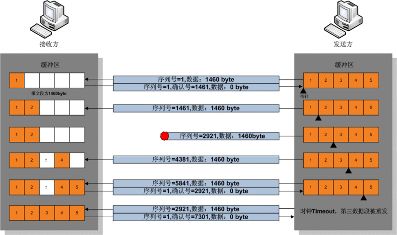
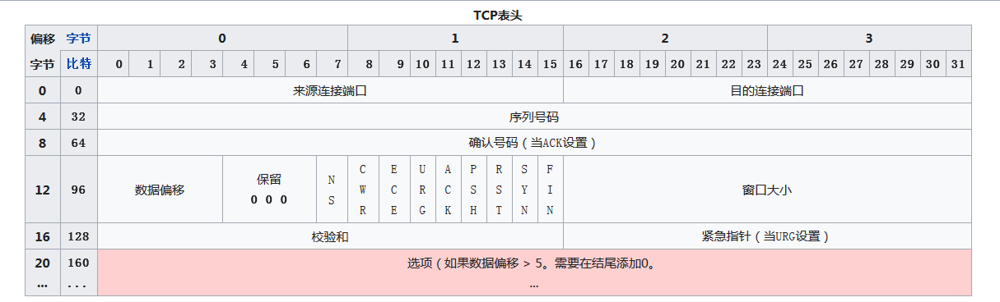

# tcp协议
参考文档：
传输控制协议：https://zh.wikipedia.org/wiki/%E4%BC%A0%E8%BE%93%E6%8E%A7%E5%88%B6%E5%8D%8F%E8%AE%AE  
一篇文章带你熟悉TCP/IP协议：https://juejin.im/post/5a069b6d51882509e5432656  
深入浅出TCP/IP协议栈：https://www.cnblogs.com/onepixel/p/7092302.html

传输控制协议tcp协议（Transmission Control Protocol）是一种面向连接的，可靠的，基于字节流的传输层通讯协议，由IETF的RFC 793定义。在简化的计算机OSI模型中，它完成第四层传输层所指定的功能。用户数据报协议（UDP）是同一层的另一个重要的协议。  
在因特网协议族（Internet Protocol Suite）中，TCP层是位于IP层之上，应用层之下的中间层。不同主机的经常需要可靠的像管道一样的连接，但是IP层不提供这样的流机制，而是提供不可靠的包交换。  
应用层向TCP层发送用于网间传输的，用8字节表示的数据流，然后TCP把数据流分割成适当长度的报文段（通常受该计算机连接的的网络的数据链路层的最大传输单元（MTU）的限制）。之后TCP把结果包传给层，由他来通过网络将包传送给接收端实体的TCP层。TCP为了保证不发生丢包，就给每一个包一个序号，同时序号也保证了传送到接收端实体的包的按序接收。然后接收端实体对已成功接收到的包发回一个相应的确认信号（ACK）；如果发送端实体在合理的往返时延（RTT）内未收到确认，那么对应的发送包就被认为已经丢失并进行重传。TCP用一个校验和函数来校验数据是否有错误，在发送和接收时都要计算校验和。  

## 简介
数据在TCP层被称为流（Stream），数据分组被称为分段（Segment）。作为对比，数据在IP层被称为Datagram，数据分组称为分片（Fragment）。UDP中分组称为Message。

## 运作方式
TCP协议的运行分为三个阶段：
* 连接建立（connection establishment）
* 数据传输（data transfer）
* 连接终止（connection termination）  
操作系统将TCP连接抽象成套接字表示的本地端点（local end-point），作为编程接口给程序使用。在TCP连接的生命周期中，本地端点要经历一系列的状态变换。  
以下为简化版的TCP状态图：  

## 创建通路
TCP用三次握手（three-way handshake）过程创建一个连接。在连接创建过程中，很多参数要被初始化，例如序号被初始化以保证按序传输和连接的强壮性。  
一对终端同时初始化一个他们之间的连接是可能的。但通常是有一端打开一个套接字（socket）然后监听来自另一方的连接，这就是通常所指的被动打开（passive open）。服务端被动打开以后，用户端就能开始创建主动打开（active open）。  

1. 客户端通过向服务器端发送一个SYN来创建一个主动打开，作为三次握手的一部分。客户端把这段连接的序号设置为一个随机数A
2. 服务器端应当为一个合法的SYN会送一个SYN/ACK。ACK的确认码应该为A+1，SYN/ACK包本身又有一个随机产生的序号B
3. 最后客户端再发送一个ACK。当服务器端收到这个ACK后，就完成了三次握手，并进入连接创建状态。此时包的序号被设定为收到的确认号A+1，而响应号则为B+1

如果服务器端接到客户端发出的SYN后回了SYN/ACK后客户端掉线了，服务器端没有收到客户端回来的ACK，那么这个连接处于中间状态，既没有成功也没有失败于是服务器如果在一段时间内没有收到TCP就会重发SYN/ACK。在linux下默认重试次数为5次，重试的时间间隔从一秒开始每次都翻一倍，5次的重试时间间隔分别为1s,2s,4s,8s,16s,总共
31s，第五次发出后还要等32s才知道第五次也超时，所以总共需要63s，TCP才会断开这个连接。  
可以使用以下三个参数来调整TCP行为：  
* tcp_synack_retries：减少重试次数
* tcp_max_syn_backlog：增加SYN连接数
* tcp_abort_on_overflow：决定超出能力时的行为

## 资源使用
主机在收到一个TCP包时，用两端的IP地址和端口号来表示这个TCP包属于哪个session。使用一张表来存储所有的session，表中的每条记录称为Transmission Control Block（TCB），TCB结构的定义包含连接使用的以下信息：  
* 源IP和端口，目的IP和端口
* 序号，应答序号
* 对方的窗口大小，己方的窗口大小
* TCP状态
* TCP输入/输出队列
* 应用层输入队列
* TCP的重传有关的变量等

服务器端的连接数量是无限的，只受内存的限制。客户端的连接数量，过去由于在发送第一个SYN到服务器之前需要先分配一个随机空闲的端口，着限制了客户端IP地址的对外发出连接数量的上限。从linux4.2开始，有了socket选项IP_BIND_ADDRESS_NO_PORT，它通知linux内核不保留UsingBind使用端口号为0时内部使用的临时端口（ephemeral port）,在connect时会自动选择端口以组成独一无二的四元组（同一个客户端口可用于连接不同的服务器套接字；同一个服务器端口可用于接受不同客户端套接字的连接）。  
对于不能确认的包，接收但还没读取的数据，都会占用操作系统的资源。

## 数据传输
在TCP的数据传输状态，很多重要的机制保证了TCP的可靠性和强壮性。他们包括：  
* 使用序号对收到的报文进行排序以及检测重复的数据
* 使用码校验报文段的错误，即无错传输
* 使用确认和计时器来检测和纠正丢包和延时
* 流控制（flow control）
* 拥塞控制（congestion control）
* 丢包重传

### 可靠传输
通常在每一个TCP报文段中都有一对序号和确认号。TCP报文发送者称自己的字节流的编号为序号，称接收到对方的字节流编号为确认号。TCP报文的接收者为了确保可靠性，在接收到一定数量的连续字节流后才发送确认。这是对TCP的一种扩展，称为选择确认（selective Acknowledgement）。选择确认使得Tcp接收者可以对乱序到大的数据块进行确认，每一个字节传输过后，ISN号都会递增1。  
通过使用序号和确认号，Tcp层可以把报文段中的字节按正确的顺序交付给应用层。序号是32位的无符号数，在它增大到2^32 -1 时，便会回绕到0。对于ISN的选择是Tcp中关键的一个操作，他可以确保强壮性和安全性。  
Tcp协议使用序号（sequence number）表示每段发出的字节的顺序，从而在另一端接收到数据时可以进行重排序，无惧传输时包的乱序交付或丢包。在发送第一个包时（SYN包），选择一个随机数作为序号的初值，以克制Tcp序号预测攻击。  
发送确认包（ACKS），携带了接收到对方发来的字节流的编号，称为确认号，已告诉对方已经成功接收的数据流的字节位置。ACK并不意味着数据已经交付了上层应用程序。  
可靠性通过发送方检测到丢失的传输数据并重传这些数据，包括超时重传（Retransmission Timeout，RTO）与重复累计确认（duplicate cumulative acknowledge，DupAcks）

### 重复累计确认重传
如果一个包（假设他的序号是100，即包含与第100字节）丢失，接收方就不能确认这个包及以后的包，因此采用了累积ack。接收方在收到100以后的包时，采用对包含对第99字节包的确认。这种重复确认是包丢失的信号。发送方如果收到3次对同一个包的确认，就重传最后一个未被确认的的包。阈值设为3被证实可以减少乱序包导致的无作用重传（Spurious Retransmission）现象。选择性确认（SACK）的使用能明确反馈那个包收到了，极大的改善了TCP重传必要的包的能力。  

### 超时重传
发送方使用一个保守估计得时间作为收到数据包的确认的超时上限。如果超过这个上限仍然没有收到确认包，发送方将重传这个数据包。每当发送发收到确认包后，会重置这个重传定时器。典型的定时器的值设定为其中G是时钟粒度。进一步如果重传定时器被触发，仍然没有收到确认包，定时器的值将被设置为前次值得二倍（直到特定阈值）。这可对抗中间人攻击方式的拒绝服务攻击，这种攻击愚弄发送者重传很多次导致接收者被压垮。

### 数据传输举例如下图：

1. 发送发首先发送第一个包含序列号为1（可变化）长度为1460字节数据的TCP报文段给接收方。接收方以一个没有数据的TCP报文段来回复（只含报头），用确认号1461来表示已经完全收到并请求下一个报文段。
2. 发送发发送第二个包含序列号位1461，长度为1460字节的数据的TCP报文给接收方。正常情况下，接收方会以一个没有数据的TCP报文来回复，用确认号2921（1461+1460）来表示已完全收到并请求下一个报文段。发送接收就这样继续下去。
3. 当这些数据都是相连的情况下，接收方没有必要每一次都回应。比如他收到1~5的TCP报文段，只要回应第五条就行了。在上图中第三条报文丢失了，所以尽管他收到第四条和第五条，然而他只能回应第二条。
4. 发送方在发送了第三条以后，没能收到回应，因此当时钟过时时，他将重发第三条。（每次发送者发送一条TCP报文段后，他都会再次启动一次时钟：RTT）
5. 这次第三条被成功接收，接收方可以直接确认第五条，因为4，5条已经收到。

### 校验和
TCP的16为的校验和（checkSum）的计算和校验过程如下：发送者将TCP报文段的头部和数据部分的和计算出来，在对其求反码（1的补数），就得到了校验和，然后将结果装入到报文中传输。（这里用反码的原因是这种方法的循环进位使校验和可以在16位，32位，64位等情况下的技术结果再叠加后相同）接收者在收到报文后再按相同的方法计算一次校验和。这里使用反码使得接收者不用再将校验和字段保存起来后清零，而可以直接将报文段连同校验加总。如果计算结果全部为1，那么就表示报文的完整性和正确性。  
**注意**：TCP的校验和也包括96位的伪头部，其中有源地址，目的地址，协议以及TCP的长度。这可以避免报文被错误的路由。  
按现在的标准，TCP的校验是一个比较弱的校验。出错概率比较高的数据链路层需要更高的能力来探测和纠正连接错误。TCP如果是今天设计的，他很可能有一个32位的**CRC校验**来纠错，而不是使用校验和。但是通过在第二层使用通常的CRC校验或更完全一点的校验可以部分的弥补这种脆弱的校验。第二层是在TCP层和IP层之下的，比如PPP或以太网，他们使用了这些校验。但这也并不意味着TCP的16为校验和是多余的，对于因特网传输的观察，表明在受CRC保护的各跳之间，软件和硬件的错误通常也会在报文中引入错误，而端到端的TCP校验能够捕捉到大部分的错误。这就是应用中的端到端原则。

### 流量控制
流量控制是用来避免主机分组发送的过快而使接收方来不及完全收下，一般由接收方通知发送方进行调控。  
TCP使用**滑动窗口协议**实现流量控制。接收方在“接受窗口”域指出还可以接受的字节数量。发送方在没有新的确认包的情况下至多发送“接收窗口”允许的字节数量。接收方可修改“接收窗口”的值。  
当接收方宣布接收窗口的值为0时，发送方停止进一步发送数据，开始可“保持定时器”（persist timer），以避免因随后的修改接受窗口的数据包丢失使连接双侧进入死锁的状态，发送方无法发送数据直到接收到接收方修改窗口的指示。当“保持定时器”到期时，TCP发送方尝试恢复发送一个小的ZWP包（Zero window Probe），期待接收方回复一个带着显得接收窗口大小的确认包。一般ZWP包会设置成3次，如果3次过后还是0得话，有的TCP实现就会发RST指令把链接断掉。  
但是存在一个问题，如果接收方的window size一旦有大于零的可传递空间就通知发送发进行发送的话，可能存在该可传递空间很小的情况，而这样接收方就会发布一系列数值比较小的接收窗口。这被称为**愚蠢窗口综合症**，因为相对于TCP包头很大的开销，它在TCP数据包中却发送了很少的字节，严重占用了网络连接。为了避免这个问题，就要避免对小的window Size做出响应，直到有足够大的window size时再作响应。针对该情况TCP做出了以下优化：
* 接收端使用David D Clark算法：如果接收的数据导致window size小于某个值，可以直接Ack把window给关闭掉，阻止了发送端在发送数据。等到接收端处理了一些数据后window size大于等于MSS，或者接受buffer有一半为空，就可以把window打开让发送端在发送数据过来。
* 发送端使用Nagle算法来延时处理，1. window size >= MSS 或是 Data size >= MSS ；2. 等待时间超时200Ms 。这两个条件有一个满足才会发送数据，否则就是在积累数据。Nagle算法默认是打开的，所以对于一些需要小包场景的程序----比如Telnet，sshz这样的交互式程序，需要关闭这个算法。可以在socket设置TCP_NODELAY选项来关闭这个算法。

### 拥塞控制
拥塞控制是发送方根据网络的承载情况控制分发组的发送量，以获取高性能又能避免拥塞崩溃（congestion collapse，网络性能下降几个数量级）。这在网络之间产生近似**最大最小公平**分配。  
发送发与接收方根据确认包或者丢包的情况，以及定时器来估计网络的拥塞情况，从而修改数据流的行为，这称为拥塞控制或网络拥塞避免。  
TCP的实现包括四种相互影响的拥塞控制算法：慢开始，拥塞避免，快速重传，快速恢复。  
此外，发送方采用“超时重传”（Retransmission Timeout，RTO），这是估计出**来回通信延迟（RTT）**以及RTT的方差。  
RFC793中定义的计算SRTT的经典算法：指数加权移动平均（Exponential Weighted Moving Average）
1. 先采样RTT，记录最经好几次的RTT值
2. 做平滑计算SRTT，对应的公式为：，其中α 取值在0.8与0.9之间。
3. 计算RTO，公式：，其中UBOUND是最大的Timeout时间上限值，LBOUND是最小的Timeout时间下限，β值一般在1.3到2.0之间。

1987年，出现计算RTT的Karn算法或TCP时间戳（RFC1323），最大的特点是忽略重传，不把重传的RTT做采样。但是，如果在某一时间，网络闪动，突然变慢了，产生了比较大的延时，这个延时导致要重传所有的包（因为之前的RTO很小），于是因为重传的不算，导致RTO不会被更新，这将是灾难性的。为此Karn算法一发生重传，就对现有的RTO值翻倍。这就是Exponential Backoff。  
1988年，在RFC 6298中给出范*雅各布森算法取平均已获得平滑往返延时（Smoothed Round Trip Time，SRTT）作为最终RTT估计值。这个算法被用在今天的TCP协议中：  
  
  
其中：DevRTT是Deviation RTT。在linux下：α = 0.125，β = 0.25， μ = 1，∂= 4  
当前还有很多TCP拥塞控制算法在研究中

## 重要名词
### 最大分段大小
最大分段大小（MSS）是在单个分段中TCP愿意接收的数据字节的最大值。MSS应当足够小以避免IP分片，他会导致丢包或者过多的重传。在TCP连接创建时，双端在SYN报文中用MSS选项宣布各自的MSS，这是从双端各自直接相连的数据链路层的最大传输单元（MTU）的尺寸减去固定的IP首部和TCP首部长度。以太网的MTU为1500字节，MSS可达1460字节。使用IEEE 802.3的MTU为1492字节，MSS可达1452字节。如果目的IP地址为“非本地的”，MSS通常的默认值为536（这个默认值允许20字节的IP首部和20字节的TCP首部以适应576字节的IP数据报）。此外发送方可用传输路径MTU发现（RFC 1191）推导出从发送方到接收方的最小MTU，以此动态的调整MSS以避免网络IP分片。

### 数据包结构

* 来源连接端口（16位长）-识别发送连接端口
* 目的连接端口（16位长）-识别接收连接端口
* 序列号（SEQ 32位长）
    * 如果含有同步化标示（SYN），则此为最初的序列号；第一个数据比特的序列码为本序列号加一
    * 如果没有同步化标示（SYN），则此为第一个数据的比特号
* 确认号（ACK，32位长）-期望收到的独居的开始序列号。也即已经收到的uh局的字节长度加1
* 数据偏移（4位长）-以4字节为单位计算出数据段开始地址的偏移值
* 保留（3比特长）-须置0
* 标志位（9比特长）
    * NS--ECN-nonce
    * CWR--Congestion window Reduced
    * ECE--ECN-Echo有两种意义，取决于SYN的标示位的值
    * URG---为1表示高优先级数据包，紧急指令字段有效
    * ACK--为1表示确认号字段有效
    * PSH--为1表示带有PUSH标志的数据，指示接收方应该尽快将这个报文段交给应用层而不用等待缓存区装满。
    * RST--为1表示出现严重差错。可能需要重新创建TCP连接。还可以用于拒绝非法的报文段和拒绝连接请求
    * SYN--为1表示这是连接请求或是连接接受请求，用于创建连接和使顺序号同步
    * FIN--为1表示发送方没有数据要传递了，要求释放连接
* 窗口（WIN，16位）-表示从确认号开始本报文接收方可以接收的字节数，即接收窗口大小。用于流量控制
*校验和（CheckSum 16位）-对整个TCP报文段，包括TCP头部和TCP数据，以16位字进行计算所得。这是一个强制性的字段。
* 紧急指针（16位长）-本报文端中的紧急数据的最后一个字节的序号。
* 选项指段（最多40字节）-每个选型的开始是1字节的Kind字段，说明选项的类型
    * 0：选项表结束（1字节）
    * 1：无操作（1字节）用于选项字段之间的数对齐
    * 2：最大报文长度（4字节，Maximun Segment Size，MSS）通常在创建连接而设置SYN标志的数据包中指明这个项，指明本端所能接收的最大长度的报文段。通常将MSS设置为（MTU-40）字节，这样携带TCP报文段的IP数据报的就不会超过MTU（MTU最大长度为1518字节，最短为64字节），从而避免本机发生IP分段。只能出现在同步报文中否则将会被忽略
    * 3：窗口扩大因子（4字节，Wscale），取值0-14。用来把TCP的窗口的值左移的位数，使窗口值成倍增加。自能出现在同步报文中，否则将会被忽略。这是因为现在的TCP接收数据缓冲区（接收窗口）的长度通常大于65535字节
    * 4：SackOK-发送端支持并同意使用SACK选项
    * 5：SACK实际工作选项
    * 8：时间戳（10字节，TCP TimeStamps Option ,TSopt）
        * 发送端的时间戳（TimeStamp Value Field, TSval，4字节）
        * 时间戳回显应答（Timestamp Echo Replay field，TSecr，4字节）

