# 网卡多队列简介
多队列网卡是一种技术，最初是用来解决网络IO Qos（quality of service）问题的，后来随着网络IO带宽的不断提升，单核CPU不能完全满足网卡的需求，通过多队列网卡驱动的支持，将各个队列通过中断绑定到不同的核上，以满足网卡的需求。  
常见的有Intel的82575，82576，Boardcom的57711等，以公司服务器使用较多的Intel 82575网卡为例，分析一下多队列网卡的硬件实现以及Linux内核软件的支持。  

## 1. 多队列网卡硬件实现
下图是Intel 82575硬件逻辑图，有四个硬件队列。当收到报文时，通过Hash包头的SIP、Sport、DIP、Dport四元组，将一条数据流总是分配到相同的队列。同时触发与该队列绑定的中断。

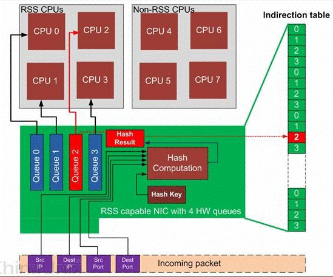

## 2. 2.6.21以前的网卡驱动实现
Kernel从2.6.21之前是不支持多队列特性的，一个网卡只能申请一个中断，因此同一时刻只有一个核在处理网卡收到的包。如下图2.1，协议栈通过NAPI轮询收取各个硬件Queue中的报文到图2.2的net_device的数据结构中，通过QDisc队列将报文发送到网卡。

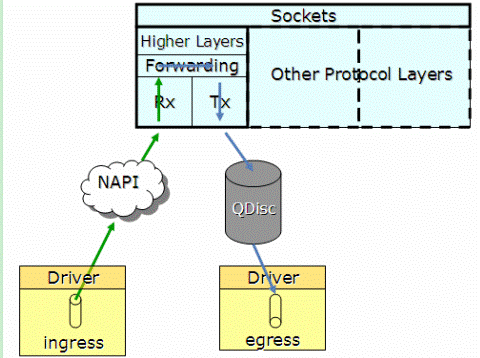  
图2.1 2.6.21之前的内核协议栈  
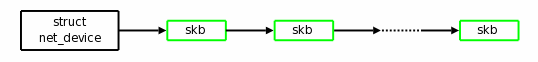  
图2.1 2.6.21之前的net_device  

## 3. 2.6.21后的网卡驱动实现
2.6.21开始支持多队列特征，当网卡驱动加载时，通过获取网卡型号，得到网卡硬件Queue的数量，并结合CPU核的数量，最终通过Sum=Min（网卡Queue，CPUCore）得出要激活的网卡Queue数量（Sum），并申请Sum个中断号，分配给各个激活的Queue。  
如图3.1，当某个Queue收到报文时，触发相应的中断，收到中断的核，将该任务加入到协议战中负责收包的该核的net_rx_softirq队列中（net_rx_softirq在每个核上都有一个实例），在net_rx_softirq中，调用NAPI的收包接口，将报文收到CPU中。如图3.2有多个netdev_queue的net_device数据结构中。  
这样Cpu的各个核可以并发的收包，就不会因为一个核不能满足要求，导致网络IO的性能下降。  

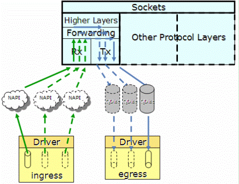  
图3.1 2.6.21之后的内核协议栈  
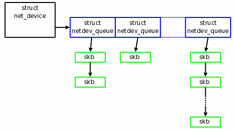  
图3.2 2.6.21之后的net_device  

## 4. 中断绑定
当Cpu可以并发收包时，就会出现不同核收取了同一个Queue的报文，这就会产生报文乱序的问题，解决方法是将一个Queue的中断绑定到唯一的一个核上，从而避免乱序的问题。同时如果网络流量大的时候，可以将软中断均匀的分散到各个核上，避免了Cpu成为瓶颈。  

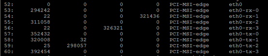  
图4.1 /proc/interrupts  

## 5. 中断亲和纠正
一些多队列网卡驱动实现的不是太好，在初始化后会出现下图中同一个队列的Tx，Rx中断绑定到不同核上的问题，这样数据在core0与core3之间流动，导致核间数据交流加大，cache命中率降低，降低了效率。  

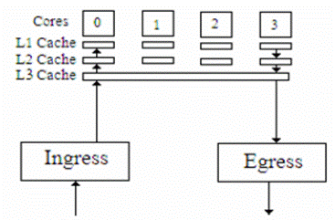  

linux network子系统的负责人David Miller提供了一个脚本，首先检索/proc/interrupts文件中的信息，按照
图5.1中Eth0-rx-0（$VEC）中的VEC得出中断Mask，并将Mask写入中断号53对应的smp_affinity中。由于Eth-rx-0与Eth-tx-0的VEC相同，实现同一个Queue的Tx与Rx中断绑定到同一个核上的功能。  
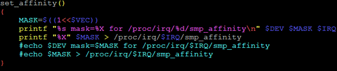  
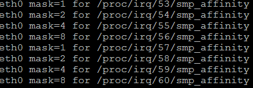  
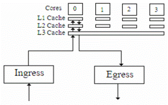  

set_irq_affinity脚本位于http://mirror.oa.com/tlinux/tools/set_irq_affinity.sh  

## 6. 多队列的网卡识别
使用如下命令：
```
#lspci -vvv  
```
Enthernet Controller的条目内容，如果有MSI-X && Enable+ && TabSize> 1 ,则该网卡为多队列网卡  

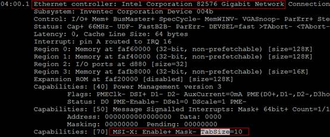  

Message Signaled Interrupts(MSI)是PCI规范的一个实现，可以突破CPU 256条Interrupt的限制，使每个设备具有多个中断线变为可能，多队列网卡给每个Queue申请了MSI。MSI-X是MSI数组，Enable+指使能，TabSize是数组的大小。

## 7. 网卡分发解决方案RSS/RPS/RFS
1. RSS是网卡的用硬件特性实现的多队列功能，将不同的流分发到不能给的CPU上，同一个流始终在同一个CPU上，避免了TCP的顺序性和CPU的并行性冲突。基于流的负载均衡，解决了顺序协议和CPU并行的冲突以及Cache热度问题。  
多队列网卡的好处是可以将每个队列产生的中断分布到CPU的多个核上，实现负载均衡，避免单个核被占用100%而其他核还处于空闲的情况。多队列网卡的每个队列的中断都是使用单独的中断线。  
如果网卡支持RSS，会再系统中看到网卡对应多个发送和接收队列：  
```
[root@localhost ~]# ls /sys/class/net/eth0/queues/
rx-0 rx-1 rx-2 rx-3 rx-4 rx-5 rx-6 rx-7 tx-0 tx-1 tx-2 tx-3 tx-4 tx-5 tx-6 tx-7 
```

2. RPS/RFS是网卡软中断分发软件解决方案，RSS需要网卡硬件支持，当网卡不支持RSS时，为了充分利用多核CPU，Centos6.1开始提供RPS（Receive Packet Steering）和RFS（Receive Flow Steering）。RPS使网卡可以把一个Rx队列的软中断分发到多个CPU核上，从而达到负载均衡的目的。RFS是RPS的扩展，RPS只依靠Hash来控制数据流，提供了好的负载均衡，但是他没有考虑应用程序的位置（这个位置是指程序在那个CPU上执行）。RFS则考虑到应用程序的位置。RFS的目标是通过指派应用线程运行的CPU来进行数据包的处理，以此来增加数据缓存的命中率。

参考文档：  
https://blog.csdn.net/turkeyzhou/article/details/7528182  
http://www.voidcn.com/article/p-kzrduuvs-bnp.html