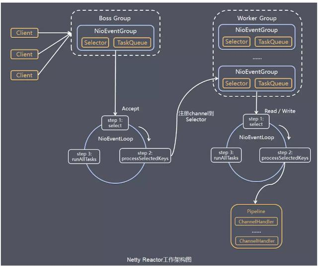
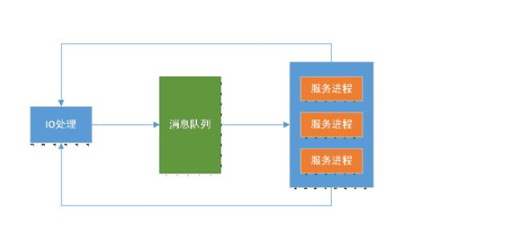

# 一篇文章，读懂Netty的高性能架构之道
Netty是由JBOSS提供的一个Java开元框架，是一个高性能，异步事件驱动的NIO框架。他提供了对TCP/UDP和文件传输的支持，作为一个异步的NIO框架，Netty的所有IO操作都是异步非阻塞的，通过Furture-Listerner机制，用户可以方便的获取或者通过通知机制获得IO操作结果。  

作为当前最流行的NIO框架，Netty在互联网领域，大数据分布式计算领域，游戏领域，通信行业等获得了广泛地应用，一些业界知名的开源组件也是基于Netty的NIO框架构建。

# 为什么选择Netty
Netty是业界流行的NIO框架之一，他的健壮性，功能，性能，可定制性和可扩展性在同类框架中都是首屈一指的，他已经得到成百上千的商业项目的验证，例如Hadoop的RPC框架Avro使用Netty作为底层通信框架；很多其他业界主流RPC框架，也使用Netty来构建高性能的异步通信能力。

## Netty的应用场景
1. 互联网行业  
在分布式系统中各个节点之间需要远程服务调用，高性能的RPC框架必不可少，Netty往往作为基础通信组件被这些RPC框架使用。比如阿里巴巴的分布式服务框架Dubbo的RPC框架使用的是Dubbo协议进行节点通信，Dubbo协议默认使用Netty作为基础的通信组件，用于实现各个节点之间的内部通信。除了Dubbo，淘宝的消息中间件RocketMQ的消息生产和消费之间，也采用Netty进行高性能，异步通信。
2. 游戏行业  
无论是手游网游，Java都有对应的应用，Netty提供了TCP，UDP和HTTP协议栈，非常方便定制和开发私有的协议栈，账号登陆，地图服务等都可以通过Netty进行高性能通信。
3. 大数据领域  
经典的Hadoop的高性能通信和序列化组件Avro的RPC框架，默认采用Netty进行跨界点通信，它的Netty Service基于Netty框架二次封装实现。

## Netty特点
* 高并发
Netty是一款基于NIO开发的网络通信框架，对比BIO他的并发性能得到了很大的提升。
* 传输快
Netty的传输其实也是依赖了NIO的一个特性--零拷贝
* 封装好
Netty封装了NIO操作的很多细节，提供了易于使用的API

## 原生NIO API的缺陷
原生的NIO API存在以下问题：  
1. NIO的类库和API繁杂，使用麻烦；你需要熟练的掌握Selector，ServerSocketChannel，SocketChannel，ByteBuffer等
2. 需要具备其他额外技能做铺垫：熟悉Java多线程编程，因为NIO涉及到Reactor模式，你必须对多线程和网络编程非常熟悉，才能编写出高质量的NIO程序。
3. 可靠性能力不足，开发工作量和难度非常大：例如客户端面临断连重连，网络闪断，半包读写，失败缓存，网络拥塞和异常码流的处理问题。NIO编程的特点是功能开发相对简单，但是可靠性补齐工作量和难度都非常大。
4. JDK NIO的Bug：例如臭名昭著的Epoll Bug，它会导致Selector空轮询，最终导致CPU 100%。官方声明JDK1.6版本修复了该问题，但是直到1.7该问题都依然存在，只是发生的概率低了一些。

## Netty框架的优势
* API使用简单，开发门槛低
* 功能强大，预置了各种编解码功能，支持多种主流的协议
* 定制能力强，可以通过ChannelHandler对通信框架进行灵活的扩展
* 性能高，通过与其他的业界主流NIO框架对比，Netty的综合性能最优
* 成熟稳定，Nettty修复了一发现的JDK NIO BUG，业务开发人员不需要再为此而烦恼
* 社区活跃，版本迭代周期短：发现的BUG可以及时的被修复，同时更多的新功能被加入
* 经历了大规模的商业应用考验，质量达到验证。在互联网，大数据，网络游戏，企业应用，电信软件等众多行业得到成功商用，证明了他已经完全能够满足不同行业的商业应用场景。

# Netty的核心组件
* Bootstrap or ServerBootstrap
* EventLoop
* EventLoopGroup
* ChannelPipeline
* Channel
* Future Or ChannelFuture
* ChannelInitiallizer
* ChannelHandler

## 1. BootStrap
一个Netty应用通常由一个BootStrap开始，它的主要作用是配置整个Netty程序，串联起各个组件，Handler，为了支持各种协议和处理各种数据，便诞生了handler组件，Handler主要用来处理各种事件，这里的事件很广泛，比如可以是连接，数据接收，异常，数据装换等。

## 2. ChannelInBoundHandler
一个最常用的Handler，用于处理接收到数据时的事件，我们的业务逻辑一般就是写在这个Handler里面的

## 3. ChannelInitializer
当一个连接建立时，我们需要知道如何接收和发送数据，当然我们有各种各样的的Handler实现可以处理它，ChannelInitializer便是用来配置这些Handler，他会提供一个ChannelPipeLine，并把Handler加入到ChannelPipeLine上。

## 4. ChannelPipeline
一个Netty应用基于ChannelPipeLine机制，这种机制依赖于EventLoop和EventLoopGroup，因为他们三个都与事件或者事件处理相关。  
EventLoops的目的是为Channel处理IO操作，一个EventLoop可以与对个Channel服务  
EventLoopGroup会包含多个EventLoop

## 5. Channel
代表了一个Socket连接，或者其他的IO相关的操作，它和EventLoop一起用来参与IO处理

## 6. Future
在Netty中所有的IO操作都是异步的，因此，你不能立刻得知消息是否被正确处理，但是为们可以过一会等他执行完或者直接注册一个监听，具体的实现就是通过Future和ChannleFuture来实现的，他们可以注册一个监听，当操作成功或者失败时监听会自动触发，总之所有的操作都会返回一个ChannelFuture

# Netty架构分析
Netty采用了比较经典的三层网络架构进行设计，逻辑架构图如下：

未完待续  
参考文档：  
https://blog.csdn.net/a724888/article/details/80771791