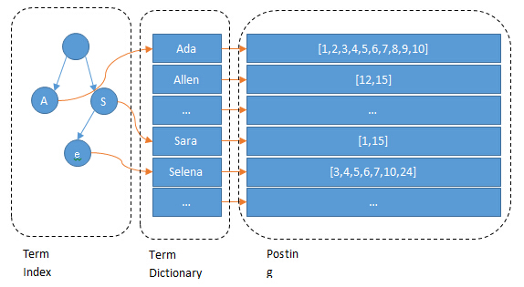
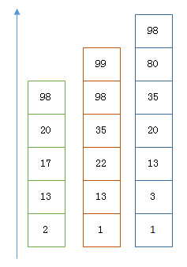
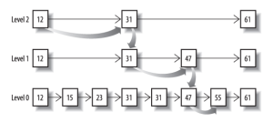
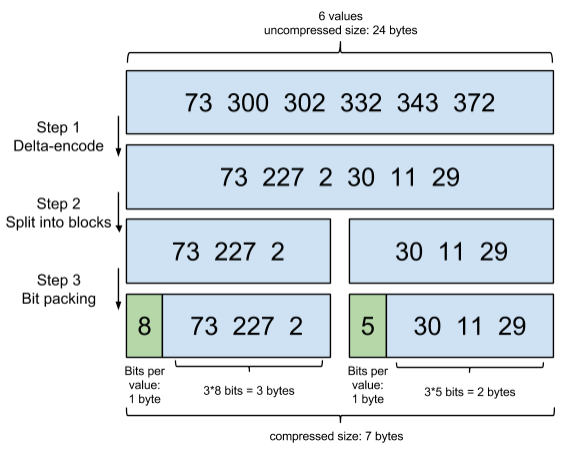
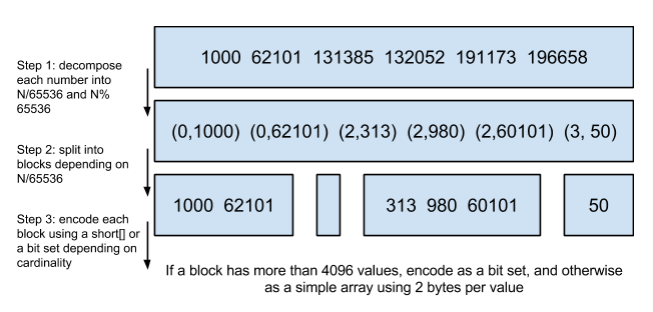

# ElasticSearch框架内部原理
## 1. 如何实现快速索引
ElasticSearch是通过Luncene的倒排索引技术实现比关系型数据库更快的过滤效果的。特别是它对多条件的过滤支持的非常好，比如年龄在18到30之间，性别是女性这样的组合查询。为什么倒排索引的速度比B-tree的速度快呢？  
笼统的说b-tree索引是为了写入优化的索引结构。当我们不需要支持快速更新的时候，可以用预先排序等方式换取更小的存储空间，更快的检索速度等好处，其代价是更新慢。要进一步深入的话，还是要看一下Luncene的倒排索引是怎样构成的。 

  

这里有好几个概念。下面结合具体的实例进行讲解，假如有如下数据：

   
 
 上图没一行是一个Document。每一个Document都有一个Docid。那么给这些Document建立倒排索引的就是：  
 * 按年龄  
   

 * 按性别  
    

 可以看出倒排索引是Per Field的，每一个字段都有一个自己的倒排索引。18，20这些叫Term，而[1,3]就是Posting List。Posting List就是一个int的数组，存储着所有符合某个Term的文档的Id集合。那么什么是Term Dictionary和Term Index？  
 加入有多个Term如下：  
 **Carla,Sara,Elin,Ada,Patty,Kate,Selena**  
 如果按这样的顺序排列，找出某个特定的Term一定很慢，因为Term没有排序，需要全部过滤一遍才能找到特定的Term。排序之后就变为：  
 **Ada,Carla,Elin,Kate,Patty,Sara,Selena**  
 这样就可以通过二分查找的方式，比全部遍历更快的找到目标。这个就是Term Dictionary。有了Term Dictionary之后，可以在LogN次磁盘查找找到目标。但是磁盘的随机读操作任然是非常昂贵的（一次random dictionary大约需要10S的时间）。所以尽量减少磁盘的读操作，有必要把一些数据缓存到内存中。但是整个term dictionary本身有太大了，无法完整的放到内存中。于是就有了term index。term index有点像一本字典的大的章节表。比如：  
 * A开头的term................XXX页
 * C开头的term................XXX页
 * E开头的term................XXX页
如果所有的term都是英文字符开头的话，可能这个term index就真的是26个英文字符表构成的了。但是实际上，term未必都是英文字符，term可以使任意byte数组。而且26个英文字符也未必每一个字符都有均等的term，比如X字符开头的term可能一个都没有，而S开头的term有特别多。实际的term index是如下的一个trie树：  

   

 例子是一个包含 "A", "to", "tea", "ted", "ten", "i", "in", 和 "inn" 的 trie 树。这棵树不会包含所有的term，它包含的term是一些前缀。通过term index可以快速的定位到term dictionary的某个offset，然后从这个位置再往后顺序查找。再加上一些压缩技术（搜索Luncene Finite State Transducers）term index的尺寸可以只有所有term的尺寸的几十分之一，使得用内存缓存整个term index成为可能。整体上来说就是这样的效果：  



因此就可以很清楚的明白为什么ElasticSearch比mysql快的原因。Mysql只有term Dictionary这一层，是以b-tree的排序方式存储在磁盘上的。检索一个term需要若干次的random access的磁盘操作。而Luncene在term dictionary的基础上添加了term index来加速检索，term index以树的形式缓存在内存中。从term index查询到对应的term dictionary的block位置后，再去磁盘上找term，大大减少了磁盘的random access次数。  
额外值一提的两点是：term index在内存中是以**FST**（Finite State Transducers）的形式保存的。其特点是非常节省内存。**term dictionary在磁盘上是以分block的方式保存的**，一个block内部利用公共前缀压缩，比如都是Ab开头的单词就可以把Ab省去。这样term dictionary可以比b-tree更节省磁盘空间。  

## 如何联合索引查询
age = 18 and gender = ‘女’  
首先过滤条件age = 18的过程是从term index找到18的term dictionary的大概位置，然后再从term dictionary里精确地找到这个18的term，然后得到posting list或者一个指向posting list位置的指针。然后在查询gender = ‘女’的posting list。最后把这两个post listing 进行”与“操作。  
这个理论上的“与”操作可不容易，在mysql中，如果你给Age和Gender两个字段都建立了索引，查询的时候只会选择其中最具有Selective价值得字段进行查询，然后另外一个条件是在遍历行的过程中在内存中计算之后过滤掉。在ElasticSearch中则有以下两种实现联合索引的方式：  
* 使用Skip List数据结构。同时遍历Gender和Age的Posting List，互相Skip；
* 使用Bitset数据结构，对Gender和Age两个Filter分别求出Bitset，对两个Bitset做AND操作。

PostGreSQL从8.4版本开始支持通过Bitset联合使用两个索引，就是利用了Bitset数据结构来做到的。当然一些商业的关系型数据库也支持类似的联合索引的功能。Elasticsearch支持以上两种联合索引方式，如果查询的Filter缓存到了内存中（以Bitset的形式），那么合并就是两个Bitset的AND。如果查询的Filter没有缓存，那么就有Skip List的方式去遍历两个On Disk的Posting List。 ### Skip List原理分析 

  

以上是三个Posting List。我们现在需要把他们用AND的关系合并，得出Posting List的交集。首先选择最短的Posting List，然后从小到大遍历。便利的过程可以跳过一些元素，比如我们遍历到绿色的13的时候，就可以跳过蓝色的3了，因为3比13要小。整个遍历过程如下：  
```
Next -> 2
Advance(2) -> 13
Advance(13) -> 13
Already on 13
Advance(13) -> 13 MATCH!!!
Next -> 17
Advance(17) -> 22
Advance(22) -> 98
Advance(98) -> 98
Advance(98) -> 98 MATCH!!!
```

最后得出的交集是[13,98]，所需的时间比完整遍历三个Posting List要快的多。但是前提是每个List需要指出Advance这个操作，快速的移动指向的位置。Skip List数据结构刚好满足这样的功能。  
  

从概念上来说，对一一个很长的Posting List，比如：  
[1,3,13,101,105,108,255,256,257]  
我们可以把这个List分为三个Block：  
[1,3,13] [101,105,108] [255,256,257]  
然后可以构建Skip List的第二层：  
[1,101,255]  
1,101,255分别指向自己对应的Block。这样就可以很快的跨Block的移动指向位置了。  
同时Luncene也对Block进行了再次压缩。其压缩方式叫做Frame Of Reference编码。示例如下图：  



Frame Of Reference压缩的原理就是通过增量，将原来的大数变成小数仅存储增量值，在精打细算的按Bit排好队，最后通过字节存储，而不是大大咧咧的尽管数值是2也用一个Int的数据进行存储。这样最大限度的达到压缩存储的目的，缺点就是在解压时耗费更多的Cpu(以时间换空间的方式)。  

考虑到频繁出现的Term（所谓Low Cardinality的值），比如Gender里的男女。如果有一百万个文档，那么性别为男的Posting List里极可能有50万个int值。用Frame Of Reference编码进行压缩可以极大减少磁盘占用。这个优化对于减少索引尺寸有非常重要的意义（MysqlBtree里也有一个类似的Posting List的东西，是未经这样压缩的）。  
因为这个Frame Of Reference的编码是有解压缩成本的。当它和Skip List的跳跃功能结合使用时，不仅跳过了遍历成本，同时也跳过了了解这些压缩过的Block的过程，从而节省了Cpu。

### Roaring Bitmaps原理解析
要了解Roaring Bitmaps需要先从Bitset说起，Bitset是一种比较直观的数据结构，假设如果对应的Posting List如下：  
[1,3,4,7,10]  
那么其对应的Bitset就是下面这个样子：  
[1,0,1,1,0,0,1,0,0,1]  
它的原理是通过数组的Index来对应一条文档记录Id，通过1或者0来表示该Id是否存在。因此Bitset这种数据结构构成原理就决定它具有压缩的特点，用一个byte就可以对应8个文档Id（以此算下来100万个文档只需要12.5万个byte）。但是如果文档数量有数十亿之多的话，在内存中保存Bitset仍然会出现占用很大内存的情况。Bitset缺点是存储空间随着文档个数线性增加，Roaring Bitmaps需要打破魔咒就要用到某些指数特性：  



Roaring Bitmaps的思路是将Posting List按照65535为界限进行分块，结果就是第一块的包含的文档Id范围在0~65535之间，第二块的Id范围在65536~131071之间，以此类推。然后再用<商，余数>的组合表示每一组Id，这样就保证了每一组的Id范围就一直在0~65535内了，从而实现更有效的存储。  
之所以用65535作为界限是因为65535=2^16-1，正好是两个字节所能表示的最大数，一个short的存储单元。注意到上图里的最后一行“If a block has more than 4096 values, encode as a bit set, and otherwise as a simple array using 2 bytes per value”，如果是大块（一块内包含数据个数超过4096个的话），用节省点的数据结构Bitset存，如果是小块，每一个数据就用2个字节表示，用一个short[]存储。  
用4096来区分大小快的原因是因为：4096*2bytes ＝ 8192bytes < 1KB, 磁盘一次寻道可以顺序把一个小块的内容都读出来，再大一位就超过1KB了，需要两次读。

这两种合并索引的方式都有其用途，通过ElasticSearch的性能分析得出：对于简单的相等条件的索引合并，缓存成纯内存的Bitset其查询效率还不如通过磁盘存储的Skip List的的方式高（主要的原因是由于Skip List的跳表原理结合Frame Of Reference的编码方式效率太高）。  

## 如何减少文档数
一种常见的压缩时间序列的方法是：把多个数据点合成一行。Opentsdb支持海量数据的一个绝招就是定期把很多行数据合并成一行，这个过程叫做Compaction。类似的Vivdcortext使用Mysql存储的时候，也把一分钟的很多数据点合并存储到Mysql的一行里以减少行数。这个过程大致如下图实例所示：  


合并之后就变成下图：  


可以看到行变成了列。每一列可以代表这一分钟内一秒的数据。  
在ElasticSearch中对应的这个功能的名称叫Nested Document。我们可以把一段时间的很多个数据点打包存储到一个父文件里，变成其嵌套的子文档。示例如下：
```
{timestamp:12:05:01, idc:sz, value1:10,value2:11}
{timestamp:12:05:02, idc:sz, value1:9,value2:9}
{timestamp:12:05:02, idc:sz, value1:18,value:17}
```
可以打包成：  
```
{max_timestamp:12:05:02, min_timestamp: 
12:05:01, idc:sz,records: [
{timestamp:12:05:01, value1:10,value2:11}
{timestamp:12:05:02, value1:9,value2:9}
{timestamp:12:05:02, value1:18,value:17}]
```
这样可以把数据点公共的维度字段上移到父文档里，而不用在每个子文档里重复的存储，从而减少索引的尺寸。  


在存储的过程中，无论父文档还是子文档，对于Luncene来说都是文档都会有文档Id。但对于嵌套文档来说，可以保存起子文档和父文档的文档Id是连续的，而且父文档总是最后一个。有这样一个排序性作为保障，那么有一个所有父文档的Posting List就可以跟踪所有的父子关系。也可以很容易的在父子文档之间做转换。把父子关系也理解为一个Filter，那么查询时检索的时候不过是又AND了另一个Filter而已。前面我们已经看到了ElasticSearch可以非常高效的处理多个Filter的情况，充分利用了底层的索引。  
使用了嵌套文档之后，对于Term的Posting List只需要保存父文档的DocId就可以了，可以保存所有的数据点的Doc Id要上很多。如果我们可以在一个父文档里塞入50个嵌套文档，那么Posting List可以变成之前的1/50大小。


参考文档：  
https://www.cnblogs.com/dreamroute/p/8484457.html  
http://www.uml.org.cn/sjjm/2015090110.asp
