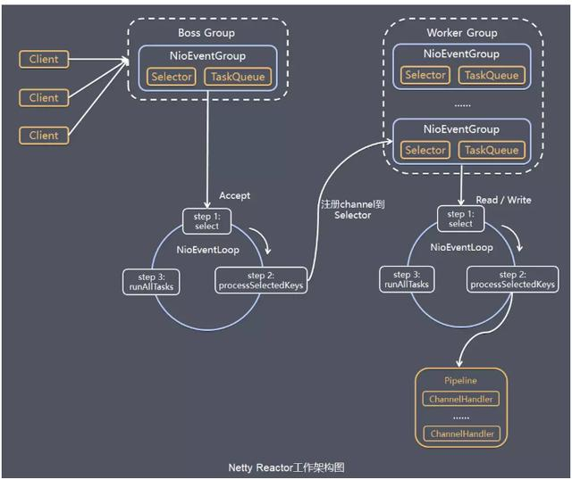
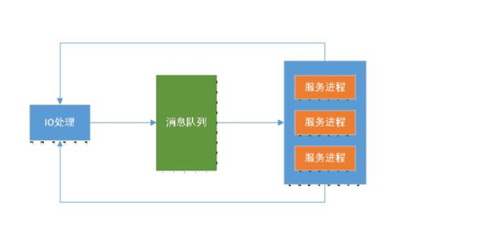
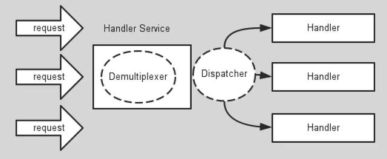
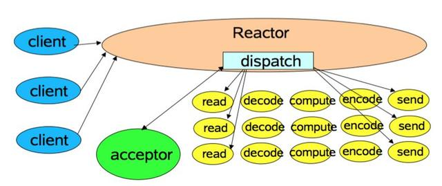
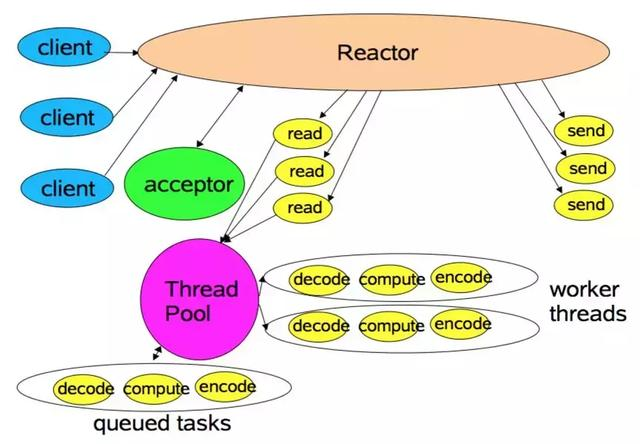
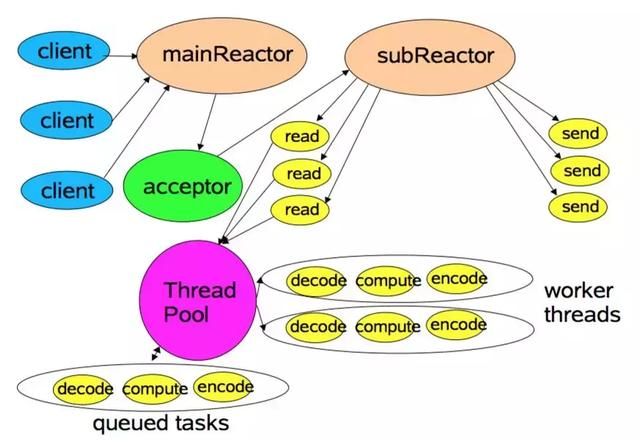
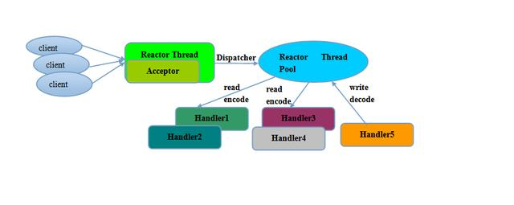

# 看懂Netty世界
netty时Jboss提供的基于JavaNIO的开源框架，Netty提供了异步非阻塞，事件驱动，高性能，高可靠，高可定制性的网络应用程序和工具，可以用于开发服务器端和客户端。  

## netty是什么
Netty是一个高性能的异步事件驱动的NIO框架，基于Java NIO提供的API实现。他提供了对于TCP，UDP和文件传输的支持。作为一个异步框架，他的所有IO操作都是异步非阻塞的，通过Future-Listener机制，用户可以方便的主动获取或者通过通知机制获得IO的操作结果。

## Netty线程模型
在Java NIO方面Selector给Reactor模式提供了基础，Netty结合Selector和Reactor模式设计了高效的线程模型。

## Reactor模式

首先Reactor模式是事件驱动的，有一个或者多个并发输入源，有一个Server Handler和多个Request Handlers，这个Service Handler会同步的将输入的请求多路服用的分发给相应的Request Handler。其流程大致如下图：  

从结构上类似与生产者和消费者模式，即一个或多个生产者将事件放入queue中，一个或多个消费者主动消费这个队列。而Reactor模式没有Queue来做缓冲，每当有事件输入到Service Handler之后，该Service Handler会主动根据不同的Event类型将其分发给对应的Request Handler来处理。

## Reactor的模式实现

### 第一种实现模型

这是最简单的Reactor单线程模型，由于Reactor模式使用的是异步非阻塞的IO，所有的IO操作都不会阻塞，理论上一个线程可以独立处理所有的IO操作。这时的Reactor线程是个多面手，负责多路分离套接字，Accept新的连接，分发请求到处理链路中。对于一些小容量应用场景，可以使用这种单线程模型。不适合高负载大并发的应用场景。

缺陷： 
1.  当一个NIO线程同时处理成百上千的链路，性能上无法支撑，即使NIO线程的CPU负载达到100%，也无法完全处理消息。
2. 当NIO线程负载过重后，处理速度会变慢，会导致大量客户端连接超时，超时之后往往会重发，会加重NIO线程的负载。
3. 可靠性低，一个线程意外死循环，会导致整个通讯系统不可用。

为了解决这个问题，出现了Reactor多线程模型

### Reactor多线程模型

相比上一种模式，该模式在处理链部分采用了多线程（线程池）  
在绝大多数场景下，该模式都能满足性能需求，但是在一些特殊的场景下，比如服务器会对客户端的握手消息进行安全认证。这类场景下，单独的一个Acceptor线程可能会存在性能不足的问题。  
为了解决这种问题，产生了第三种Reactor线程模型。  

### Reactor主从模型

该模型相比于第二种模型，是将Reactor分为两部分，MainReactor负责监听server socket，accept新的连接；并将建立的socket分派给subReactor。  
subReactor负责多路分离已连接的socket，读写网络数据，对业务处理功能，其扔给worker线程池完成。通常，subReactor个数上可与cpu个数等同。  

## Netty模型

其实Netty的模型是Reactor模型的变种，那就是去掉线程池的第三种模型的变种，这也是Netty NIO的默认模式。Netty的Reactor模式的参与者主要有以下几种组件：  
1. Selector
2. EventLoopGroup/EventLoop
3. ChannelPipeline

Selector即为NIO提供的的SelectableChannel多路复用器，充当着Demultiplexer的角色，这里不在赘述；下面对另外两个组件在Netty的Reactor模式中扮演的的角色进行介绍。

### EventLoopGroup/EventLoop

参考文档：  
高性能：《一遍文章带你看懂 Netty世界》：https://www.toutiao.com/i6706828472330748419/