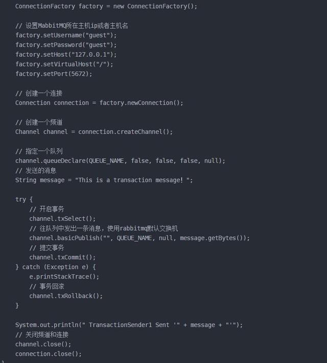
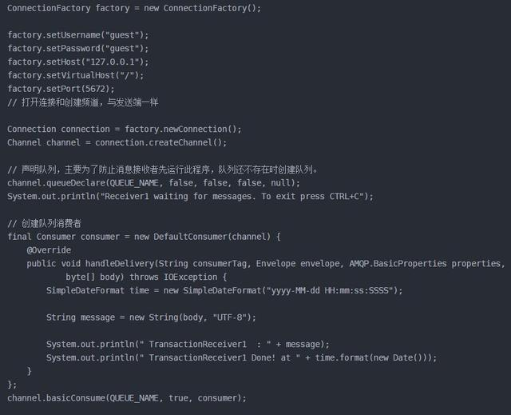

# RabbitMQ消息发送确认与消息接收确认

参考文档：  
RabbitMQ消息可靠性分析：https://www.jianshu.com/p/ea04ee9504c3
RabbitMQ消息发送确认与消息接收确认：https://www.jianshu.com/p/2c5eebfd0e95
RabbitMQ基本概念：https://www.jianshu.com/p/25816ae3d8db
RabbitMQ消息确认机制：https://www.toutiao.com/i6732016280859050500/
RabbitMQ整合Spring Booot【死信队列】：https://www.cnblogs.com/toov5/p/10288260.html

RabbitMQ为了确保消息一定能发送到Broker，RabbitMQ有两种可实现方式：  
1. RabbitMQ的事务方式
2. RabbitMQ的confirm机制

## 事务方式
Rabbit与事务有关的方法主要有三个：  
* txSelect()：用于开启事务
* txCommit()：用于提交事务
* txRollBack()：用于回滚事务

生产者代码：

消费者代码：

使用wireShark来监听网络

可以得到请求的大致流程：
1. client发送tx.select
2. broker发送tx.select-ok(服务器端确认可以发送)
3. client发送Tx.commit
4. broker发送Tx.commit-ok
