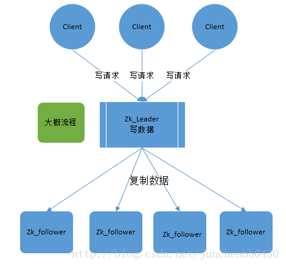
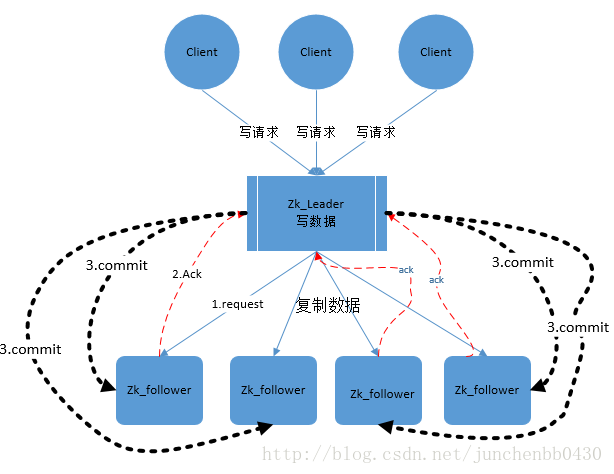
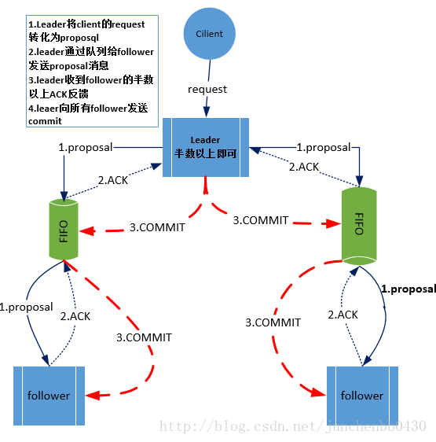
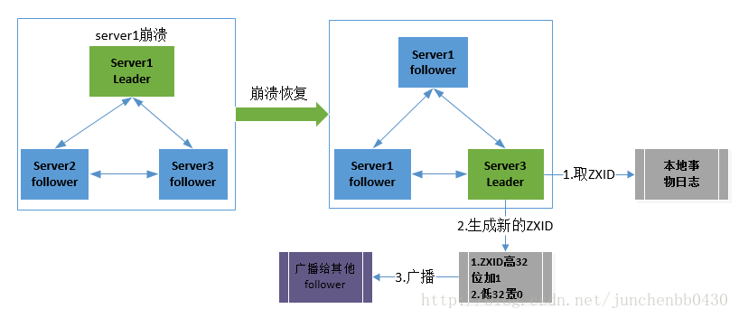

# Zookeeper中的ZAB协议理解
参考文档：  
zookeeper中的ZAB协议理解：https://blog.csdn.net/junchenbb0430/article/details/77583955  
ZooKeeper和ZAB协议：https://www.cnblogs.com/makelu/p/11123103.html

## ZAB协议
1. Zab协议是专门为Zookeeper实现分布式协调功能而设计的。Zookeeper主要是根据Zab协议来实现分布式系统数据一致性。
2. Zookeeper根据Zab协议建立了主备模型，完成Zookeeper集群中的数据同步。
> 这里所说的主备模型是指：在Zookeeper集群中，只有一台Leader负责处理客户端的事务请求（写操作），然后leader服务器将客户端的写操作同步到所有的Follower节点中。

3. Zab的协议核心是在整个Zookeeper集群中只有一个节点即Leader，将客户端的写操作转化为事务（或提议Proposal）。Leader节点在数据写完之后，将向所有的Follower节点发送数据广播请求(或数据复制)，等待所有的follower节点反馈。在Zab协议中，只有超过半数的Follower节点反馈OK，Leader节点就会向所有的Follower服务器发送Commit消息。即将Leader节点上的数据同步到Follower节点上。

4. Zab协议中主要有两种模式，第一是消息广播模式；第二是崩溃恢复模式

## 消息广播模式
在Zookeeper集群中数据副本的传递策略就是采用消息广播模式。Zookeeper中数据副本的同步方式与二阶段提交相似但是却有不同。二阶段条的要求协调者必须等到所有的协调者必须等到所有的参与者全部反馈Ack确认信息后，再发送Commit消息。要求所有的参与者要么全部成功要么全部失败。二阶段提交会产生严重的阻塞问题。  
Zab协议中Leader等待Follower的Ack反馈是指“只要半数以上的Follower成功反馈即可，不需要收到全部的Follower反馈”  
下图展示了消息广播的具体流程图：

Zookeeper中消息广播的具体步骤如下：  
* 客户端发起一个写操作
* Leader服务器将客户端的Request请求转化为事务Proposal提案，同时为每一个Proposal分配一个全局唯一的ID，即ZXID
* Leader服务器与每个Follower之间都有一个队列，Leader将消息发送到该队列
* follower机器从队列中取出消息处理完毕后（写入本地事务日志中），向Leader服务器发送Ack确认
* Leader服务器收到半数以上的Follower的Ack后，即认为可以发送Commit
* Leader向所有的Follower服务器发送Commit消息

Zookeeper采用Zab协议的核心就是只要有一台服务器提交了Proposal，就要确保所有的服务器最终都能正确提交Proposal。这也是Cap/Base最终实现一致性的一个体现  
Leader服务器与每个Follower之间都有一个单独的队列进行收发消息，使用队列消息可以做到异步解耦。Leader和Follower之间只要往队列中发送了消息即可。如果使用同步方式容易引起阻塞。性能上要下降很多。

## 崩溃恢复
Zookeeper集群中为保证任何所有进程能够有序的顺序执行，只能是Leader服务器接受写请求，即使是Follower服务器接收到客户端的请求，也会转发到Leader服务器进行处理。  
如果Leader服务器发生崩溃，则Zab协议要求Zookeeper集群进行崩溃恢复和Leader服务器选举  
Zab协议崩溃恢复要求满足如下两个请求：
1. 确保已经被Leader提交的Proposal必须最终被所有的Follower服务器提交
2. 确保丢弃已经被Leader出的但是没有被提交的Proposal

根据上述要求，新选举出来的Leader不能包含未提交的Proposal，即新选举的Leader必须都是已经提交了的Proposal的Follower服务器节点。同时新选举的Leader节点中包含最高的ZXID。这样做的好处就是可以避免了Leader服务器检查ProposalProposal的提交和丢弃工作。  
leader服务器发生崩溃时分为如下场景：
1. Leader在提出Proposal时未提交之前崩溃，则经过崩溃回复后，新选举的Leader一定不能是刚才的Leader。因为这个Leader存在未提交的Proposal
2. Leader在发送Commit消息之后，崩溃。即消息已经发送到队列中。经过崩溃恢复后，参与选举的Follower服务器（刚才崩溃的Leader有可能已经恢复运行，也属于Follower节点范畴）中有的节点已经是消费了队列中的所有的Commit消息。即该Follower节点将会被选举为最新的leader。剩下的动作就是数据同步过程。

## 数据同步
在Zookeeper集群中新的Leader选举成功后，Leader会将自身提交的最大的Proposal的事务ZXID发送给其他的Follower节点，Follower节点会根据Leader消息进行回退或者数据同步操作。最终的目的是要保证集群中所有节点的数据副本一致。  
数据同步完之后，Zookeeper集群如何保证新选举的Leader分配的ZXID是全局唯一的呢？这个就要从ZXID的设计谈起：  ZXID是长度为64位的数字，其中低32位是按照数字递增，即每次客户端发起一个Proposal，低32位的数字简单加1。高32位是Leader周期的Epoch编号，至于这个变好如何产生（我也没有搞通），每当选举出一个新的Leader时，新的Leader就从本地事务日志中取出ZXID，然后解析出高32位的Epoch编号，进行加1，再将低32位的全部设置为0。这样就保证了每次新选举的Leader对应的ZXID的唯一性而且是保证递增的。

## Zab协议原理
Zab协议要求每个Leader都要经历三个阶段：发现，同步，广播
1. 发现：即要求Zookeeper集群必须选择出一个Leader进程，同事Leader会维护一个Follower可用列表。将来客户端可以和这些Follower中的节点进行通信
2. 同步：Leader要负责将本身的数据与Follower完成同步，做到多副本存储。这样也是体现了Cap中的高可用性和分区容错。Follower将队列中未处理完的请求消费完成后，写入本地事务日志中。
3. 广播：Leader可以接受客户端新的Proposal请求，将新的Proposal请求广播给所有的Follower

## Zookeeper设计目标
采用Zab协议的最大目标就是建立一个高可用可扩展的分布式数据主备系统。即在任何时刻只要Leader发生宕机，都能保证分布式系统数据的可靠性和最终一致性。

