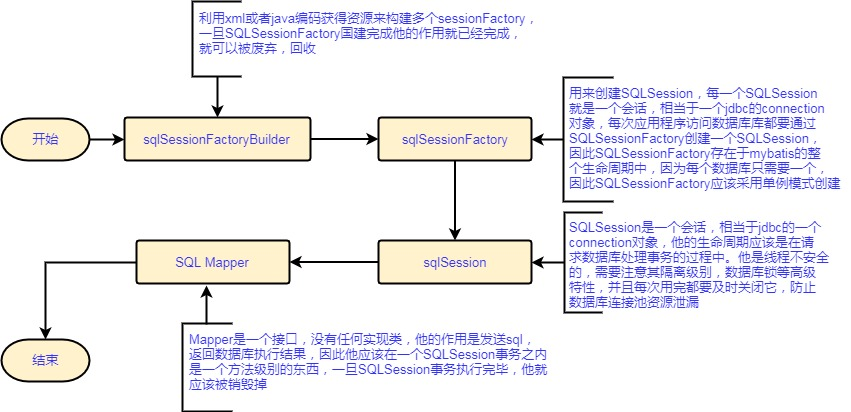
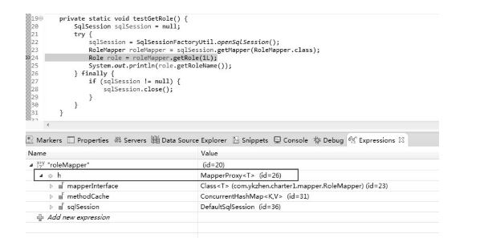
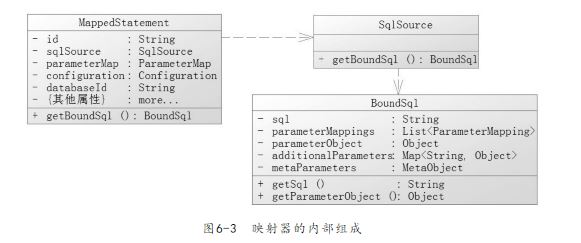

# mybatis
参考文档：  
深入浅出MyBatis：MyBatis解析和运行原理：https://juejin.im/post/5abcbd946fb9a028d1412efc  
深入理解mybatis原理》 MyBatis的架构设计以及实例分析：https://blog.csdn.net/luanlouis/article/details/40422941

# mybatis简述
mybatis是一个轻量级的映射框架，相较于hibernate有更加灵活的手动调整空间，因此也更加接近底层jdbc逻辑。

# mybatis主要类功能和对应关系图

# mybatis涉及到的技术难点

# 动态代理
在调用mybatis进行数据库操作时，大家可以明显的发觉我们调用操作数据库的仅仅是一个Mapper接口，而并非是一个完整的包含逻辑的实现类。那mybatis是如何通过一个接口来完成对数据库库的操作的呢，其实答案就是动态代理，我们不妨看一下在接口真正被调用的运行时Mapper到底内部的构成是什么样子的。    

很明显在具体使用的时候Mapper是产生了一个具体的代理类来真正负责业务的执行，这个代理类就是有mybatis为我们创建的。具体到实现技术就是通过动态代理的方式来创建的。
代理的技术实现有两种：cglib和jdk动态代理，在mybatis中两种代理方式都有用到，但是在代理之前还需奥了解一下代理依赖的重要技术：反射  

## 反射技术
通过反射我们可以获取到类的对象，获取到对象的方法，并通过反射来调用对象的方法。反射的好处是使配置性大大提高，使一个类的各种常亮，方法变得可配置，这就大大提高了java的灵活性并降低了模块之间的耦合。  

## jdk动态代理
jdk的动态代理是由java.lang.reflect.*包提供支持的。要实现动态代理，需要完成以下步骤：  
1. 编写服务类和接口，这个是真正的服务提供者
2. 编写代理类，提供绑定和代理方法。

jdk的代理最大的缺点就是需要提供一个接口，而mybatis的Mapper本身就是一个接口，它采用的就是jdk的动态代理。当一个对象呗绑定好代理类后，执行其方法的时候就会进入到代理方法。  
jdk产生一个代理对象需要三个参数：  
1. target.getClass.getClassLoader()：类加载器
2. target.getClass().getInterface()：代理对象要挂在那个接口上
3. this：当前的代理类，换句话说其内部是是代理对象的代理方法来作为对象的代理执行者的

一旦绑定后，在进入代理对象方法调用的时候，就会实际调用代理对象（Proxy.InvocationHandler）的方法，而代理对象的方法内部调用都是通过方法反射执行的，该方法要传递三个参数：  
1. Proxy：代理对象
2. Method：当前调用哪个方法
3. args：方法的参数

**虽然真实调用的是对象的代理对象，但是代理对象的内部真实保存了target服务对象，最终Proxy仍然是通过反射技术调用到内部真实对象的方法的。**

## cglib动态代理
jdk的动态代理的缺陷是不许需要一个接口才能使用，而cglib可以实现在不需要接口的情况下也可以动态代理业务类。  
要实现cglib动态代理，被代理的目标类和对应的接口都不需要做任何改变。唯一要变的是要实现cglib的methodInterceptor的动态代理方法。  
在mybatis中通常是在延迟加载的时候才会用到cglib的动态代理。

# SQLSessionFactory构建
SQLSessionFactory是mybatis的核心类之一，其最重要的功能是提供了创建mybatis的核心接口SQLSession的创建功能。  
mybatis是一个复杂的系统，因此其核心创建类SQLSessionFactory的创建也是是一个复杂的过程，他需要读取配置文件和相关的参数，采用构造器模式区创建SQLSessionFactory，我们可以通过SQLSessionFactoryBuilder去创建，创建过程分为两步：  
1. 通过org.apache.ibatis.buulder.xml.xmlConfigBuilder解析配置的XML文件，读出配置参数，并将读出的数据存入到org.apache.ibatis.session.Configuration类中（mybatis几乎所有的配置都存在于这个类中）
2. 使用configuration对象去创建SQLSessionFactory。mybatis中的SQLSessionFactory是一个接口，而不是实现类，为此mybatis提供了一个默认的SQLSessionFactory实现类，我们一般会使用org.apache.ibatis.session.defaults.DefaultSqlSessionFactory。在大部分情况下我们没有必要去创建新的SQLSessionFactory实现类。

这种创建方式是一种builder模式。对于复杂的对象而言，直接使用构造方法去创建一个对象是困难的。这会导致大量创建逻辑放在构造方法中，由于对象的复杂性，我们更希望一步一步的创建它，从而降低其复杂性，这个时候使用一个参数类总领全局，例如configuration类，然后分步构建SQLSessionFactory。

# configuration构建
在SQLSessionFactory构建中，configuration是最重要的，他的作用如下：  
1. 读取配置文件，包括基础的配置XML文件和映射器的XML文件
2. 初始化基础配置，比如mybatis的别名等，一些重要的类对象，例如插件，映射器，objectFactory和typeHandler的对象。
3. 提供单例，为后续创建sessionFactory服务并提供哪个配置的参数。
4. 执行一些中有好的对象方法，初始化配置信息。

mybatis的几乎所有的配置信息都保存在configuration类中，configuration是通过XMLConfigBuilder去构建的。mybatis首先会读取所有的XML配置信息，然后将这些信息保存在configuration类的单例中。他会做如下初始化工作：  
* properties全局参数
* setting设置
* typeAliases别名
* typeHandler类型处理器
* objectFactory对象
* plugin插件
* environment环境
* databaseIdProvider数据库标识
* Mapper映射器

# 映射器的内部组成
因为插件会频繁访问映射器，所以在理解插件前，务必需要先掌握一下映射器的内部原理  
一般而言，映射器分为三个部分，下面是他们的内部构成图：  

1. MappedStatement：它保存映射器的一个节点（select|insert|delete|update）。包括许多我们配置的sql，sql的id，缓存信息，parameterType，resultType，resultMap，languageDriver等重要的配置信息。
2. sqlSource：他提供了boundSql对象的地方，他是mappedStatment的一个属性
3. boundSql：他是建立sql和参数地方，他有3个常用的属性：sql，parameterObject，parameterMapppings

MappedStatement涉及的东西很多，一般都不要去修改它，SQLSource是一个接口，他的主要功能是根据参数和其他规则组装sql（包括动态sql），这些也很复杂，不过mybatis已经内部实现了，一般也不需要去修改。对于参数和sql而言，主要的规则都反映在BoundSql类对象上，在插件中一般需要通过拿到它，来获得当前运行的sql和参数规则，来做适当的修改，以满足特定的需求。  
boundSql提供了三个主要的属性：parameterMapping，parameterObject和sql  
* parameterObject为参数本身，可以传递简单对象，pojo，map或者@param注解的参数，由于他在插件中很常用，需要着重介绍一下
    1. 当传递java原始对象时mybatis会自动把他封装为类对象，比如int，mybatis自动把他变为Integer
    2. 如果传递pojo或者map时，parameterObject就是这个对象
    3. 如果传递多个参数但是没有@param注解是，mybatis会把他们封装成一个按先后顺序序号为key的map对象，其格式大致如下：{1：“aa”,2:"bb",3:"cc".......}
    4. 如果传递多个参数并且有@param注解是，mybatis会把他们封装成一个key，value的map对象，其格式大致如下：{“key1”：“aa”, “key2”："bb", “key3”："cc".......}
* ParameterMapping：他是一个list，每个元素都是parametermapping的对象。这个对象包含了我们的以下参数属性：属性，名称，表达式，JavaType，JDBCType，typehandler等信息，我们一般不需要去改变它，通过他可以实现参数和sql的结合，以便preparedStatement能够通过它找到parameterObject对象的属性并设置参数，使得程序正常运行。
* sql：它对应的就是一条sql语句，大多数情况下不需要修改，只有在插件的情况下，需要进行改写。
