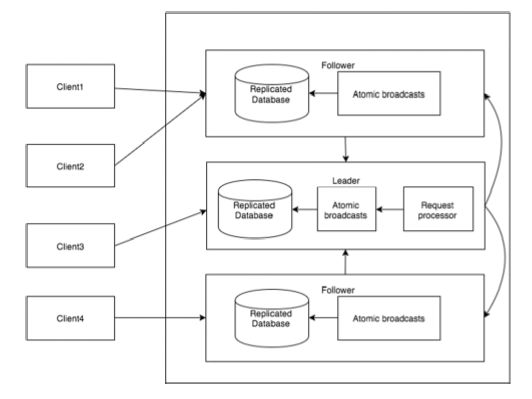

# zookeeper工作流解析
一旦Zookeeper集合启动，他将等待客户端连接。客户端将连接到ZooKeeper集合中的一个节点上。他可以是leader节点也可以是follower节点。一旦客户端被连接，节点将向特定客户端分配会话ID并向客户端发送确认信息。如果客户端收到确认表明连接成功，如果没有客户端将尝试连接Zookeeper集合中的另一个节点直到连接成功。一旦连接成功，客户端将以有规律的间隔向节点发送心跳，以确保连接不会丢失。

## 客户端的操作
* 读取特定Znode
> 客户端向其连接的节点发送读取请求，节点直接通过读取其自身的数据库的数据返回给客户端。
* 存储数据到ZooKeeper集合
> 客户端发送存储请求，对应的节点收到请求后，将Znode路径和数据发送到服务器。连接的服务器将该请求转发给leader，leader将向所有的follower发送写入请求。如果大部分节点成功相应，而且写入成功，则返回成功代码到客户端。否则，写入请求失败。绝大多数节点被称为Quornm

## ZooKeeper集合拥有不同节点个数的效果
* 1个：当该节点故障时，ZooKeeper集合将故障，因为只有一个节点，从而导致单点故障，不建议在生产环境使用
* 2个：如果一个故障，在重新选举leader时无法满足大多数选举的条件，从而导致无法选举leader节点功能
* 3个：如果一个故障，从新选举满足大多数规则，整个集合仍然可以正常工作（三个节点是ZooKeeper集合的最少配置）
* 4个：如果两个节点故障，他将再次故障，而且额外的几点不用于任何目的，因此建议添加奇数个节点

下图描述了ZooKeeper的工作流程：

其中涉及到的组件和对应的功能描述：  
组件|描述
---|---
写入（write）|写入过程由leader节点处理。leader将写入请求转发给所有的Znode，并等待Znode的回复，一半的Znode回复写入成功，则写入过程陈成功。
读取（read）|读取由对应连接的Znode直接内部执行，不需要与集群交互
复制数据库（replicated database）|他用于在ZooKeeper中存储数据。每个Znode都有自己的数据库，每个Znode在一致性的帮助下每次都有相同的数据
Leader|负责处理写入请求的Znode
Follower|负责读请求的处理，写入请求转交给leader处理
请求处理器（request processor）|只存在于Leader节点，管理来自Follower节点的写入请求
原子广播（atomic broadcasts）|负责广播从leader节点到follower节点的变化