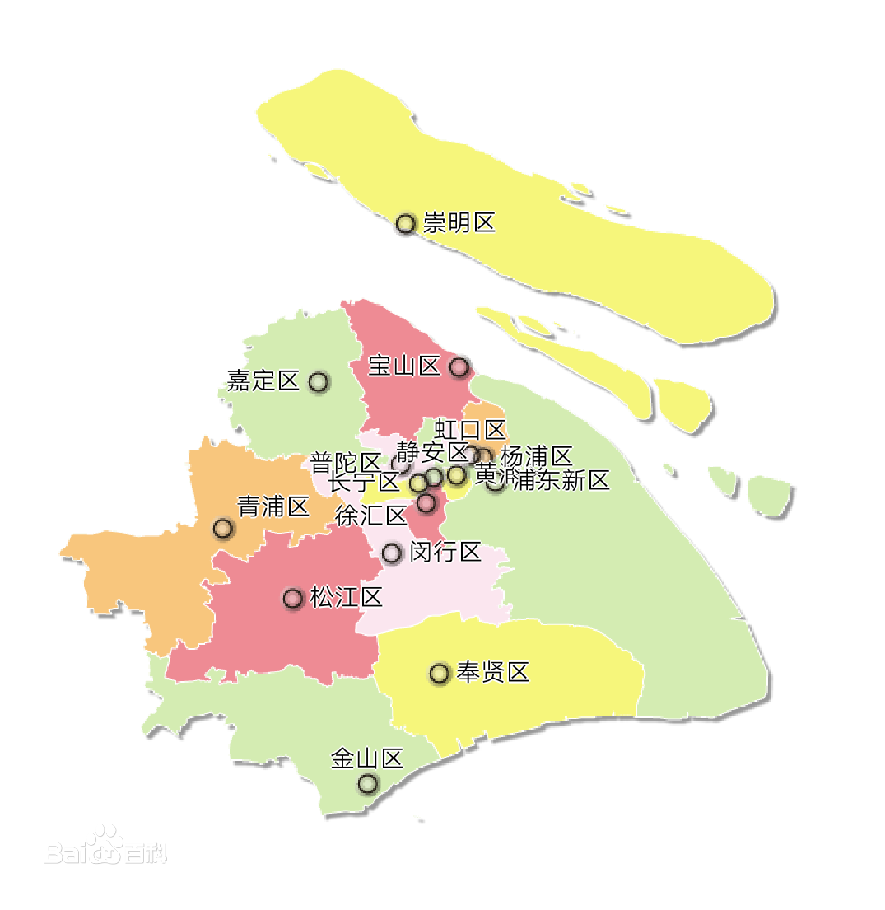
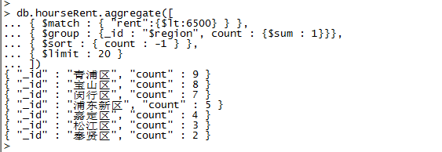

# 上海房租
## 1. 上海区域分布如下图：

## 2. 房租低于65元/m2

## 3. 合适房价：
{ "community" : "大华圣地维拉", "region" : "青浦区", "rent" : 6486, "ratio" : 1182 }
{ "community" : "浦江世博家园六街坊", "region" : "闵行区", "rent" : 6399, "ratio" : 2072 }
{ "community" : "浦江世博家园七街坊", "region" : "闵行区", "rent" : 6361, "ratio" : 3424 }
{ "community" : "好日子大家园C区", "region" : "宝山区", "rent" : 6326, "ratio" : 1459 }
{ "community" : "农房D9空间", "region" : "嘉定区", "rent" : 6204, "ratio" : -2305 }
{ "community" : "德华三村", "region" : "嘉定区", "rent" : 6173, "ratio" : 1223 }
{ "community" : "曙光苑", "region" : "浦东新区", "rent" : 6129, "ratio" : 244 }
{ "community" : "济阳人家", "region" : "浦东新区", "rent" : 6107, "ratio" : -30 }
{ "community" : "三湘四季花城四期", "region" : "松江区", "rent" : 6091, "ratio" : -526 }
{ "community" : "银桥花园", "region" : "闵行区", "rent" : 6034, "ratio" : 4316 }
{ "community" : "凌兆玉兰苑", "region" : "浦东新区", "rent" : 6027, "ratio" : 1372 }
{ "community" : "孙桥公寓", "region" : "浦东新区", "rent" : 5904, "ratio" : 3195 }
{ "community" : "富仕名邸", "region" : "闵行区", "rent" : 5797, "ratio" : 2747 }
{ "community" : "保利叶语", "region" : "宝山区", "rent" : 5705, "ratio" : 1237 }
{ "community" : "新顾村大家园D区", "region" : "宝山区", "rent" : 5306, "ratio" : 1074 }
{ "community" : "枫树林景苑", "region" : "嘉定区", "rent" : 5242, "ratio" : 2831 }
{ "community" : "东明花苑", "region" : "松江区", "rent" : 5176, "ratio" : 666 }
{ "community" : "徐泾北城欣沁苑", "region" : "青浦区", "rent" : 5170, "ratio" : 193 }
{ "community" : "好日子大家园A区", "region" : "宝山区", "rent" : 5169, "ratio" : 695 }
{ "community" : "菊泉新城", "region" : "宝山区", "rent" : 5162, "ratio" : -140 }
{ "community" : "塘泾北苑", "region" : "闵行区", "rent" : 5159, "ratio" : 199 }
{ "community" : "玫瑰湾", "region" : "浦东新区", "rent" : 5038, "ratio" : -528 }
{ "community" : "嘉宝紫提湾", "region" : "嘉定区", "rent" : 4834, "ratio" : -275 }
{ "community" : "新城盛景", "region" : "青浦区", "rent" : 4832, "ratio" : 743 }
{ "community" : "达安圣芭芭花园", "region" : "松江区", "rent" : 4801, "ratio" : 2786 }
{ "community" : "新青浦佳苑", "region" : "青浦区", "rent" : 4587, "ratio" : -756 }
{ "community" : "宝顾佳苑", "region" : "宝山区", "rent" : 4500, "ratio" : 2200 }
{ "community" : "圣卡洛·铂庭", "region" : "宝山区", "rent" : 4456, "ratio" : 1725 }
{ "community" : "青浦佳乐苑", "region" : "青浦区", "rent" : 4305, "ratio" : -1180 }
{ "community" : "美罗家园吉翔苑", "region" : "宝山区", "rent" : 4247, "ratio" : 2534 }
{ "community" : "金城上品", "region" : "青浦区", "rent" : 3953, "ratio" : 4000 }
{ "community" : "现代华庭", "region" : "青浦区", "rent" : 3900, "ratio" : -786 }
{ "community" : "欣佳宝邸", "region" : "闵行区", "rent" : 3747, "ratio" : 342 }
{ "community" : "东方庭院", "region" : "青浦区", "rent" : 3737, "ratio" : 772 }
{ "community" : "汇秀景苑三街坊", "region" : "闵行区", "rent" : 3664, "ratio" : -745 }
{ "community" : "金昊雅苑", "region" : "奉贤区", "rent" : 3207, "ratio" : -631 }
{ "community" : "新南家园", "region" : "奉贤区", "rent" : 3081, "ratio" : 1611 }
{ "community" : "珠溪新苑", "region" : "青浦区", "rent" : 2304, "ratio" : -2578 }