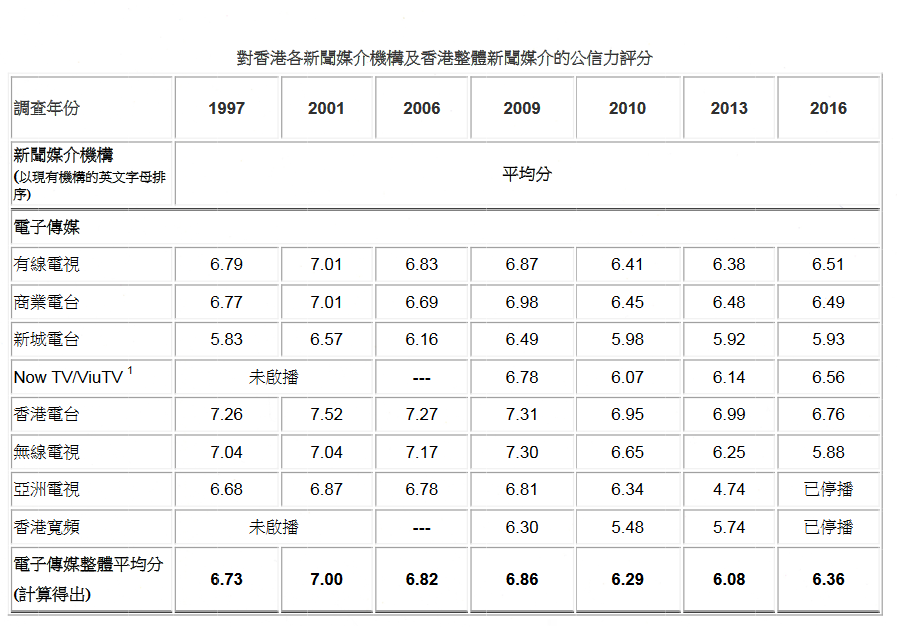
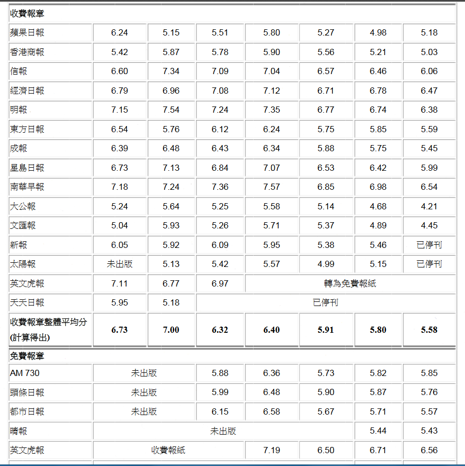
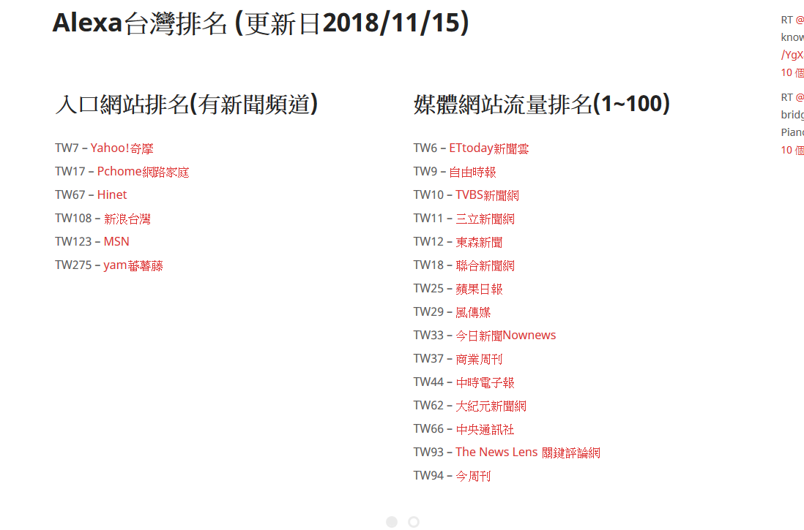

香港传播与民意调查中心：http://www.com.cuhk.edu.hk/ccpos/b5/tracking1.html  
无国界记者：https://rsf.org/en/ranking#  
半岛电视台：https://www.aljazeera.com/  
  
  

台湾媒体：  
```
最受信任的媒體品牌當中，排名依序為公共電視、天下雜誌、商業周刊、TVBS新聞網、ETtoday、中央社、聯合報、中國時報、報導者The Reporter、蘋果日報、民視新聞、中天電視、風傳媒，以及自由時報。台灣閱聽者對於總體新聞的信任度有32%、對個人所使用的新聞信任度為36%、搜尋引擎的新聞信任度有31%，而對社群媒體上的新聞信任度則為23%。
```
