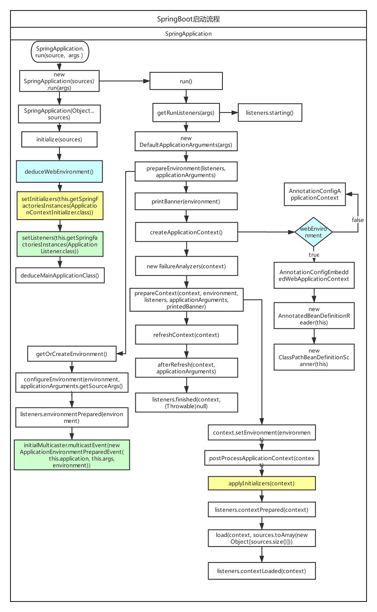

# SpringBoot启动流程

参考文档：  
Spring Boot启动过程源码分析：https://www.cnblogs.com/davidwang456/p/9172685.html  
spring加载流程之AnnotatedBeanDefinitionReader：https://blog.csdn.net/yu_kang/article/details/88068619  
spring加载流程之ClassPathBeanDefinitionScanner：https://blog.csdn.net/yu_kang/article/details/88075447

相关流程图：  

