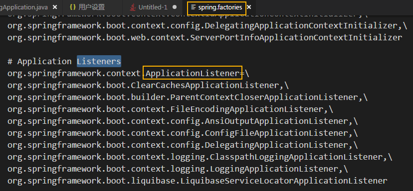

# springBoot启动流程
参考文档：  
SpringBoot 应用程序启动过程探秘：https://juejin.im/post/5b8f05a5f265da43296c6102

# 概述


说到springboot启动，包含两个最重要的关键元素。
* @SpringBootApplication
* SpringApplication以及run方法

关于@SpringBootApplication注解的剖析可以参考：[《SpringBoot 中 @SpringBootApplication注解背后的三体结构探秘》](https://link.juejin.im/?target=https%3A%2F%2Fwww.jianshu.com%2Fp%2F9dc7a385d19e)，其实其背后就是三个结构，只是SpringBoot给了一个包装而已。下面主要分析SpringApplication以及run方法的功能。对应脑图：  


# SpringApplication简介
SpringApplication这个类应该是SpringBoot框架的创新产物，原始的spring并没有这个类，SpringApplication里面封装了一套spring应用的启动流程，而且这对用户完全透明，因此当我们上手SpringBoot是才感觉简洁轻量。  
一般来说默认的SpringApplication执行流程已经可以满足大部分需求。但是乳沟用户想干预这个过程，这可以通过SpringApplication在流程某些地方开启的**扩展点**来完成对流程的扩展，典型的扩展方案就是使用set方法。示例如下：  
```
@SpringBootApplication
public class CodeSheepApplication {
	public static void main( String[] args ) {
		// SpringApplication.run( CodeSheepApplication.class args ); // 这是传统SpringBoot应用的启动，一行代码搞定，内部默认做了很多事
		SpringApplication app = new SpringApplication( CodeSheepApplication.class );
		app.setXXX( ... ); // 用户自定的扩展在此 ！！！
		app.run( args );
	}
}
```

通过拆解我们可以发现，我们也需要先构造SpringApplication类对象，然后调用非对象的run方法。那么接下来就讲一下SpringApplication的构造过程以及run方法的流程，搞清楚了这个，就搞清楚了SpringBoot是如何运行起来的。

# SpringApplication实例的初始化


代码可见主要有四个关键步骤：  
1. 推断应用的类型：根据推断的结果来创建Reactive应用，servlet应用还是none应用


2. 使用SpringFactoriesLoader查找并加载classPath下的META-INFO/spring.factories文件中所有可用的ApplicationContextInitializer


3. 使用SpringFactoriesLoader查找并加载classPath下的META-INFO/spring.factories文件中所有可用的ApplicationListener



4. 推断并设置main方法的定义类


# SpringApplication的run方法探秘
代码如下：  


其启动流程图汇整如下：  


各步骤总结精炼如下：  
1. 通过SpringFactoriesLoader加载META-INFO/spring.factories文件，获取并创建SpringApplicationRunListener对象
2. 然后由SpringApplicationRunListener来发出starting消息
3. 创建参数，并配置当前SpringBoot应用将要使用的Environment
4. 完成之后，依然由SpringApplicationRunListener来发出environmentPrepared消息
5. 创建ApplicationContext
6. 初始化ApplicationContext，并设置environment加载相关配置等。
7. 由SpringApplicationRunListener来发出contentPrepared消息，告知SpringBoot应用使用的ApplicationContext已经准备OK
8. 将各种bean装载进入ApplicationContext，继续由SpringApplicationRunListener来发出contextLoaded消息，告知SpringBoot应用使用的applicationContext已装填完成
9. refresh ApplicationContext，完成IOC容器可用的最后一步
10. 由SpringApplicationRunListener来发出started消息
11. 完成最终的程序启动
12. 由SpringApplicationRunListener来发出running消息，告知程序已经运行起来了