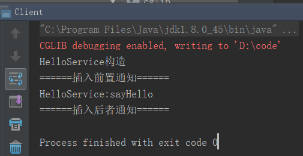
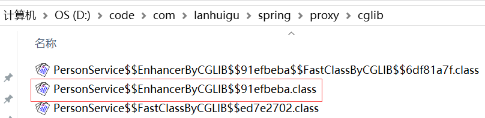

# cglib动态代理实现原理
 参考文档：
 CGLIB动态代理实现原理：https://blog.csdn.net/yhl_jxy/article/details/80633194

 # cglib介绍
 cglib（code generation library）是一个开源项目，是一个强大的，高性能的，高质量的的code生成类库。它可以在运行期扩展java类实现java接口。  
 hibernate用它来实现po（persistent object持久化对象）字节码的动态生成。在spring aop照片那他提供方法的拦截interception。  
 cglib包的底层是通过使用一个小而快的字节码处理框架asm，来转换字节码并生成新的类。除了cglib包，脚本语言groovy和beanShell也是通过使用asm来生成java字节码的，当然不鼓励直接使用asm。因为它需要你必须对jvm内部结构包括class文件的格式和指令集都很熟悉。

 # cglib动态代理实例
 实现一个业务类（这个业务类并没有实现任何接口）  
 ```
 package com.lanhuigu.spring.proxy.cglib;
 
public class HelloService {
 
    public HelloService() {
        System.out.println("HelloService构造");
    }
 
    /**
     * 该方法不能被子类覆盖,Cglib是无法代理final修饰的方法的
     */
    final public String sayOthers(String name) {
        System.out.println("HelloService:sayOthers>>"+name);
        return null;
    }
 
    public void sayHello() {
        System.out.println("HelloService:sayHello");
    }
}
 ```

 自定义methodInterceptor：  

 ```
 package com.lanhuigu.spring.proxy.cglib;
 
import net.sf.cglib.proxy.MethodInterceptor;
import net.sf.cglib.proxy.MethodProxy;
 
import java.lang.reflect.Method;
 
/**
 * 自定义MethodInterceptor
 */
public class MyMethodInterceptor implements MethodInterceptor{
 
    /**
     * sub：cglib生成的代理对象
     * method：被代理对象方法
     * objects：方法入参
     * methodProxy: 代理方法
     */
    @Override
    public Object intercept(Object sub, Method method, Object[] objects, MethodProxy methodProxy) throws Throwable {
        System.out.println("======插入前置通知======");
        Object object = methodProxy.invokeSuper(sub, objects);
        System.out.println("======插入后者通知======");
        return object;
    }
}
 ```

 生成cglib代理对象的调用目标方法：  

 ```
 package com.lanhuigu.spring.proxy.cglib;
 
import net.sf.cglib.core.DebuggingClassWriter;
import net.sf.cglib.proxy.Enhancer;
 
public class Client {
    public static void main(String[] args) {
        // 代理类class文件存入本地磁盘方便我们反编译查看源码
        System.setProperty(DebuggingClassWriter.DEBUG_LOCATION_PROPERTY, "D:\\code");
        // 通过CGLIB动态代理获取代理对象的过程
        Enhancer enhancer = new Enhancer();
        // 设置enhancer对象的父类
        enhancer.setSuperclass(HelloService.class);
        // 设置enhancer的回调对象
        enhancer.setCallback(new MyMethodInterceptor());
        // 创建代理对象
        HelloService proxy= (HelloService)enhancer.create();
        // 通过代理对象调用目标方法
        proxy.sayHello();
    }
}
 ```

 运行结果如下：  

 


 # cglib动态代理源码分析
实现cglib动态代理必须实现MethodInterceptor（方法拦截器）接口。其源码如下：  
```
package net.sf.cglib.proxy;

public interface MethodInterceptor
extends Callback
{
    public Object intercept(Object obj, java.lang.reflect.Method method, Object[] args,
                               MethodProxy proxy) throws Throwable;
}
```

这个接口只有一个intercept（）方法，这个方法有4个参数：  
1. object：表示增强的对象，即实现这个接口类的一个对象
2. method：表示要被拦截的方法
3. args：被拦截方法的参数
4. Proxy：要触发父类的方法对象

在上面的client代码中，通过enhancer.create（）方法创建代理对象，create方法的源代码如下：  
```
public Object create() {
    classOnly = false;
    argumentTypes = null;
    return createHelper();
}
```

该方法的含义是如果有必要就创建一个新类，并且用指定的回调对象创建一个新的对象实例。使用父类的构造方法来实例化父类的部分。核心内容在createhelper()中，其源码如下：  
```
private Object createHelper() {
    preValidate();
    Object key = KEY_FACTORY.newInstance((superclass != null) ? superclass.getName() : null,
            ReflectUtils.getNames(interfaces),
            filter == ALL_ZERO ? null : new WeakCacheKey<CallbackFilter>(filter),
            callbackTypes,
            useFactory,
            interceptDuringConstruction,
            serialVersionUID);
    this.currentKey = key;
    Object result = super.create(key);
    return result;
}
```

preValidate（）方法校验callbackTypes，Filter是否为空，以及为空时的处理。
通过newInstance（）方法创建enhancerKey对象，作为enhancer父类AbstractClassGenerator.create（）方法创建代理对象：  
```
protected Object create(Object key) {
    try {
        ClassLoader loader = getClassLoader();
        Map<ClassLoader, ClassLoaderData> cache = CACHE;
        ClassLoaderData data = cache.get(loader);
        if (data == null) {
            synchronized (AbstractClassGenerator.class) {
                cache = CACHE;
                data = cache.get(loader);
                if (data == null) {
                    Map<ClassLoader, ClassLoaderData> newCache = new WeakHashMap<ClassLoader, ClassLoaderData>(cache);
                    data = new ClassLoaderData(loader);
                    newCache.put(loader, data);
                    CACHE = newCache;
                }
            }
        }
        this.key = key;
        Object obj = data.get(this, getUseCache());
        if (obj instanceof Class) {
            return firstInstance((Class) obj);
        }
        return nextInstance(obj);
    } catch (RuntimeException e) {
        throw e;
    } catch (Error e) {
        throw e;
    } catch (Exception e) {
        throw new CodeGenerationException(e);
    }
}
```

真正创建代理对象的方法在nextInstance（）方法中，该方法为抽象类AbstractClassGenerator的一个方法，签名如下：  
abstract protected Object nextInstance(Object instance) throws Exception;  
在子类Enhancer中实现，其源码如下：  
```
protected Object nextInstance(Object instance) {
    EnhancerFactoryData data = (EnhancerFactoryData) instance;

    if (classOnly) {
        return data.generatedClass;
    }

    Class[] argumentTypes = this.argumentTypes;
    Object[] arguments = this.arguments;
    if (argumentTypes == null) {
        argumentTypes = Constants.EMPTY_CLASS_ARRAY;
        arguments = null;
    }
    return data.newInstance(argumentTypes, arguments, callbacks);
}
```

再看data.newInstance(argumentTypes, arguments, callbacks)方法：  
第一参数为代理对象的构成器类型，第二参数为代理对象构造方法参数，第三参数为对应回调对象。最后根据这些参数通过反射生成代理对象，源码如下：  
```
public Object newInstance(Class[] argumentTypes, Object[] arguments, Callback[] callbacks) {
    setThreadCallbacks(callbacks);
    try {
        if (primaryConstructorArgTypes == argumentTypes ||
                Arrays.equals(primaryConstructorArgTypes, argumentTypes)) {
            return ReflectUtils.newInstance(primaryConstructor, arguments);
        }
        return ReflectUtils.newInstance(generatedClass, argumentTypes, arguments);
    } finally {
        setThreadCallbacks(null);
    }
}
```

最后生成代理对象：  



反编译源码如下：  
```
package com.lanhuigu.spring.proxy.cglib;
 
import java.lang.reflect.Method;
import net.sf.cglib.core.ReflectUtils;
import net.sf.cglib.core.Signature;
import net.sf.cglib.proxy.*;
 
public class HelloService$$EnhancerByCGLIB$$4da4ebaf extends HelloService
	implements Factory
{
 
	private boolean CGLIB$BOUND;
	public static Object CGLIB$FACTORY_DATA;
	private static final ThreadLocal CGLIB$THREAD_CALLBACKS;
	private static final Callback CGLIB$STATIC_CALLBACKS[];
	private MethodInterceptor CGLIB$CALLBACK_0; // 拦截器
	private static Object CGLIB$CALLBACK_FILTER;
	private static final Method CGLIB$sayHello$0$Method; // 被代理方法
	private static final MethodProxy CGLIB$sayHello$0$Proxy; // 代理方法
	private static final Object CGLIB$emptyArgs[];
	private static final Method CGLIB$equals$1$Method;
	private static final MethodProxy CGLIB$equals$1$Proxy;
	private static final Method CGLIB$toString$2$Method;
	private static final MethodProxy CGLIB$toString$2$Proxy;
	private static final Method CGLIB$hashCode$3$Method;
	private static final MethodProxy CGLIB$hashCode$3$Proxy;
	private static final Method CGLIB$clone$4$Method;
	private static final MethodProxy CGLIB$clone$4$Proxy;
 
	static void CGLIB$STATICHOOK1()
	{
		Method amethod[];
		Method amethod1[];
		CGLIB$THREAD_CALLBACKS = new ThreadLocal();
		CGLIB$emptyArgs = new Object[0];
		// 代理类
		Class class1 = Class.forName("com.lanhuigu.spring.proxy.cglib.HelloService$$EnhancerByCGLIB$$4da4ebaf");
		// 被代理类
		Class class2;
		amethod = ReflectUtils.findMethods(new String[] {
			"equals", "(Ljava/lang/Object;)Z", "toString", "()Ljava/lang/String;", "hashCode", "()I", "clone", "()Ljava/lang/Object;"
		}, (class2 = Class.forName("java.lang.Object")).getDeclaredMethods());
		Method[]  = amethod;
		CGLIB$equals$1$Method = amethod[0];
		CGLIB$equals$1$Proxy = MethodProxy.create(class2, class1, "(Ljava/lang/Object;)Z", "equals", "CGLIB$equals$1");
		CGLIB$toString$2$Method = amethod[1];
		CGLIB$toString$2$Proxy = MethodProxy.create(class2, class1, "()Ljava/lang/String;", "toString", "CGLIB$toString$2");
		CGLIB$hashCode$3$Method = amethod[2];
		CGLIB$hashCode$3$Proxy = MethodProxy.create(class2, class1, "()I", "hashCode", "CGLIB$hashCode$3");
		CGLIB$clone$4$Method = amethod[3];
		CGLIB$clone$4$Proxy = MethodProxy.create(class2, class1, "()Ljava/lang/Object;", "clone", "CGLIB$clone$4");
		amethod1 = ReflectUtils.findMethods(new String[] {
			"sayHello", "()V"
		}, (class2 = Class.forName("com.lanhuigu.spring.proxy.cglib.HelloService")).getDeclaredMethods());
		Method[] 1 = amethod1;
		CGLIB$sayHello$0$Method = amethod1[0];
		CGLIB$sayHello$0$Proxy = MethodProxy.create(class2, class1, "()V", "sayHello", "CGLIB$sayHello$0");
	}
 
	final void CGLIB$sayHello$0()
	{
		super.sayHello();
	}
 
	public final void sayHello()
	{
	  MethodInterceptor var10000 = this.CGLIB$CALLBACK_0;
      if(this.CGLIB$CALLBACK_0 == null) {
         CGLIB$BIND_CALLBACKS(this);
         var10000 = this.CGLIB$CALLBACK_0;
      }
 
      if(var10000 != null) {
         // 调用拦截器
         var10000.intercept(this, CGLIB$setPerson$0$Method, CGLIB$emptyArgs, CGLIB$setPerson$0$Proxy);
      } else {
         super.sayHello();
      }
	}
	......
	......
}
```

从代理对象反编译源码可知：  
代理对象继承与HelloService，拦截器调用intercept（）方法，intercept（）方法有自定义MyMethodInterceptor实现，所以，最后调用MyMethodInterceptor中的intercept（）方法，从而完成了由代理对象访问到目标对象的动态代理功能。