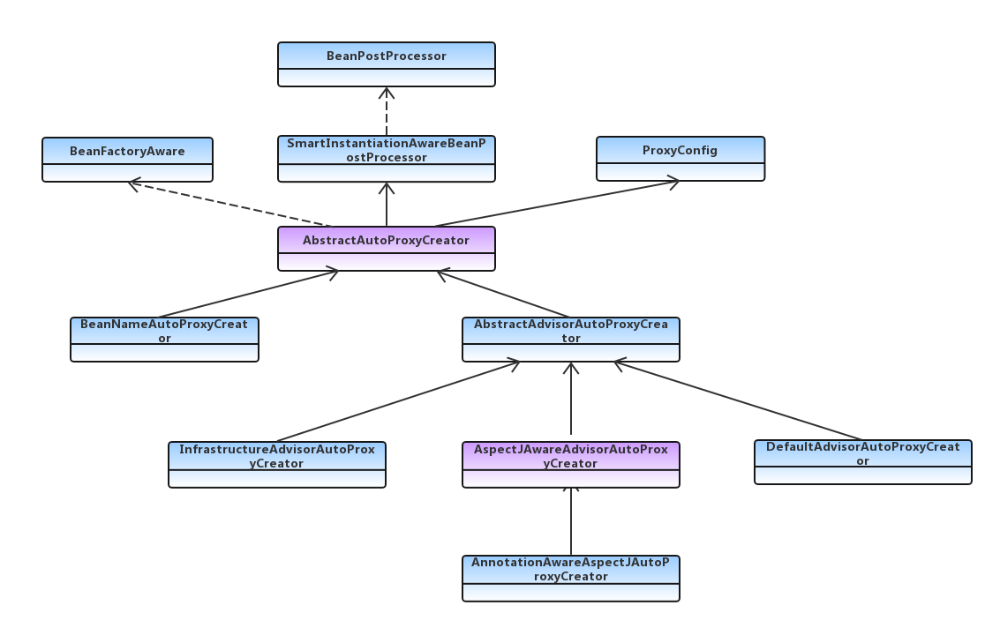
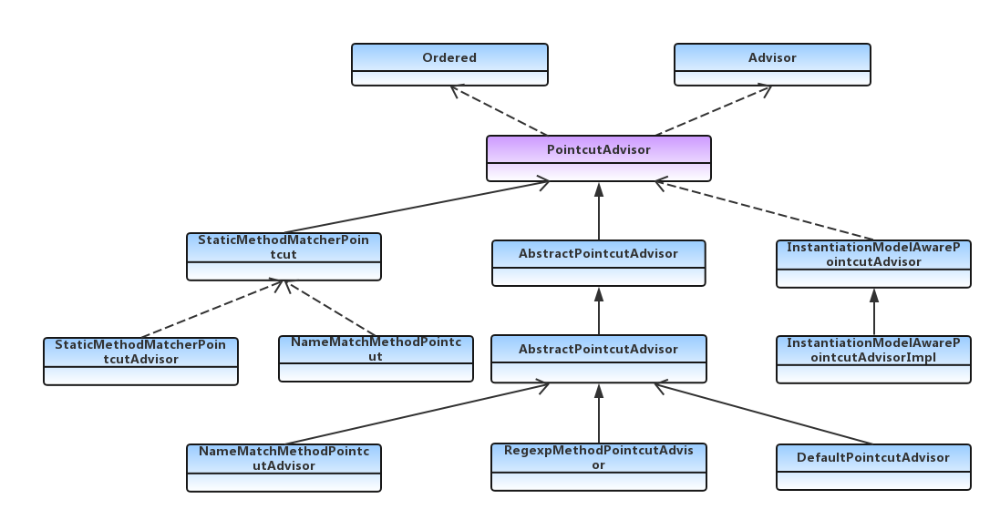
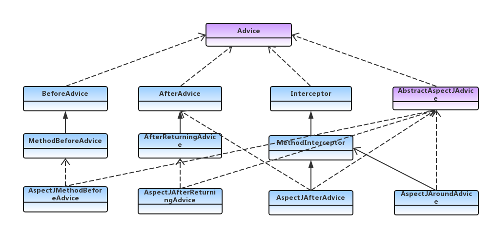
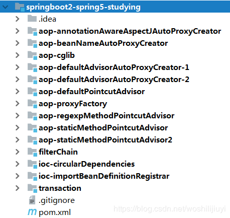

# Spring AOP 原理深度源码分析
参考文档：  
Spring-aop 全面解析（从应用到原理）：https://juejin.im/post/591d8c8ba22b9d00585007dd#heading-12  
SpringBoot2 | Spring AOP 原理深度源码分析（八）：https://juejin.im/post/5ce4d8e451882533591d549a#heading-7

# 概述
AOP（aspect-oriented programming）面向切面编程。spring aop在spring框架中的的地位举足轻重，主要用于实现事务，缓存，安全等功能。本片主要对源码进行深度解析。  
主要涉及以下三个方面内容：  
1. spring aop多种代理机制相关核心类
2. spring boot中aop注解方式源码解析
3. spring boot 1.X版本和2.X版本aop默认配置的变动

# spring aop多种代理机制相关核心类介绍
spring aop中核心类大致分为三类：  
1. advisorCreator：继承spring IOC的扩展接口beanPostProcessor，主要用来扫描获取2. advisor：封装了spring aop中的切面和通知
3. advice：通知，也就是aop中增强的方法

以下为三个核心类的UML关系图：  
## advisorCreator

0

* abstractAutoProxyCreator：spring为spring aop暴露的可扩展抽象类，也是sop中最核心的抽象类。nepxion Matrix框架便是基于此类对aop进行扩展增强的
* beanNameAutoProxyCreator：根据指定名称创建代理对象（阿里大名鼎鼎的数据库连接池框架druid也是基于此类做了扩展的）通过设置advisor，可以对指定的beanName进行代理。支持模糊匹配。
* abstractAdvisorAutoProxyCreator：功能比较强大，默认扫描所有的advisor的实现类。相对于根据beanName匹配，该类更加灵活，动态的匹配每一个类，判断是否可以被代理，并寻找合适的增强类，以及生成代理类。
* defaultAdvisorAutoProxyCreator： abstractAdvisorAutoProxyCreator的默认实现类。可以单独使用，在框架中使用aop，尽量不要手动创建此对象。
* aspectJAwareAdvisorAutoProxyCreator：aspectJ的实现方式，也是spring aop常见的实现方式，如果用注解的方式，则用其子类AnnotationAwareAspectJAutoProxyCreator
* AnnotationAwareAspectJAutoProxyCreator：目前最常用的的aop使用方式。spring aop开启注解方式之后，该类会扫描所有的@Aspect（）注解的类，并生成对应的advisor。目前SpringBoot框架中默认支持的方式，自动配置。

## advisor



*  staticMethodMatcherPointcut：静态方法切面，抽象类。定义一个classFilter，通过重写getClassFilter（）来制定切面规则。另外实现了StaticMethodMatcher接口，通过重写matches来做指定方法匹配规则。
* StaticMethodMatcherPointcutAdvisor：惊呆方法匹配切面顾问，同抽象类，扩展了切面排序方法
* NameMatcherMethodPointcut：名称匹配切面，通过指定方法集合变量mappedNames，模糊匹配
* nameMatchMethodPointcutAdvisor：方法名称切面顾问，内部封装了nameMatchMethodPoingcut，通过设置名称，模糊匹配规则和通知类来实现切面功能。
* RegexpMetnodPointcutAdvisor：正则表达式切面顾问，可设置多个正则表达式规则，通过内部封装的JdkRegexpMethosPointcut解析正则表达式
* DefaultPointcutAdvisor：默认切面顾问，比较灵活，可自由组合切面和通知
* InstantiationModelAwarePointcutAdvisorImpl：SpringBoot自动装配的顾问类型，也是最常用的一种顾问实现，在注解实现的切面中，所有的@aspect类，都会被解析成该对象

## advice



* AspectJMethodBeforeAdvice：前置切面，AspectJ中before属性对应的通知，在切面方法执行之前通知
* AspectJAfterReturningAdvice：后置通知，AspectJ中AfterReturning属性对应的通知，在切面方法执行之后执行，如果有异常，则不执行，注意该通知与AspectJMethodBeforeAdvice对应
* AspectJAroundAdvice：环绕通知，AspectJ中around属性对应的通知，在切面方法执行前后执行
* AspectJAfterAdvice：返回通知，AspectJ中after属性对应的通知，不论是否异常都会执行。

可以看出spring aop提供的实现方法很多，但是殊途同归



# springboot中aop注解方式源码解析
springaop使用使用方式很多，从上面的API也可以看出，本片基于最常用的直接方式，对源码深入分析

```
@Aspect
@Component
public class LogableAspect {

    @Pointcut("@annotation(com.springboot2.spring5.springAop.aspect.Logable)")
    public void aspect() {
    }
    
    @Around("aspect()")
    public Object doAround(ProceedingJoinPoint point) throws Throwable {
        //...
        Object returnValue =  point.proceed(point.getArgs());
        //...
        return returnValue;
    }
}
```

这是实际项目中，使用aop最常用的方式，基于注解实现。如今SpringBoot大行其道，我们就从SpringBoot中enableAspectJAutoProxy自动配置开始  
springaop大致流程主要分为以下三个步骤：  
1. 创建annotationAwareAspectJAutoProxyCreator对象
2. 扫描容器中的切面，创建PointcutAdvisor对象
3. 生成代理类

## 创建annotationAwareAspectJAutoProxyCreator对象
**在springboot中aop同样采用自动装配的方式生成，所以要从spring.factories开始**
```
# Auto Configure from spring.factories
org.springframework.boot.autoconfigure.aop.AopAutoConfiguration,\
```

```
@Configuration
@ConditionalOnClass({ EnableAspectJAutoProxy.class, Aspect.class, Advice.class,
		AnnotatedElement.class })
@ConditionalOnProperty(prefix = "spring.aop", name = "auto", havingValue = "true", matchIfMissing = true)
public class AopAutoConfiguration {

	@Configuration
	@EnableAspectJAutoProxy(proxyTargetClass = false)
	@ConditionalOnProperty(prefix = "spring.aop", name = "proxy-target-class", havingValue = "false", matchIfMissing = false)
	public static class JdkDynamicAutoProxyConfiguration {

	}

	@Configuration
	@EnableAspectJAutoProxy(proxyTargetClass = true)
	@ConditionalOnProperty(prefix = "spring.aop", name = "proxy-target-class", havingValue = "true", matchIfMissing = true)
	public static class CglibAutoProxyConfiguration {

	}

}
```

1. 从以下判断语句可以看出该类的加载前提条件。
```
@ConditionalOnClass({ EnableAspectJAutoProxy.class, Aspect.class, Advice.class,
		AnnotatedElement.class })
```

判断条件中所依赖的类全部都包含在spring-boot-starter-aop中，只要引入了改依赖就可以自动装配。而且从代码中可以看到spring.aop.auto默认为true，并不需要手动开启，很多开发者在SpringBoot项目中使用aop时，习惯性的在启动类上引入@EnableAspectJAutoProxy注解，其实完全没有必要，只要保证项目中引入spring-boot-starter-aop依赖类就行了。

2. 代码同时会判断spring.aop.proxy-target-class变量来控制ProxytargetClass的变量，最终都会加载@EnableAspectJAutoProxy配置，spring.aop.proxy-target-class默认为true，该变量相当关键，他控制了springaop代理类的生成方式。

继续跟进EnableAspectJAutoProxy：  
```
class AspectJAutoProxyRegistrar implements ImportBeanDefinitionRegistrar {

	@Override
	public void registerBeanDefinitions(
			AnnotationMetadata importingClassMetadata, BeanDefinitionRegistry registry) {

		//注册 AnnotationAwareAspectJAutoProxyCreator
		AopConfigUtils.registerAspectJAnnotationAutoProxyCreatorIfNecessary(registry);

		AnnotationAttributes enableAspectJAutoProxy =
				AnnotationConfigUtils.attributesFor(importingClassMetadata, EnableAspectJAutoProxy.class);
		//将 aop 代理方式相关的变量设置到 AopConfigUtils，创建代理类时会读取变量
		if (enableAspectJAutoProxy != null) {
			if (enableAspectJAutoProxy.getBoolean("proxyTargetClass")) {
				AopConfigUtils.forceAutoProxyCreatorToUseClassProxying(registry);
			}
			if (enableAspectJAutoProxy.getBoolean("exposeProxy")) {
				AopConfigUtils.forceAutoProxyCreatorToExposeProxy(registry);
			}
		}
	}
}
```

```
	@Nullable
	public static BeanDefinition registerAspectJAnnotationAutoProxyCreatorIfNecessary(BeanDefinitionRegistry registry,
			@Nullable Object source) {

		return registerOrEscalateApcAsRequired(AnnotationAwareAspectJAutoProxyCreator.class, registry, source);
	}
```
从上面的代码可以看出在EnableAspectJAutoProxy类中注册了一个与切面相关的BeanDefinition对象，即上面提到的的AnnotationAwareAspectJAutoProxyCreator类,并设置了代理方式配置变量**ProxyTargetClass**默认为true  
可以看出这里只是注册了BeanDefinition对象，并没有实例化和初始化对象。那什么时候会实例化和初始化该对象呢？通过第一张图的UML图可以看出，该类继承的顶层接口是beanPostProcessor。我们知道beanPostProcessor的实现类会提前进行初始化，由PostProcessorRegistrationDelegate触发，具体细节可参考另外一篇博客：[ SpringBoot2 | @SpringBootApplication注解 自动化配置流程源码分析（三）](https://link.juejin.im/?target=https%3A%2F%2Fblog.csdn.net%2Fwoshilijiuyi%2Farticle%2Fdetails%2F82388509)  
同时该类又继承了BeanFactoryAware，所以在其实例化Bean后，会触发setBeanFactory（）方法，最终会触发InitBeanFactory方法：  
```
	@Override
	protected void initBeanFactory(ConfigurableListableBeanFactory beanFactory) {
		super.initBeanFactory(beanFactory);
		if (this.aspectJAdvisorFactory == null) {
			//advisor 工厂类
			this.aspectJAdvisorFactory = new ReflectiveAspectJAdvisorFactory(beanFactory);
		}
		//用于创建 advisor
		this.aspectJAdvisorsBuilder =
				new BeanFactoryAspectJAdvisorsBuilderAdapter(beanFactory, this.aspectJAdvisorFactory);
	}
```

至此AnnotationAwareAspectJAutoProxyCreator BeanDefinition创建完毕。

## 扫描容器中的切面，创建PointcutAdvisor对象
在spring IOC流程创建过程中，会触发beanPostProcessor扩展接口，SmartInstantiationAwareBeanPostProcessor是一个实现了beanPostProcessor接口的扩展接口，而AnnotationAwareAspectJAutoProxyCreator正好实现了IOC流程创建过程中，会触发beanPostProcessor扩展接口，SmartInstantiationAwareBeanPostProcessor接口，所以该扩展类正式aop实现的入口。

该接口的触发在实例化bean之后，初始化之前，其具体代码逻辑如下：
```
@Override
	public Object postProcessBeforeInstantiation(Class<?> beanClass, String beanName) throws BeansException {
		Object cacheKey = getCacheKey(beanClass, beanName);

		if (!StringUtils.hasLength(beanName) || !this.targetSourcedBeans.contains(beanName)) {
			//advisedBeans用于存储不可代理的bean，如果包含直接返回
			if (this.advisedBeans.containsKey(cacheKey)) {
				return null;
			}
			//判断当前bean是否可以被代理，然后存入advisedBeans
			if (isInfrastructureClass(beanClass) || shouldSkip(beanClass, beanName)) {
				this.advisedBeans.put(cacheKey, Boolean.FALSE);
				return null;
			}
		}

		// Create proxy here if we have a custom TargetSource.
		// Suppresses unnecessary default instantiation of the target bean:
		// The TargetSource will handle target instances in a custom fashion.
		//到这里说明该bean可以被代理，所以去获取自定义目标类，如果没有定义，则跳过。
		TargetSource targetSource = getCustomTargetSource(beanClass, beanName);
		if (targetSource != null) {
			if (StringUtils.hasLength(beanName)) {
				this.targetSourcedBeans.add(beanName);
			}
			Object[] specificInterceptors = getAdvicesAndAdvisorsForBean(beanClass, beanName, targetSource);
			Object proxy = createProxy(beanClass, beanName, specificInterceptors, targetSource);
			this.proxyTypes.put(cacheKey, proxy.getClass());
			//如果最终可以获得代理类，则返回代理类，直接执行实例化后置通知方法
			return proxy;
		}

		return null;
	}
```

从代码可以看出，判断bean是否被代理的逻辑有以下两段代码实现：  
```
	private boolean hasAspectAnnotation(Class<?> clazz) {
		//判定当前类是否有 Aspect 注解，如果有，则不能被代理
		return (AnnotationUtils.findAnnotation(clazz, Aspect.class) != null);
	}
```

```
	protected boolean isInfrastructureClass(Class<?> beanClass) {
		//判定当前bean是否是 Advice、Pointcut、Advisor、AopInfrastructureBean等子类或实现类，如果是，则不能被代理
		boolean retVal = Advice.class.isAssignableFrom(beanClass) ||
				Pointcut.class.isAssignableFrom(beanClass) ||
				Advisor.class.isAssignableFrom(beanClass) ||
				AopInfrastructureBean.class.isAssignableFrom(beanClass);
		if (retVal && logger.isTraceEnabled()) {
			logger.trace("Did not attempt to auto-proxy infrastructure class [" + beanClass.getName() + "]");
		}
		return retVal;
	}

```