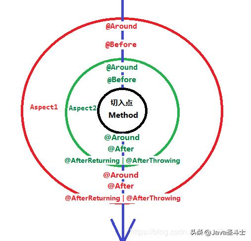

# spring aop原理分析
参考文档：  
https://www.toutiao.com/a6689707033454707204/

## aop5大通知类型
1. around advice
2. before advice
3. after advice
4. after return advice
5. after throwing advice

### advice嵌套关系
假设现在存在同一个节点的两个aspect：order为1的aspect1和order为10的aspect2，那么他们切点的执行流程大致如下：  

