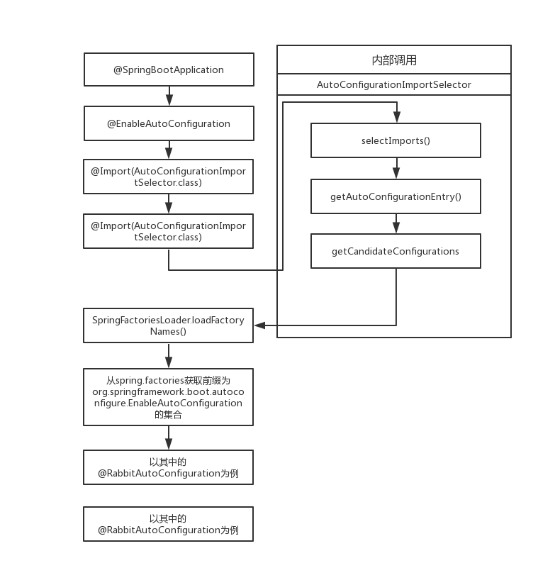

# SpringBoot文档

参考文档：  
Spring Boot启动过程源码分析：https://www.cnblogs.com/davidwang456/p/9172685.html  
spring加载流程之AnnotatedBeanDefinitionReader：https://blog.csdn.net/yu_kang/article/details/88068619  
spring加载流程之ClassPathBeanDefinitionScanner：https://blog.csdn.net/yu_kang/article/details/88075447
springParser调用过程：https://blog.csdn.net/u014723529/article/details/41958841

# 1. 启动流程图：  

# 2. 自动配置流程
参考文档：https://blog.csdn.net/liaokailin/article/details/49559951  .
springboot 启动Tomcat流程：https://www.javazhiyin.com/37521.html

