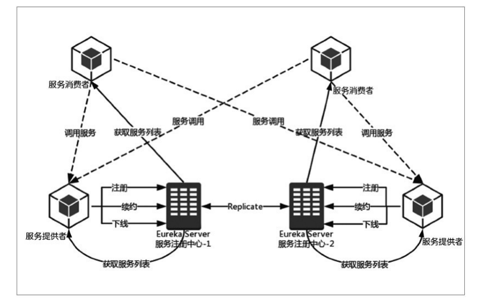

# springCloud分析
参考文档：
Spring Cloud模块功能介绍：https://blog.csdn.net/qq_42046105/article/details/83793787
cap理论：http://www.ruanyifeng.com/blog/2018/07/cap.html

# eureka
spring cloud eureka它既包含服务端组件也包含客户端组件，如果Eureka以集群的方式部署，当集群有分片出现故障，eureka进入自我保护模式。它允许在分片故障期间继续提供服务的发现和注册，当故障分片恢复运行时，集群中的其他分片会把他们的状态再次同步回去。  
在应用程序运行时eureka客户端向注册中心注册自身提供的服务，滚吧周期性的发送心跳来更新它的服务租约。  

## 配置服务注册中心流程
1. 添加依赖spring-cloud-starter-eureka-server
2. 启动类添加注解@EnableEurekaServer
3. 修改application.properties配置

## 配置服务消费者流程
1. 添加依赖spring-cloud-starter-eureka-server
2. 启动类添加注解@EnableDiscoveryClient
3. 修改application.properties配置

## eureka高可用性
eureka server的高可用性实际上就是将自己作为服务向其他服务注册中心注册自己，这样就形成一组互相注册的服务中心，已实现服务清单的互相同步，达到高级可用的效果。  
要实现该效果需要修改每个注册中心的application.properties配置

## 服务的发现与消费
客户端调用服务就需要服务的发现和消费，发现工作主要由eureka客服端完成，服务消费任务有ribbon完成。ribbon是一个基于http和tcp的客户端负载均衡器，他可以通过客户端中配置的ribbonServerList服务列表轮询来达到负载均衡的作用，当ribbon和eureka联合使用时，ribbon的服务清单ribbonServerList会被DiscoveryEnabledNIWSServerList重写，扩展成为从eureka注册中心获取服务端列表。同时eureka也会用NIWSDiscoveryPing来取代IPing，实现检测服务器端是否已经启动的功能。  
实现方式：  
1. 消费端添加依赖spring-cloud-starter-ribbon
2. 主类中创建RestTemplate的spring Bean实例并添加@LoadBalanced注解开启客户端负载均衡。

## 服务下线
当服务实例进行正常的关闭操作时，他会触发一个服务下线的rest请求给eureka server，告诉注册中心我要下线了。服务端在接收到请求之后，将该服务状态标识为下线，并把该下线事件传播出去。

## 失效剔除
如果服务实例因为某种原因不能正常发送下线请求，为了从服务器端剔除无法提供服务的实例，eureka server在启动的时间会创建一个定时任务，默认每个隔一段时间（60秒）将当前清单中超时（默认90秒）没有续约的服务剔除掉。

## 自我保护机制
服务注册到eureka server之后，会维护一个心跳连接，告诉eureka server自己还活着，eureka server在运行期间，会统计心跳失败的比例在15分钟之内是否低于80%，如果低于，eureka server会启动保护机制，将当前实例注册信息保护起来，让它们不过期，尽可能保护这些注册信息。但是会出现消费端获取到的服务实例真的无法调通的情况，这时消费端需要有相对应的容错机制，比如通过请求重试、断路器来实现容错。

## 服务治理机制

