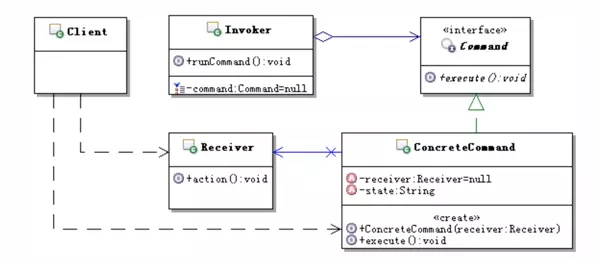
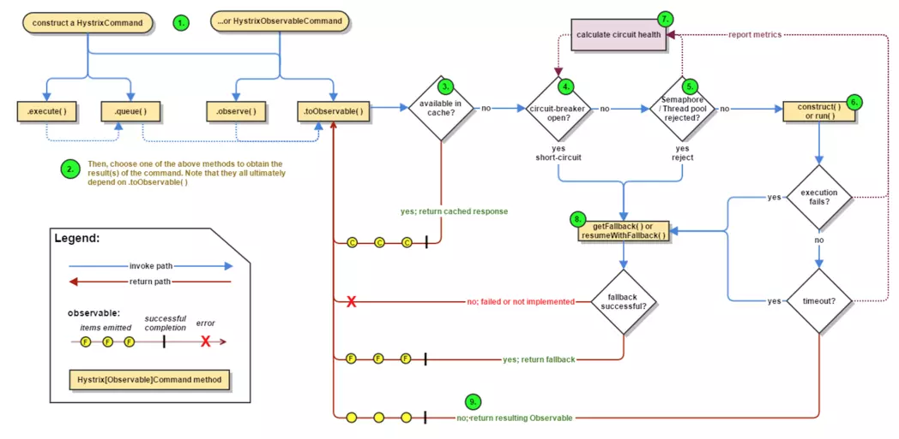
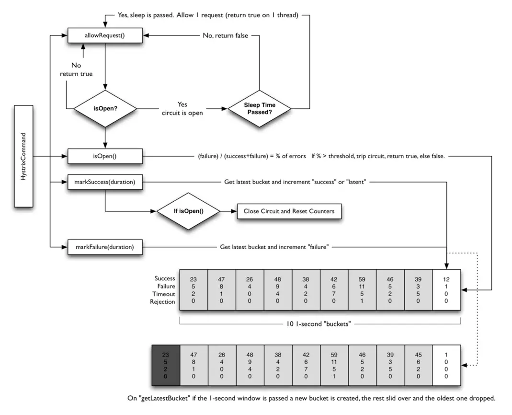
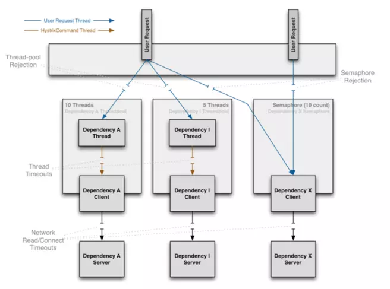

# springCloud组件之hystrix

参考文档：  
Hystrix系列-5-Hystrix的资源隔离策略：https://blog.csdn.net/liuchuanhong1/article/details/73718794  
使用Hystrix实现自动降级与依赖隔离[微服务]：https://www.jianshu.com/p/138f92aa83dc  

# 简介
hystrix是netfix开源的一个容灾框架，用来解决当外部依赖故障时拖跨业务系统，甚至引起雪崩问题。对于一些非核心操作，如增减库存后保存操作日志，发送异步消息时，一旦出现MQ异常时，会导致接口相应超超时，音痴可以考虑对费河西操作引入降级服务，服务隔离。

# 为什么需要hystrix
在大中型分布式系统中，通常系统很多依赖http，hession，netty，dubbo等，在该并发下这些依赖的稳定性与否对系统的影响非常大，但是依赖的很多不可控问题：网络连接缓慢，资源繁忙，暂时不可用，服务脱机等。  
当依赖阻塞时，大多数服务器的线程池就出现阻塞（block），影响整个线上服务的稳定。在复杂的分布式架构的应用程序有很多的依赖，都会不可避免的在某些时候失败。高并发的依赖失败时如果没有隔离措施，当前应用程序就存在被拖垮的风险。解决问题的方案是对依赖做隔离。  

# hystrix设计理念
要想知道如何用，就必须明白其核心的设计理念，hystrix基于命令模式，通过UML图先直观的认识一下这一设计模式。  

可见command是在receiver和invoker之间添加中间层，command实现了对receiver的封装。那么hystrix的应用场景如何与上图对应的呢？  
API既可以是invoke又可以是reciever，通过继承hystrix核心类hystrixCommand来封装这些API，例如接口远程调用，数据库查询子类的可能会产生延迟操作。就可以为api提供弹性保护了。

# hystrix如何解决依赖隔离
* hystrix使用命令模式hystrixCommand包装依赖调用逻辑，每个命令在单独线程中/信号授权下执行
* 可配置依赖调用超时时间，超时时间一般设置为比99.5%平均时间略高集合，当调用超时时，直接返回或者执行ballback逻辑。
* 为每个依赖提供一个小的线程池（或信号），如果线程池已满调用将被立即拒绝，默认不采用排队，家属失败判断判定时间
* 依赖调用结果分为：成功，失败（抛出异常），超时，拒绝线程，短路。请求失败时执行fallBack降级逻辑
* 提供熔断器组件，可以自动运行或者手动调用，停止当前依赖一段时间（默认10秒），熔断器默认错误率阈值为50%，超过将自动运行。
* 提供近乎实时的依赖的统计和监控。

# hystrix流程结构解析

流程说明：  
1. 每次调用创建一个新的hystrixCommand，把依赖调用封装在run方法里
2. 每次执行execute（）/queue做同步或者异步调用
3. 判断熔断器（circuit-breaker）是否打开，如果打开跳到步骤7的降级策略
4. 判断线程池/队列/信号量是否跑满，如果跑满进入步骤7的降级策略
5. 调用hystrixCommand的run方法，进行依赖调用逻辑
    1. 依赖逻辑调用超时，进入步骤7
    2. 判断是否调用成功，成功返回结果，失败调用步骤7
6. 计算熔断器状态，所有的额运行状态（成功，失败，拒绝，超时）都上报到熔断器，用于统计判断熔断器运行状态
7. getFallBack（）降级逻辑，以下4中情况将触发fallBack降级逻辑
    1. run方法抛出非hystrixBadRequestException异常
    2. run方法调用超时
    3. 熔断器开启垃拦截掉用
    4. 线程池，队列，信号量已占满
8. 没有实现fallBack降级策略的逻辑调用将抛出异常
9. fallBack降级逻辑调用成功将直接返回，失败则抛出异常
10. 返回最终执行的结果

# 熔断器circuit breaker
每个熔断器默认维护10个bucket，每秒一个bucket，每个bucket记录最终执行的结果（成功，失败，超时，拒绝），默认错误超过50%且10秒内超过20个请求进行中段拦截  

# hystrix隔离分析
hystrix隔离方式采用线程池/信号量的方式，通过隔离限制依赖的并发量和阻塞扩散

## 线程隔离
把执行依赖代码的线程和请求线程分离，请求线程可以自由的控制离开的时间（异步过程），通过线程池的大小可以控制并发量，当线程池饱和时可以提前拒绝服务，防止依赖问题扩散。线上建议线程次不要设置过大，否则大量阻塞线程有可能会拖慢服务器。

## 信号隔离
信号隔离也可以用于限制并发访问，防止阻塞扩散，与线程隔离最大的不同是执行依赖代码的线程依然是请求线程（该线程需要通过信号申请），如果客户端是可信的字儿可以快速返回，可以使用信号隔离替代线程隔离，降低开销，信号量的大小可以动态调整，线程池大小不可以。  
线程隔离和信号隔离的原理如下图：  

