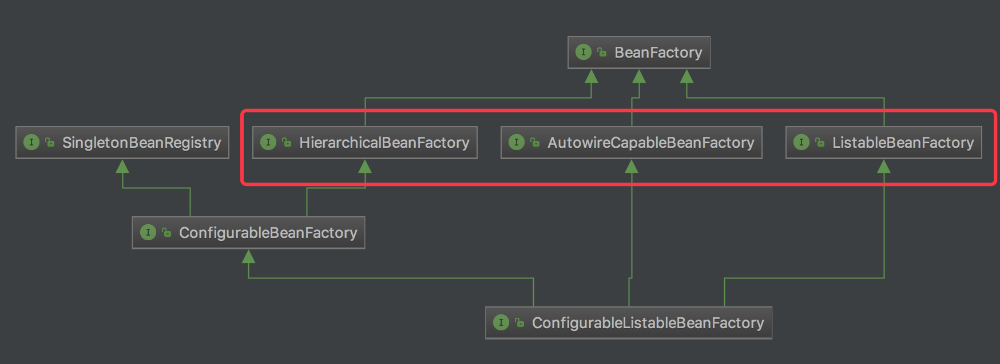
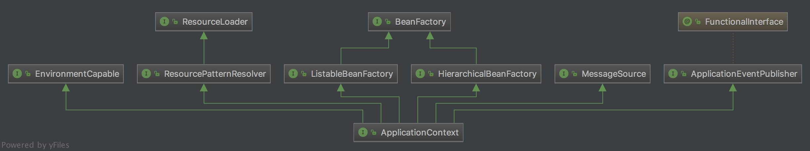
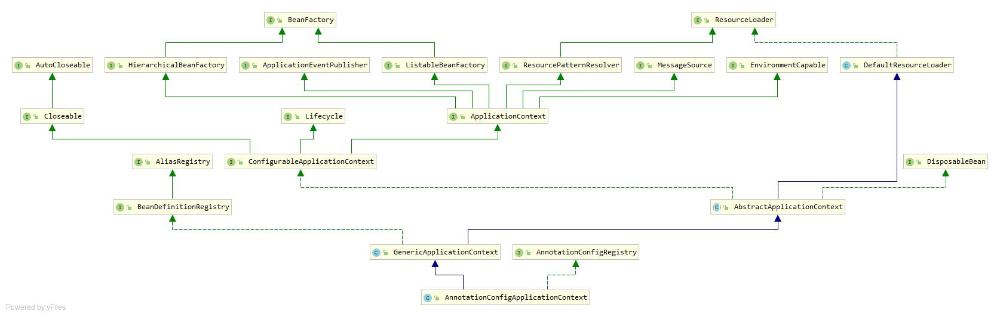

# spring IOC容器创建bean过程
参考文档：  
Spring IOC容器创建bean过程浅析：https://www.cnblogs.com/micrari/p/7354650.html

# 背景
spring框架本身非常庞大，源码阅读可以从spring IOC容器的实现一点点了解。然而即使是IOC容器，代码仍然是非常多的，短时间内全部精度完全不现实，本文对beanDefinition的加载解析，bean实例化的反射调用细节不再介绍，仅以初略的角度答题感受一下IOC容器创建bean的过程。

# 大纲
本文主要围绕以下关键点进行讲解：  
* BeanFactory和ApplicationContext的区别
* IOC容器创建bean的大致过程
* bean的循环依赖是如何解决的
* 那些aware究竟是什么

# 通过源码解析
## BeanFactory和applicationContext区别
### BeanFactory体系
org.springframework.beans.factory.BeanFactory是spring的bean容器的衣蛾非常重要的接口，位于spring-beans模块。  
它包含了各种getbean方法，如通过名称，类型，参数等，试图从bean容器中返回一个bean实例。还包括诸如containBean，isSingleton，isPrototype等方法判断bean容器中是否存在某个bean或者判断bean是否为单例/原型模式等待。  



可以看出BeanFactory向下主要有三条继承路线：  
1. ListableBeanFactory  
在BeanFactory基础上，支持对bean容器中bean的枚举
2. HierarchicalBeanFactory-》ConfigurableBeanFactory  
HierarchicalBeanFactory有个getParentBeanFactory方法，是的bean容器具有亲缘关系。而configurableBeanFactory则是对BeanFactory的一系列配置功能提供了支持。
3. autowireCapableBeanFactory  
提供了一系列自动装配bean的方法，用户代码比较少用到，更多的是spring内部使用。

### applicationContext体系
org.springframework.context.ApplicationContext是spring上下文的底层接口，位于spring-context模块中。他可以视作是spring IOC容器的一个高级形式，也是我们用spring企业开发时必然会用到的一个接口，它含有许多面向框架的特性，也对应用环境做了适配。  



从上图结构关系可以看出SpringContext作为BeanFactory的子接口，与BeanFactory之间也是通过hierarchicalBeanFactory与listableBeanFactory桥接的。  
applicationContext接口同时也继承了MessageSource，ResourceLoader，ApplicationEventPublisher接口，以BeanFactory为主线添加了许多高级容器特性。

## spring创建bean的大致流程
搞清楚整个spring IOC容器创建bean的过程，对于阅读源码的效率会有很大的提升。  
下面是梳理后的整个初始化流程：  
1. 实例化BeanFactoryPostProcessor实现类
2. 调用BeanFactoryPostProcessor#postProcessorBeanFactory
3. 实例化beanPostProcessor实现类
4. 调用InstantiationAwareBeanPostProcessor#postProcessorBeforeInstantiation
5. 实例化bean
6. 调用InstantiationAwareBeanProcessor#postProcessAfterInstantiation
7. 调用InstantiationAwareBeanPostProcessor#postProcessPropertyValues
8. 为bean注入属性
9. 调用BeanNameAware#setBeanName
10. 调用BeanClassLoaderAware#setBeanClassLoader
11. 调用BeanFactoryAware#setBeanFactory
12. 调用BeanPostProcessor#postProcessorBeforeInitialization
13. 调用InitializingBean#afterPropertiesSet
14. 调用Bean的init-method
15. 调用BeanPostProcessor#postProcessAfterInitialization


## IOC容器注入
完整来说，IOC容器的初始化的过程中做了在容器中建立BeanDefinition的数据映射。之后所有的依赖注入都依托于已经存在的BeanDefinition，限于篇幅，此处省略对BeanDefinition的建立过程的介绍。直接从上下文的getBean开始看起。  
在AbstractApplicationContext抽象类中有一个getBeanFactory方法用于返回一个ConfigurableListableBeanFactory，所有的BeanFactory接口的实现实际上都委托给了之类内部的ConfigurableListableBeanFactory实现。  
我们以AnnotationConfigApplicationContext为例，它在被构造时，内部的BeanFactory实际上是由父类GenericApplicationContext来初始化了一个DefaultListableBeanFactory的。  



因此我们看某个bean是如何被加载的可以从DefaultListableBeanFactory的getBean方法看起，对于DefaultListableBeanFactory而言那些getBean方法实际上在AbstractBeanFactory这一层就实现了，并且都委托给了AbstractBeanFactory#doGetBean。下面就看一下doGetBean方法：  
```
protected <T> T doGetBean( final String name, final Class<T> requiredType, final Object[] args, boolean typeCheckOnly)
        throws BeansException {

    final String beanName = transformedBeanName(name);
    Object bean;

    /*
     * 尝试从缓存中拿取一个bean实例。
     * Spring会在Bean还没完全初始化完毕的前，通过一个ObjectFactory提前暴露出bean实例，这样为解决循环依赖提供了遍历。
     */
    Object sharedInstance = getSingleton(beanName);
    if (sharedInstance != null && args == null) {
        if (logger.isDebugEnabled()) {
            if (isSingletonCurrentlyInCreation(beanName)) {
                logger.debug("Returning eagerly cached instance of singleton bean '" + beanName +
                        "' that is not fully initialized yet - a consequence of a circular reference");
            }
            else {
                logger.debug("Returning cached instance of singleton bean '" + beanName + "'");
            }
        }
        // 对FactoryBean的情况进行特殊处理。
        bean = getObjectForBeanInstance(sharedInstance, name, beanName, null);
    }

    else {
        // 如果正在创建的bean为原型并且已经正在创建，这种循环依赖是无法解决的，要抛出异常。
        if (isPrototypeCurrentlyInCreation(beanName)) {
            throw new BeanCurrentlyInCreationException(beanName);
        }

        // 如果该beanFactory中不包含要创建bean的beanDefinition，则尝试从父beanFactory中寻找。
        BeanFactory parentBeanFactory = getParentBeanFactory();
        if (parentBeanFactory != null && !containsBeanDefinition(beanName)) {
            String nameToLookup = originalBeanName(name);
            if (args != null) {
                return (T) parentBeanFactory.getBean(nameToLookup, args);
            }
            else {
                return parentBeanFactory.getBean(nameToLookup, requiredType);
            }
        }

        if (!typeCheckOnly) {
            markBeanAsCreated(beanName);
        }

        try {
            final RootBeanDefinition mbd = getMergedLocalBeanDefinition(beanName);
            checkMergedBeanDefinition(mbd, beanName, args);

            // 有些bean是有depends-on/@DependsOn的，需要先初始化这些依赖。
            String[] dependsOn = mbd.getDependsOn();
            if (dependsOn != null) {
                for (String dep : dependsOn) {
                    if (isDependent(beanName, dep)) {
                        throw new BeanCreationException(mbd.getResourceDescription(), beanName,
                                "Circular depends-on relationship between '" + beanName + "' and '" + dep + "'");
                    }
                    registerDependentBean(dep, beanName);
                    getBean(dep);
                }
            }

            // 创建单例bean。
            if (mbd.isSingleton()) {
                /*
                 * 调用父类DefaultSingletonBeanRegistry的getSingleton，具体创建bean的工作实际上仍然是
                 * 回调参数中传递的ObjectFactory#getObject方法，而createBean实际上是子类AbstractAutowireCapableBeanFactory实现的。
                 */
                sharedInstance = getSingleton(beanName, new ObjectFactory<Object>() {
                    @Override
                    public Object getObject() throws BeansException {
                        try {
                            return createBean(beanName, mbd, args);
                        }
                        catch (BeansException ex) {
                            destroySingleton(beanName);
                            throw ex;
                        }
                    }
                });
                // 对FactoryBean的情况进行特殊处理。
                bean = getObjectForBeanInstance(sharedInstance, name, beanName, mbd);
            }
            // 创建原型bean。
            else if (mbd.isPrototype()) {
                Object prototypeInstance = null;
                try {
                    // 前置处理，维护prototypesCurrentlyInCreation，加入当前bean记录。
                    beforePrototypeCreation(beanName);
                    // 委托给子类AbstractAutowireCapableBeanFactory来完成具体的创建bean工作。
                    prototypeInstance = createBean(beanName, mbd, args);
                }
                finally {
                    // 后置处理，维护prototypesCurrentlyInCreation信息，删除当前bean记录。
                    afterPrototypeCreation(beanName);
                }
                // 对FactoryBean的情况进行特殊处理。
                bean = getObjectForBeanInstance(prototypeInstance, name, beanName, mbd);
            }

            else {
                String scopeName = mbd.getScope();
                final Scope scope = this.scopes.get(scopeName);
                if (scope == null) {
                    throw new IllegalStateException("No Scope registered for scope name '" + scopeName + "'");
                }
                try {
                    Object scopedInstance = scope.get(beanName, new ObjectFactory<Object>() {
                        @Override
                        public Object getObject() throws BeansException {
                            beforePrototypeCreation(beanName);
                            try {
                                return createBean(beanName, mbd, args);
                            }
                            finally {
                                afterPrototypeCreation(beanName);
                            }
                        }
                    });
                    bean = getObjectForBeanInstance(scopedInstance, name, beanName, mbd);
                }
                catch (IllegalStateException ex) {
                    throw new BeanCreationException(beanName,
                            "Scope '" + scopeName + "' is not active for the current thread; consider " +
                            "defining a scoped proxy for this bean if you intend to refer to it from a singleton",
                            ex);
                }
            }
        }
        catch (BeansException ex) {
            cleanupAfterBeanCreationFailure(beanName);
            throw ex;
        }
    }

    // 到这里一个bean就已经创建完了，最后一步检查类型，如果不匹配会尝试转换。
    if (requiredType != null && bean != null && !requiredType.isAssignableFrom(bean.getClass())) {
        try {
            return getTypeConverter().convertIfNecessary(bean, requiredType);
        }
        catch (TypeMismatchException ex) {
            if (logger.isDebugEnabled()) {
                logger.debug("Failed to convert bean '" + name + "' to required type '" +
                        ClassUtils.getQualifiedName(requiredType) + "'", ex);
            }
            throw new BeanNotOfRequiredTypeException(name, requiredType, bean.getClass());
        }
    }
    return (T) bean;
}
```

通过对doGetBean源码进行分析，可以看出他主要做了如下事情：  
1. 转换beanName
2. 尝试从缓存的单例中拿到实例
3. 如果要创建的bean是原型模式，且已经在尝试创建，这种循环依赖是无法解决的
4. 当前BeanFactory如果不包含bean的BeanDefinition的话，尝试从parentBeanFactory中获取
5. 如果当前bean有依赖，则需要先完成那些bean的初始化创建
6. 针对scope分类讨论创建。我们比较关心的就是单例，其次是原型
7. 类型检查，并且创世转换

我们一般比较关心的就是单例bean和原型bean的创建。  
在获取单例bean时doGetBean方法会调用父类DefaultSingletonBeanRegistry#getSingleton。可以把DefaultSingletonBeanRegistry当做一个"单例bean桶"，因为它确实就是用来存放单例bean的桶。但是这个桶本身不关心bean到底是怎么创建的，所以对于桶里面还没有的bean，它将创建bean的职责通过回调ObjectFactory#getObject来完成，而AbstractBeanFactory中传递给getSingleton方法的ObjectFactory#getObject的具体实现就是调用createBean，这个方式是真正用于创建并初始化bean的方法，由子类AbstractAutowireCapableBeanFactory来具体实现完成。所以下面具体观察一下createBean的代码实现：  
```
protected Object createBean(String beanName, RootBeanDefinition mbd, Object[] args) throws BeanCreationException {
    if (logger.isDebugEnabled()) {
        logger.debug("Creating instance of bean '" + beanName + "'");
    }
    RootBeanDefinition mbdToUse = mbd;

    Class<?> resolvedClass = resolveBeanClass(mbd, beanName);
    if (resolvedClass != null && !mbd.hasBeanClass() && mbd.getBeanClassName() != null) {
        mbdToUse = new RootBeanDefinition(mbd);
        mbdToUse.setBeanClass(resolvedClass);
    }

    try {
        mbdToUse.prepareMethodOverrides();
    }
    catch (BeanDefinitionValidationException ex) {
        throw new BeanDefinitionStoreException(mbdToUse.getResourceDescription(),
                beanName, "Validation of method overrides failed", ex);
    }

    try {
        /* 
         * 在对象被实例化前，这里有一个短路逻辑，会调用InstantiationAwareBeanPostProcessor#postProcessBeforeInstantiation。
         * 如果存在某个InstantiationAwareBeanPostProcessor的调用结果不为null，则形成了短路，接下来调用BeanPostProcessor#postProcessAfterInitialization。
         *
         * 实际上，一般Spring里默认就LazyInitTargetSourceCreator和QuickTargetSourceCreator可能会使得这里的短路生效。
         * 大部分情况AOP还是在bean被正常实例化后通过调用postProcessAfterInitialization实现的。
         */
        Object bean = resolveBeforeInstantiation(beanName, mbdToUse);
        if (bean != null) {
            return bean;
        }
    }
    catch (Throwable ex) {
        throw new BeanCreationException(mbdToUse.getResourceDescription(), beanName,
                "BeanPostProcessor before instantiation of bean failed", ex);
    }

    // 创建bean的主要方法。
    Object beanInstance = doCreateBean(beanName, mbdToUse, args);
    if (logger.isDebugEnabled()) {
        logger.debug("Finished creating instance of bean '" + beanName + "'");
    }
    return beanInstance;
}
```

从上面可以看出AbstractAutowireCapableBeanFactory#createBean是创建bean的主要入口方法，当仍然不是最主要在“干活”的方法，继续向下看doCreateBean方法。  
```
protected Object doCreateBean(final String beanName, final RootBeanDefinition mbd, final Object[] args) throws BeanCreationException {

    BeanWrapper instanceWrapper = null;
    if (mbd.isSingleton()) {
        // 尝试从factoryBean缓存中获取。
        instanceWrapper = this.factoryBeanInstanceCache.remove(beanName);
    }
    if (instanceWrapper == null) {
        // 创建bean实例。
        instanceWrapper = createBeanInstance(beanName, mbd, args);
    }
    final Object bean = (instanceWrapper != null ? instanceWrapper.getWrappedInstance() : null);
    Class<?> beanType = (instanceWrapper != null ? instanceWrapper.getWrappedClass() : null);

    synchronized (mbd.postProcessingLock) {
        if (!mbd.postProcessed) {
            try {
                applyMergedBeanDefinitionPostProcessors(mbd, beanType, beanName);
            }
            catch (Throwable ex) {
                throw new BeanCreationException(mbd.getResourceDescription(), beanName,
                        "Post-processing of merged bean definition failed", ex);
            }
            mbd.postProcessed = true;
        }
    }

    /*
     * Spring为了解决单例bean的循环引用问题，会在bean还没有完全初始化完毕前通过添加singletonFactory
     * 使得其它bean可以拿到某个bean的实例引用。
     */
    boolean earlySingletonExposure = (mbd.isSingleton() && this.allowCircularReferences &&
            isSingletonCurrentlyInCreation(beanName));
    if (earlySingletonExposure) {
        if (logger.isDebugEnabled()) {
            logger.debug("Eagerly caching bean '" + beanName +
                    "' to allow for resolving potential circular references");
        }
        addSingletonFactory(beanName, new ObjectFactory<Object>() {
            @Override
            public Object getObject() throws BeansException {
                return getEarlyBeanReference(beanName, mbd, bean);
            }
        });
    }

    // 接下去初始化bean。
    Object exposedObject = bean;
    try {
        // 填充bean中的属性。
        populateBean(beanName, mbd, instanceWrapper);
        if (exposedObject != null) {
            /*
             * 调用初始化方法,比如:
             * 1. 各种aware回调
             * 2. 调用BeanPostProcessor#postProcessBeforeInitialization
             * 3. 调用InitializingBean#afterPropertiesSet, xml中的init-method
             * 4. 调用BeanPostProcessor#postProcessAfterInitialization
             */
            exposedObject = initializeBean(beanName, exposedObject, mbd);
        }
    }
    catch (Throwable ex) {
        if (ex instanceof BeanCreationException && beanName.equals(((BeanCreationException) ex).getBeanName())) {
            throw (BeanCreationException) ex;
        }
        else {
            throw new BeanCreationException(
                    mbd.getResourceDescription(), beanName, "Initialization of bean failed", ex);
        }
    }

    if (earlySingletonExposure) {
        Object earlySingletonReference = getSingleton(beanName, false);
        /*
         * 上面的getSingleton第二个参数为false表示不会主动触发early reference的创建。
         * 所以此处earlySingletonReference只有在bean创建过程中发现有别的bean与当前bean有循环依赖才不为空。
         */
        if (earlySingletonReference != null) {
            /*
             * 如果当前bean调用initializeBean没有增强原始bean实例,则取earlySingletonReference。
             * 
             * 举例:
             * BeanA与BeanB互相依赖。Srping先创建BeanA,再创建BeanB。
             * BeanA通过addSingletonFactory暴露了获取BeanA引用的途径。
             *
             * 在populateBean的时候需要注入BeanB,而BeanB又需要注入BeanA,
             * 则在获取BeanA时会调用原先BeanA暴露的ObjectFactory,继而使得earlySingletonObjects中加入了BeanA引用。
             *
             * 回到BeanA的创建过程，走到此步时，发现initializeBean没有增强原始bean实例,
             * 则需要取其它循环依赖bean拿BeanA时在registry留下的结果(原始bean经过SmartInstantiationAwareBeanPostProcessor#getEarlyBeanReference回调)。
             */
            if (exposedObject == bean) {
                exposedObject = earlySingletonReference;
            }
            else if (!this.allowRawInjectionDespiteWrapping && hasDependentBean(beanName)) {
                // 获取当前bean依赖的其它bean。
                String[] dependentBeans = getDependentBeans(beanName);
                // 过滤筛选出真正依赖的bean。
                Set<String> actualDependentBeans = new LinkedHashSet<String>(dependentBeans.length);
                for (String dependentBean : dependentBeans) {
                    if (!removeSingletonIfCreatedForTypeCheckOnly(dependentBean)) {
                        actualDependentBeans.add(dependentBean);
                    }
                }
                /*
                 * 举例:
                 * BeanA与BeanB互相依赖。Srping先创建BeanA,再创建BeanB。
                 * BeanA的创建走到这里时会抛出异常。
                 *
                 * 原因是上面的exposedObject != bean说明initializeBean方法的调用增强了原始的BeanA。
                 * 而BeanB中注入的BeanA很可能是原始beanA(可能会有SmartInstantiationAwareBeanPostProcessor#getEarlyBeanReference回调,
                 * 也就是BeanB中注入的BeanA不是此处BeanA的最终版exposedObject。
                 */
                if (!actualDependentBeans.isEmpty()) {
                    throw new BeanCurrentlyInCreationException(beanName,
                            "Bean with name '" + beanName + "' has been injected into other beans [" +
                            StringUtils.collectionToCommaDelimitedString(actualDependentBeans) +
                            "] in its raw version as part of a circular reference, but has eventually been " +
                            "wrapped. This means that said other beans do not use the final version of the " +
                            "bean. This is often the result of over-eager type matching - consider using " +
                            "'getBeanNamesOfType' with the 'allowEagerInit' flag turned off, for example.");
                }
            }
        }
    }

    try {
        registerDisposableBeanIfNecessary(beanName, bean, mbd);
    }
    catch (BeanDefinitionValidationException ex) {
        throw new BeanCreationException(
                mbd.getResourceDescription(), beanName, "Invalid destruction signature", ex);
    }

    return exposedObject;
}
```

## bean的循环依赖是如何解决的
不是所有的循环依赖spring都能够解决的。  
* 对于最简单的情况，bean为单例同时使用autowire或者setter注入时，spring是可以解决这样的依赖的。通过上面的代码中我们可以看出，在一个bean实例化后，会调用addSingletonFactory方法，在IOC容器中通过一个ObjectFactory暴露出可以获取但是还没有初始化完毕的bean引用。若存在循环依赖，则依赖的bean可以在调用getBean是通过getSingleton方法获取到循环依赖的bean。
* 但是spring不允许出现原型环，举例来说BeanA和BeanB互相依赖且scope都是prototype，因为prototype的bean不会触发addSingletonFactory，即每次getBean的时候bean都会新创建一个。所以在创建beanA需要注入另一个beanB，而这个beanB又要注入一个新的beanA，这样的循环依赖是没办法解决的。spring会判断当前bean是否是prototype并且已经在创建中，然后抛出异常。

## aware的作用
spring中有很多XXXAware接口，从字面上的理解就是：bean能够感知到XXX。通常这些接口都是setXXX。在项目里最一个工具类实现applicationContextAware接口，里面可以保存一个applicationContext实例到静态域中，在代码中就可以很方便的获取到spring的上下文来进行一些操作。  
其大致的调用流程是在AbstractAutowireCapableBeanFactory#initializeBean方法中，搜荣迷人会对实现beanNameAware，BeanClassLoaderAware，BeanFactoryAware进行回调，为它注入beanName，ClassLoader，BeanFactory等。  
而对于更多的扩展，spring基于哪些processor实现了很轻的可扩展性与可插拔性。比如我们非常熟悉的applicationContextAware接口实际上是通过applicationContextAwareProcessor老司机调用的，他继承了beanPostProcessor，其中postProcessBeforeInitialization方法中会对environmentAware，EmbededValueResolverAware，applicationContextAware等一些列Aware接口的之类bean进行回调，为其注入相应的资源。  
那么applicationContextAwareProcessor是什么时候出现在beanPostProcessor集合中的呢？其实是在AbstractApplicationContext#prepareBeanFactory方法中，其源码如下：  
```
beanFactory.addBeanPostProcessor(new ApplicationContextAwareProcessor(this));
```
也就是当spring上下文在初始化prepareBeanFactory的时候就已经添加了ApplicationContextAwareProcessor