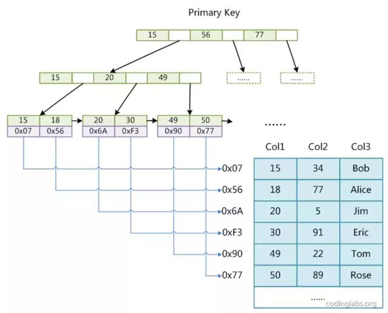
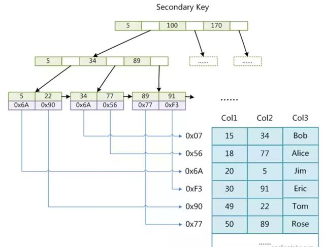
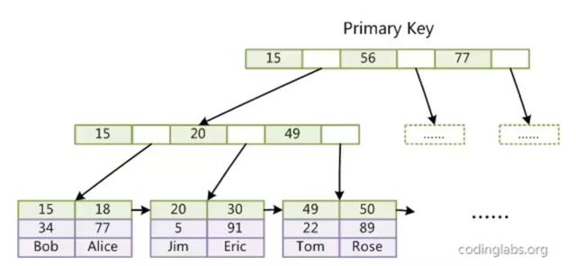
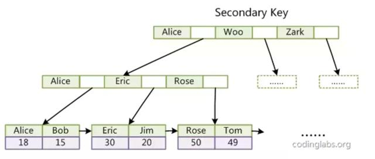

# mysql两种存储引擎的存储索引机制

## MyISAM索引实现
MyISAM引擎使用B+Tree作为索引结构，叶节点的data域存放的是数据记录的地址。主索引原理图如下：

从上图可以看出MyISAM的索引文件仅仅保存数据记录的地址。在MyISAM中，主索引和辅助索引（secondary key）在结构上没有任何区别。只是主索引要求key是唯一的，而辅助索引的key可以重复。下图为辅助索引的原理图：

MyISAM的检索算法为首先按照B+Tree搜索算法搜索索引，如果指定的key存在，则取出其data域的值，然后以data域的值为地址，读取相应的数据记录。MyISAM的这种索引方式叫做“非聚集索引”。

## InnoDB索引实现
虽然InnoDB也使用B+Tree作为索引结构，但具体的是实现却与MyISAM截然不同。

第一个重大的区别是InnoDB的数据文件本身就是索引文件。在InnoDB中表数据文件本身就是按照B+Tree组织的一个索引结构，这棵树的叶子结点data域保存了完整的数据记录。这个索引的key是数据表的主键，因此InnoDB表数据文件本身就是主索引。

从上图可以看出InnoDB的主索引叶子结点包含了完整的数据记录。这种索引叫做“聚集索引”。因为InnoDB的数据文件本身要按照主键聚集，所以InnoDB要求表必须要有主键。如果没显示指定，则会自动生成一个隐式字段作为主键（长度为6字节的长整形）

第二个与MyISAM索引不同的是InnoDB的辅助索引data域存储的是相应记录的主键值而不是地址。InnoDB的所有辅助索引都引用主键作为data域。如下图：

这里以英文字母的ASCII作为比较标准。聚集索引的这种实现使得按照主键搜索十分高效。但是辅助索引的搜索需要检索两遍索引：首先检索辅助索引获得主键，然后用主键到主索引中检索获得记录。

因此可以总结如下结论：
* InnoDB中主键不建议使用过长的字段作为主键
> 因为所有的辅助索引都引用主索引，过长的主索引会令辅助索引变得过大。
* 不建议非单调的字段作为主键
> 因为InnoDB数据文件本身是一颗B+Tree,非单调的主键在插入新纪录时数据文件为了维持B+Tree的特征而频繁的分裂调整，十分低效。所以使用自增字段作为主键是一个很好的选择。

参考文档：[mysql索引的数据结构](https://www.toutiao.com/i6681186081301332487/)