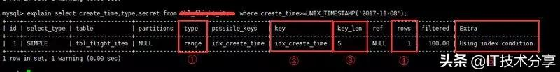

# SQL性能优化

## 1. 善用explain进行分析


* type：连接类型，一个性能高的sql语句至少要达到range级别。拒绝出现all级别
* key：使用到的索引名，如果没有用到索引值为null。可以采用强制索引。
* key_len：索引长度
* rows：扫描行数。是个预估值。
* extra：详细说明，注意常用的不太友好的值有：using filesort,using temporary

## 2. SQL语句中IN包含的值不应过多
MYSQL对IN做了相应的优化，即将IN中的常量全部存储在一个数组里面，而且这个数组是排好序的。但是如果数值较多的话，产生的消耗也是不较大的。**如果是连续的值得话尽量用between来代替；再或者使用连接来代替。**

## 3. select语句务必指明字段名称
select * 增加了很多不必要的消耗（cpu，Io，内存，网络带宽）

## 4. 当只要一条数据时，使用limit 1
这是为了使explain中的type列达到Const类型

## 5. 如果排序字段没有用到索引就尽量少排序
## 6. 如果限制条件中其他字段没有用到索引就尽量少用Or
OR两遍的字段如果有一个不是索引字段，而其他条件也不是索引字段，则该查询不走索引。很多时候使用Union All或者Union（必要的时候）的方式代替OR会得到更好的效果。

## 7. 尽量使用Union All代替 Union
Union和Union All 的差异主要是前者需要将结果集合并后在进行一次唯一过滤，这就会涉及到排序，增加了Cpu的运算，加大资源消耗及延迟。当然Union All的前提是两个结果集没有重复数据。

## 8. 不使用Order By Rand()
```
select id from `table_name` order by rand() limit 1000;
```
上面语句可优化为：
```
select id from `table_name` t1 join 
(select rand() * (select max(id) from `table_name`) as nid) t2 
on t1.id > t2.nid limit 1000;
```

## 9. 区分in和exists,not in和not exists
in和Exists主要是造成了驱动顺序的改变（这是性能变化的关键）：
* exists：以外层表为驱动，外表先被访问。适合外表小3而内表大的情况
* in：以内层表为驱动，先进行子查询。适合内表小而外表大的情况

> 关于Not In和Not Exists，推荐使用Not Exists，不仅仅是效率的问题，Not In可能存在逻辑问题。

如何高效的写出一个代替以下Not Exists的Sql语句
```
select column from A where a.id not in (select b.id from B)
```
高效的SQL
```
select column from A left Join B on a.id = b.id where b.id is null
```

## 10. 使用合理的分页方式提高效率
```
select id,name from table limit 866613,20
```
使用limit分页时随着表数据的增大，查询会越来越慢。  
优化方案：可以取前一页的最大行数id，使用这个最大id来限制下一页的起始点。假设上一页的最大id是866620，则对应的sql语句可以采用如下的写法：
```
select id,name from talble where id > 866620 limit 20
```

## 11. 使用分段查询
当选择的时间范围过大是，会造成扫描行过多而引起查询缓慢，可以采用分段查询，循环便利，合并结果的方式展示。一般扫描行在百万以上是就要用分段查询。

## 12. 避免查询语句导致不走索引的情况

* where语句中对字段进行null判断
* 使用%前缀的模糊查询
* where子句中对字段进行表达式操作
* where子句中存在隐式类型转换
* 联合索引必须遵循最左原则
* 联合索引的范围查询（between，>,<）会造成后面的索引字段失效。

## 13. join优化
Inner Join会默认使用最小表作为驱动。索引建议使用Inner Join。  
在Join时尽量使用被驱动表的索引字段作为On的限制条件  
巧用Straight_join


参考文档：
https://www.toutiao.com/i6692944806584254979/