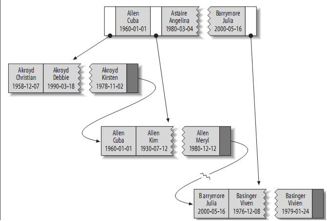
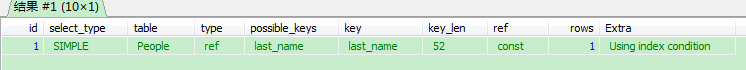
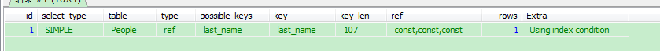
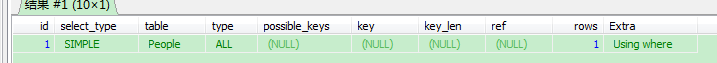

# mysql联合索引分析

## 1. 建表语句如下：
```
CREATE TABLE People (
   last_name varchar(50)    not null,
   first_name varchar(50)    not null,
   dob        date           not null,
   gender     enum('m', 'f') not null,
   key(last_name, first_name, dob)
);
```

## 2. 联合索引结构图如下：



## 3. 联合索引最左原则：

查询语句|是否使用索引|执行计划
--|--|--
explain select * from People  where last_name='aa'|是|
explain select * from People  where last_name='aa' AND first_name='bb'|是|
explain select * from People  where last_name='aa' AND first_name='bb' AND dob = 'cc'|是|
explain select * from People  WHERE last_name='aa' AND dob = 'cc'|是|
explain select * from People  where  first_name='bb' AND dob = 'cc'|否|
explain select * from People  where  first_name='bb'|否|
explain select * from People  where  dob = 'cc'|否|


参考文档：
mysql联合索引分析：https://www.jianshu.com/p/01a316b5b1ac