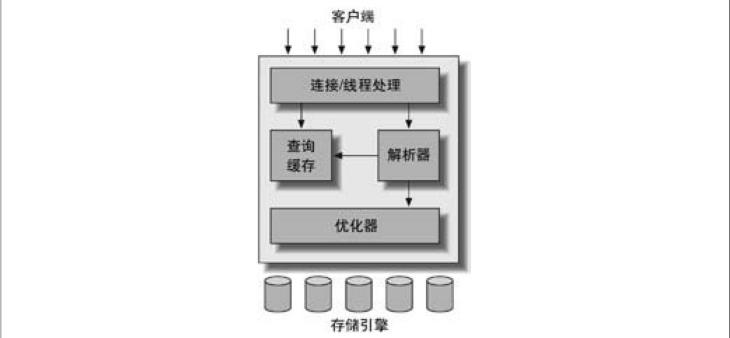

# mysql读书笔记

## 1.1 msyql的逻辑架构

* 第一层：服务主要用来处理网络连接，授权认证，安全信息等。
* 第二层：主要包括了查询解析，分析，优化，缓存等功能，以内置的函数（日期，时间，数字和加密函数）。所有跨存储引擎的工作都会在这一层实现：存储过程，触发器，视图等。
* 第三层：主要是存储引擎，存储引擎负责MySQL中数据的存储和提取。服务器通过api与存储引擎进行通信。这些接口屏蔽了不同存储引擎之间的差异，使得这些差异对上层的查询过程透明。

### 1.1.1 连接管理与安全性
每个客户端连接都会在服务器进程中拥有一个线程，每个连接的查询只会在这个单独的线程中执行，该线程只能轮流的在某个cpu核心或者cpu中运行。服务器会负责缓存线程，因此不需为每个新建的连接创建或者销毁线程。  
当客户端连接到MySQL服务器时，服务器需要对其进行认证。认证基于用户名，原始主机信息和密码。如果使用了安全套接字（ssl）的方式连接，还可以使用X.509证书认证。一旦客户端连接成功，服务器会继续验证该客户端是否具有执行某个特定查询的权限（如：是否允许客户端对world数据库的country表执行select查询）

### 1.1.2 优化和执行
MySQL会解析查询并创建内部数据结构（解析树），然后对其进行各种优化，包括重写查询，决定表的读写顺序，以及选择合适的索引等。用户可以通过特殊的关键字提示优化器，影响他的决策过程。也可以通过优化解释器优化过程的各个因素，使用户知道服务器是如何进行优化决策的。  
优化器并不关心表使用的是什么存储引擎，但存储引擎对优化查询是有影响的。优化器会请求存储引擎提供容量和某个具体操作的开销信息，以及表数据的统计信息等。  
对于select语句，在解析查询之前，服务器会先检查查询缓存（Query Cache），如果能够在其中找到对应的查询，服务器就不再执行查询解析，优化和执行的整个过程，而是直接返回查询缓存中的结果集。

## 1.2 并发控制
无论何时，只要有多个查询需要在同一时刻修改数据，都会产生并发控制的问题。MySQL在两个层面做了并发控制：服务层与存储引擎层。

### 1.2.1 读写锁
在解决并发读和写时，可以实现一个有两种类型的锁组成的锁系统来解决问题。这两种类型的锁通常被称为共享锁（shard lock）和排他锁（exclusive lock）。也叫读锁和写锁。

### 1.2.2 锁粒度
一种提高共享资源并发行的方式是让锁对象更具有选择性。尽量锁定需要修改的部分数据。而不是所有的资源。而更理想的方式是：只对会所锁定的数据片进行锁定。任何情况下，在给定的资源上只要锁定的数据量越小，则系统的并发性就越高。子要相互之间不发生冲突即可。  
问题是加锁也需要消耗资源。锁的各种操作包括获得锁，检查锁是否已经解除，释放锁等，都活增加系统的开销。如果系统花费大量的时间来管理锁，而不是存取数据，那么系统的性能可能会会因此受到影响。**所谓的锁策略就是锁的开销和数据的安全性之间寻找一个平衡**

* 表锁
表锁是MySQL最基本的锁策略，并且是开销最小的策略。
* 行锁
行锁可以最大程度的支持并发处理。行级锁只在存储引擎层实现，而MySQL服务层没有实现，服务层完全不了解存储引擎中锁的实现方式。