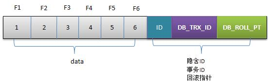

# InnoDB的MVCC
mvcc可以理解为java中的多版本
为实现对应的功能他为每行记录都实现了三个隐藏字段

* DB_TRX_ID：6字节事务id
* DB_ROLL_PTR：7字节的回滚指针
* 默认的隐藏ID

对应的实际存储结构如下图：

## 1.InnoDB的事务相关概念
为了支持事务，innoDB引入了以下概念：

* redo log
> 保存执行的sql语句到一个指定的log文件，当mysql执行recovery时重新执行redo log记录中的SQL语句即可。被保存在一个独立的文件中即innoDB的log文件中

* undo log
> 与redo log相反undo log是为了回滚而用的，具体的内容就是copy事务前的数据内容行到undo buffer,在适合的时间把undo buffer中的内容刷新到新的磁盘中，不存在单独的磁盘文件，存在于innodb数据文件中（表空间）中。

* 共享锁/排他锁
> 共享锁针对读，排他锁针对写。如果某个事务更新某行（排他锁），其他事务无论读写本行都必须等待；如果某个事务读取某行（共享锁），其他读事务无需等待，写事务必须等待。

## 2.事务演示

下面演示一个具体的行数据的修改过程

**1.初始化数据**

F1\~F6是某行列的名字，1\~6是对应的数据。假设这条数据是刚插入的，可以认为ID为1，其他两个字段为空。

**2.事务1更改该行各字段的值**

事务1更改该行的值，操作如下：

* 用排他锁锁定改行
* 记录redo log
* 把该行修改前的值copy到undo log
* 修改当前行的值，填写事务编号，使回滚指针指向undo log中的修改前的行

**3.事务2修改该行的值**

与事务1比，此时的undo log中有两行记录，并且通过回滚指针连接到一起。因此如果undo log 一直不删除，这可以通过当前回滚指针一直回溯到该行最初的内容，不过innodb中存在purge线程，他通过查询比现在最老的事务还早的undo log，并删除他，从而保证undo log文件不至于一直增长。

**4.事务提交**

如果正常提交只需要更改事物状态为commit即可，无需其他操作。如果是rollback,这需要根据当前回滚指针从undo log中找出事务修改前的版本并恢复。据统计事务影响行数在1000~10000之间是，效率还是很高的。

**5.insert undo log**

如果是insert过程中要求回滚，只要回滚时把对应的insert undo log丢弃就可以了。

## 3.事务级别

在innodb中（update,insert,delete）是一个事务过程（排他事务），查询也是一个事务过程（只读事务）。当读事务并发访问同一条数据时，能读到什么数据依赖于事务级别：

事务级别|读取结果
-|-
READ_UNCOMMIT|无论更新事务是否完成都读取主记录
READ_COMMIT|每次读取undo log中最近的记录（每次读到最新数据，两次读取可能读到不同的数据）
REPEATABLE_READ|每次都读取指定版本的数据（不会产生幻读，可能读不到最新数据）
SERIALLZABLE|锁表，读写操作相互阻塞

## 4.mvcc

**以上说述在更新前建立undo log，根据各种事务策略读取时保证非阻塞这样的机制就是mvcc，undo log中的行就是mvcc中的多版本。** 

mvcc的定义中有以下几个特点：

* 每行数据都存在一个版本，每次数据更新时就更新该版本
* 修改时copy出当前版本随意修改，各事务之间互不干扰
* 保存时比较版本号，如果成功（commit）则覆盖原纪录，失败则放弃copy(rollback)

在InnoDB中是按照如下方式对mvcc实现的：

* 事务以排他锁的形式修改原始数据
* 把修改前的数据存放在undo log中，通过回滚指针与主数据关联
* 修改成功（commit）啥都不做，失败则恢复undo log中的数据

InnoDB的实现算不上MVCC,因为没有实现核心的多版本共存，undo log中的内容只是串行化的结果，记录了多个事务的过程，不属于多版本共存。

理想的MVCC难以实现的原因在于无法通过乐观锁代替二段提交。InnoDB只是借用了MVCC提供了读的非阻塞而已。

## 5.总结

MVCC并非无处可用，对一些一致性要求不高和对单一数据的操作场景，可以借鉴mvcc中事务更新失败则重新计算再重试直至成功的方式，来提高并发和消除线程锁。

参考文章：[InnoDB中MVCC](http://www.360doc.com/content/14/0821/09/12904276_403505950.shtml)
https://www.toutiao.com/i6692338867082625540/